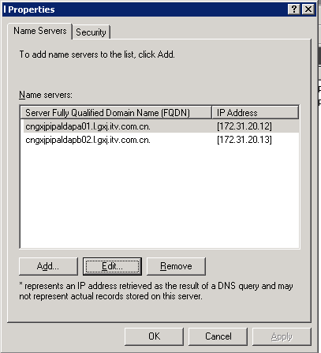

## mkdocs
```
http://mkdocs.org

yum install python-pip
pip install mkdocs
pip install mkdocs-windmill

mkdocs new [dir-name] - Create a new project.
mkdocs help - Print this help message.
mkdocs serve -a 0.0.0.0:8080
mkdocs build --clean && mkdocs build

查找是否有多余的文件
find . -name "*.md" | awk -F '/' '{print $3}' | while read line; do grep $line mkdocs.yml ; if [  $? -ne 0 ];then echo $line >> /tmp/diff; fi; done
```

## ntopng
```
http://packages.ntop.org/centos-stable/

wget http://packages.ntop.org/centos-stable/ntop.repo -O /etc/yum.repos.d/ntop.repo
yum install pfring n2disk nprobe ntopng ntopng-data cento pfring-drivers-zc-dkms redis
systemctl start redis
systemctl start ntopng

IP:3000  admin/admin
```

## dokuwiki
```
一、环境准备:
yum install httpd php php-gd php-ldap
二、安装部署
1.下载dokuwiki网站源码
# wget http://download.dokuwiki.org/src/dokuwiki/dokuwiki-stable.tgz

2.解压源码安装
#tar -zvxf dokuwiki-stable.tgz    //解包解压缩
#cd dokuwiki-2016-06-26a   //进入解压后的目录
#cp -R dokuwiki-2016-06-26a /home/www/ dokuwiki   //复制解压的网站源码文件到网站根目录
#chown -R www:www /home/www   //将文件所有者由root用户改为www用户(你nginx运行的用户)
在浏览器输入：http://域名或者ip/install.php 就可以看到如下界面：


先在右上角选好语言，简体中文zh
填写好网站的名称，管理员等，协议等
安装完后，为了安全，要删除install.php文件，然后再用刚才设置的用户名密码登陆
三、设置使用LDAP用户验证
1、首先在扩展管理器中安装LDAP插件
2、管理-配置样式中设置
```

## phpproxy
```
wget https://www.php-proxy.com/download/php-proxy.zip 解压到/var/www/
chmod 777 /vat/www -R
vim /var/www/templates/url_form.php 添加style
<div id="top_form" style="display:none;">  隐藏上面的form

vim vendor/athlon1600/php-proxy/src/helpers.php  替换http为https，可选，避免部分网站提示不安全的脚本

nginx 配置
yum install php-fpm php-curl php-mbstring youtube-dl

        root /var/www;
        location / {
              index index.php;
        }
        location ~ \.php$ {
              fastcgi_pass 127.0.0.1:9000;
              fastcgi_index index.php;
              fastcgi_param SCRIPT_FILENAME $document_root$fastcgi_script_name;
              include fastcgi_params;
        }

apache
yum install httpd php php-curl php-mbstring youtube-dl
cd /etc/httpd 
rm conf.d/welcome.conf

vim conf/httpd.conf

添加index.php
<IfModule dir_module>
    DirectoryIndex index.html index.php
</IfModule>

添加php-proxy
<VirtualHost *:80>
        DocumentRoot /var/www/
</VirtualHost>

ServerLimit 10

<IfModule mpm_prefork_module>
    StartServers        5
    MinSpareServers     5
    MaxSpareServers     10
    MaxClients          10
    MaxRequestsPerChild 0
</IfModule>

ExtendedStatus On

<Location /proxy-status>
        SetHandler server-status
</Location>


``` 

## solr
    下载：
    官网地址：http://lucene.apache.org/solr/
    国内下载地址：http://mirrors.cnnic.cn/apache/lucene/solr/
    安装：
    需要apache java
    yum install java httpd
    java –version 出现一下内容则java正常
    openjdk version "1.8.0_65"
    OpenJDK Runtime Environment (build 1.8.0_65-b17)
    OpenJDK 64-Bit Server VM (build 25.65-b01, mixed mode)


    tar -zxf solr-5.3.1.tgz
    cd solr-5.3.1/
    启动 ./bin/solr start -e cloud -noprompt
    导入文件 ./bin/post -c gettingstarted 文件路径
    清楚所有（重新初始化） ./bin/solr stop -all ; rm -Rf example/cloud/
    删除  ./bin/post -c gettingstarted -d "<delete><id>SP2514N</id></delete>"

    定时添加文件索引，加入计划任务
    */1 * * * * /bin/bash /root/add_file_solr.sh > /dev/null
    脚本：
    #!/usr/bin/env bash
    file=`find /var/www/html/logfile -type f -amin 1`
    for i in $file
    do
             if [ $i=="" ];then
                     /root/solr-5.3.1/bin/post -c gettingstarted $i
             else
                     exit
             fi
    done

    主界面 http://localhost:8983/solr
    导入的文件界面  http://localhost:8983/solr/gettingstarted/browse


    Documents  选择（solr command）
    添加索引
    <add>
    <doc>
    <fieldname="url">http://localhost/myBlog/solr-rocks.html</field>
    <field name="title">Solr Search is Simply Great</field>
    <field name="keywords">solr,lucene,enterprise,search</field>
    <fieldname="creationDate">2007-01-06T05:04:00.000Z</field>
    <field name="rating">10</field>
    <field name="content">Solr is a really great open source searchserver. It scales,
    it's easy to configure and the Solr community is reallysupportive.</field>
    <field name="published">on</field>
    </doc>
    </add>

    删除制定ID的索引
    <delete><id>05138022</id></delete>

    删除查询到的索引数据
    <delete><query>id:IW-02</query></delete>

    删除所有索引数据
    <delete><query>*:*</query></delete>

    Apache 反向代理和用户验证
    Vim /etc/httpd/conf/httpd.conf
    确保 LoadModule proxy_module modules/mod_proxy.so和
       LoadModule proxy_http_module modules/mod_proxy_http.so没有被注释

    添加：
    <VirtualHost *:80>
        ServerAdmin yunwei@3mang.com
        ServerName log.3mang.com
        ProxyRequests Off
        <Proxy *>
            AuthType Basic
            allowoverride AuthConfig
            order allow,deny 
            allow from all
            AuthName "admin"
            AuthUserFile /etc/httpd/.htpassword    增加用户登录
            require valid-user
        </Proxy>
        ProxyPass /solr http://127.0.0.1:8983/solr
        ProxyPass /solr/admin/cores http://127.0.0.1:8983/solr/admin/cores
        ProxyPassReverse /solr http://127.0.0.1:8983/solr
    </VirtualHost>

    htpasswd -cm /etc/httpd/.htpassword admin    创建文件并添加用户，之前有会清空
    htpasswd -m /etc/httpd/.htpassword test      只添加用户
    chown apache.apache /etc/httpd/.htpassword
    chmod 400 /etc/httpd/.htpassword


## smokeping
```
    https://oss.oetiker.ch/smokeping/doc/smokeping_install.en.html


    yum -y install gcc httpd-devel libxml2-devel libpng-devel glib pango pango-devel freetype freetype-devel fontconfig cairo cairo-devel libart_lgpl libart_lgpl-devel popt-devel rrdtool rrdtool-devel rrdtool-perl fping mod_fcgid perl-devel fcgi perl-Sys-Syslog
    需要rrdtool cgilib fping  echoping  fcgi

    wget https://launchpad.net/cgilib/main/0.5/+download/cgilib-0.5.tar.gz
    tar zxvf cgilib-0.5.tar.gz
    cd cgilib-0.5
    make
    cp libcgi.a /usr/local/lib
    cp cgi.h /usr/include

    wget https://fossies.org/linux/misc/old/echoping-6.0.2.tar.gz
    tar zxvf echoping-6.0.2.tar.gz
    cd echoping-6.0.2
    ./configure --without-libidn
    make && make install

    yum install perl-core -y
    wget https://oss.oetiker.ch/smokeping/pub/smokeping-2.7.2.tar.gz
    tar zxvf smokeping-2.7.2.tar.gz
    cd smokeping-2.7.2
    ./configure --prefix=/usr/local/smokeping
    gmake install
    gmake install  执行两次

    配置smokeping
    cd /usr/local/smokeping/
    mkdir cache data var
    chmod 777 cache data var
    cd /usr/local/smokeping/htdocs/
    cp smokeping.fcgi.dist smokeping.fcgi
    cd /usr/local/smokeping/etc/
    cp config.dist config
    chmod 400 /usr/local/smokeping/etc/smokeping_secrets.dist
    ln -s /usr/local/smokeping/cache /usr/local/smokeping/htdocs/cache

    创建开机自动运行脚本
    vi /etc/rc.local
    写入如下内容

    nohup /usr/local/smokeping/bin/smokeping --logfile=/var/log/smokeping.log 2>&1 &
    修改apache配置文件

    Alias /smokeping/ "/usr/local/smokeping/htdocs/"
    <Directory "/usr/local/smokeping/">
    AllowOverride None
    Options All
    AddHandler cgi-script .fcgi .cgi
    Order allow,deny
    Allow from all      apache2.4没用allow order 改为Require all granted
    DirectoryIndex smokeping.fcgi
    </Directory>
    最后重器apache服务，运行
    nohup /usr/local/smokeping/bin/smokeping --logfile=/var/log/smokeping.log 2>&1 &

    kill -9 `ps aux | grep smokeping | grep -v grep | awk '{print $2}'`
    nohup /usr/local/smokeping/bin/smokeping --logfile=/var/log/smokeping.log 2>&1 &

    监控节点的增加
    vim /usr/local/smokeping/etc/config

    中文支持 
    *** Presentation *** 添加
    charset = utf-8

    + TEST
    menu = TEST
    title = TEST
    ################web server############################
    ++ TEST-web-bbs
    menu = TEST-web-bbs
    title = TEST网站 10.0.100.10
    host = 61.160.248.10
    ++ TEST-web-main
    menu = TEST网站主WEB服务器
    title = TEST网站主WEB服务器 10.0.100.21
    host = 10.0.100.21
```


## redmine
    http://www.redmine.org/projects/redmine/wiki/RedmineInstall


    Step 1 - Redmine application

    下载redmine http://www.redmine.org/projects/redmine/wiki/Download
    解压换gem源，国外的很慢
    gem sources --add http://gems.ruby-china.org/ --remove http://rubygems.org/
    解压缩redmine  
    vim Gemfile 修改第一行
    source 'https://gems.ruby-china.org/'

    创建数据库和用户
    MySQL

    CREATE DATABASE redmine CHARACTER SET utf8; 
    CREATE USER 'redmine'@'localhost' IDENTIFIED BY 'my_password'; 
    GRANT ALL PRIVILEGES ON redmine.* TO 'redmine'@'localhost';
    For versions of MySQL prior to 5.0.2 - skip the 'create user' step and instead:
    GRANT ALL PRIVILEGES ON redmine.* TO 'redmine'@'localhost' IDENTIFIED BY 'my_password';

    PostgreSQL

    CREATE ROLE redmine LOGIN ENCRYPTED PASSWORD 'my_password' NOINHERIT VALID UNTIL 'infinity'; 
    CREATE DATABASE redmine WITH ENCODING='UTF8' OWNER=redmine;

    SQL Server

    The database, login and user can be created within SQL Server Management Studio with a few clicks.
    If you prefer the command line option with SQLCMD, here's some basic example:
    Show SQL

    Step 3 - Database connection configuration

    配置数据库连接
    Copy config/database.yml.example to config/database.yml and edit this file in order to configure your
     database settings for "production" environment.
    Example for a MySQL database using ruby 1.8 or jruby:
    production:
      adapter: mysql
      database: redmine
      host: localhost
      username: redmine
      password: my_password
    Example for a MySQL database using ruby 1.9 (adapter must be set to mysql2):
    production:
      adapter: mysql2
      database: redmine
      host: localhost
      username: redmine
      password: my_password
    If your server is not running on the standard port (3306), use this configuration instead:
    production:
      adapter: mysql
      database: redmine
      host: localhost
      port: 3307
      username: redmine
      password: my_password
    Example for a PostgreSQL database (default port):
    production:
      adapter: postgresql
      database: <your_database_name>
      host: <postgres_host>
      username: <postgres_user>
      password: <postgres_user_password>
      encoding: utf8
      schema_search_path: <database_schema> (default - public)
    Example for a SQL Server database (default host localhost, default port 1433):
    production:
      adapter: sqlserver
      database: redmine
      username: redmine # should match the database user name
      password: redminepassword # should match the login password
    Step 4 - Dependencies installation

    安装需要的依赖包
    Redmine uses Bundler to manage gems dependencies.
    gem install bundler
    Then you can install all the gems required by Redmine using the following command:
    bundle install --without development test
    Optional dependencies

    RMagick (allows the use of ImageMagick to manipulate images for PDF and PNG export)

    If ImageMagick is not installed on your system, you should skip the installation of the rmagick gem using:
    bundle install --without development test rmagick
    If you have trouble installing rmagick on Windows, refer to this HowTo.
    Database adapters

    Redmine automatically installs the adapter gems required by your database configuration by reading it from 
    the config/database.yml file (eg. if you configured only a connection using the mysql2 adapter, then only 
    the mysql2 gem will be installed).
    Don't forget to re-run bundle install --without development test ... after adding or removing adapters in 
    the config/database.yml file!
    Additional dependencies (Gemfile.local)

    If you need to load gems that are not required by Redmine core (eg. Puma, fcgi), create a file named 
    Gemfile.local at the root of your redmine directory. It will be loaded automatically when running bundle install.
    Example:
    # Gemfile.local gem 'puma'

    Step 5 - Session store secret generation

    This step generates a random key used by Rails to encode cookies storing session data thus preventing their tampering.
    Generating a new secret token invalidates all existing sessions after restart.
    with Redmine 1.4.x:
    bundle exec rake generate_session_store
    with Redmine 2.x:
    bundle exec rake generate_secret_token
    Alternatively, you can store this secret in config/secrets.yml:
    http://guides.rubyonrails.org/upgrading_ruby_on_rails.html#config-secrets-yml
    Step 6 - Database schema objects creation

    创建数据库的表
    Create the database structure, by running the following command under the application root directory:
    RAILS_ENV=production bundle exec rake db:migrate
    Windows syntax:
    set RAILS_ENV=production
    bundle exec rake db:migrate
    It will create tables by running all migrations one by one then create the set of the permissions and the
     application administrator account, named admin.
    Ubuntu troubleshooting:
    If you get this error with Ubuntu:
    Rake aborted! no such file to load -- net/https

    Then you need to install libopenssl-ruby1.8 just like this: apt-get install libopenssl-ruby1.8.
    Step 7 - Database default data set

    Insert default configuration data in database, by running the following command:
    RAILS_ENV=production bundle exec rake redmine:load_default_data
    Redmine will prompt you for the data set language that should be loaded; you can also define the REDMINE_LANG
     environment variable before running the command to a value which will be automatically and silently picked
      up by the task.
    E.g.:
    Unices:
    RAILS_ENV=production REDMINE_LANG=fr bundle exec rake redmine:load_default_data
    Windows:
    set RAILS_ENV=production
    set REDMINE_LANG=fr
    bundle exec rake redmine:load_default_data
    Step 8 - File system permissions
    NB: Windows users can skip this section.
    The user account running the application must have write permission on the following subdirectories:
    files (storage of attachments)
    log (application log file production.log)
    tmp and tmp/pdf (create these ones if not present, used to generate PDF documents among other things)
    public/plugin_assets (assets of plugins)
    E.g., assuming you run the application with a redmine user account:
    mkdir -p tmp tmp/pdf public/plugin_assets
    chown -R redmine:redmine files log tmp public/plugin_assets
    chmod -R 755 files log tmp public/plugin_assets

    Step 9 - Test the installation

    Test the installation by running WEBrick web server:
    with Redmine 1.4.x:
    bundle exec ruby script/server webrick -e production
    with Redmine 2.x:
    bundle exec ruby script/rails server webrick -e production
    with Redmine 3.x:
    bundle exec rails server webrick -e production
    Once WEBrick has started, point your browser to http://localhost:3000/. You should now see the application
     welcome page.
    Note: Webrick is not suitable for production use, please only use webrick for testing that the installation
     up to this point is functional. Use one of the many other guides in this wiki to setup redmine to use either
      Passenger (aka mod_rails), FCGI or a Rack server (Unicorn, Thin, Puma, hellip;) to serve up your redmine.
    Step 10 - Logging into the application

    Use default administrator account to log in:
    login: admin
    password: admin
    You can go to Administration menu and choose Settings to modify most of the application settings.
    Configuration

    Redmine settings are defined in a file named config/configuration.yml.
    If you need to override default application settings, simply copy config/configuration.yml.example to
     config/configuration.yml and edit the new file; the file is well commented by itself, so you should have 
     a look at it.
    These settings may be defined per Rails environment (production/development/test).
    Important : don't forget to restart the application after any change.
    Email / SMTP server settings

    Email configuration is described in a dedicated page.
    SCM settings

    This configuration section allows you to:

    override default commands names if the SCM binaries present in the PATH variable doesn't use the standard name 
    (Windows .bat/NaNd names won't work)
    specify the full path to the binary
    Examples (with Subversion):
    Command name override:
    scm_subversion_command: "svn_replacement.exe"
    Absolute path:
    scm_subversion_command: "C:\Program Files\Subversion\bin\svn.exe"
    Attachment storage settings

    You can set a path where Redmine attachments will be stored which is different from the default 'files'
     directory of your Redmine instance using the attachments_storage_path setting.
    Examples:
    attachments_storage_path: /var/redmine/files
    attachments_storage_path: D:/redmine/files
    Logging configuration

    Redmine defaults to a log level of :info, writing to the log subdirectory. Depending on site usage, 
    this can be a lot of data so to avoid the contents of the logfile growing without bound, consider rotating them,
     either through a system utility like logrotate or via theconfig/additional_environment.rb file.
    To use the latter, copy config/additional_environment.rb.example to config/additional_environment.rb and add the 
    following lines. Note that the new logger defaults to a high log level and hence has to be explicitly set to info.
    #Logger.new(PATH,NUM_FILES_TO_ROTATE,FILE_SIZE) config.logger = Logger.new('/path/to/logfile.log', 2, 1000000)
     config.logger.level = Logger::INFO

    Backups

    Redmine backups should include:
    data (stored in your redmine database)
    attachments (stored in the files directory of your Redmine install)
    Here is a simple shell script that can be used for daily backups (assuming you're using a mysql database):
    # Database /usr/bin/mysqldump -u <username> -p<password> <redmine_database> | 
    gzip > /path/to/backup/db/redmine_`date +%y_%m_%d`.gz # Attachments 
    rsync -a /path/to/redmine/files /path/to/backup/files
    Notes on Linux/Unix installation

    Be sure to disable security hardenning tools during the installation process if you run into bizarre 
    permission problems. These problems are mostly silent and can be caused by tools like extended ACLs, 
    SELinux, or AppArmor. There tools are mostly used in big companies with a strict security policy, 
    default Linux/Unix distributions settings shouldn't be a problem.
    Notes on Windows installation

    There is an prebuilt installer of Ruby MRI available from http://rubyinstaller.org.
    After installing it, select Start Command Prompt with Ruby in the start menu.
    Specifying the RAILS_ENV environment variable:
    When running command as described in this guide, you have to set the RAILS_ENV environment variable 
    using a separate command.
    I.e. commands with the following syntaxes:
    RAILS_ENV=production <any commmand>
    <any commmand> RAILS_ENV=production
    have to be turned into 2 subsequent commands:
    set RAILS_ENV=production <any commmand>
    MySQL gem installation issue:
    You may need to manually install the mysql gem using the following command:
    gem install mysql


## cobbler
    http://blog.chinaunix.net/uid-16728139-id-4174109.html
    关闭  ipv6：
    cat <<EOF>>/etc/modprobe.d/dist.conf
    alias net-pf-10 off
    alias ipv6 off
    EOF

    yum install cobbler cobbler-web createrepo yum-utils dhcp httpd  tftp cman pykickstart debmirror -y

    二：配置环境
    1>修改cobbler 的配置文件
        [root@locahost ~]# vim /etc/cobbler/settings
        next_server: 10.3.3.31
        server: 10.3.3.31
        manage_dhcp: 1
        manage_rsync: 1
    生成密码串:
        [root@locahost ~]#  openssl passwd -1 -salt "cobber" "123456"
        $1$cobber$yV9XfOuaaiVDvImopK7o.1
    openssl passwd -1 -salt '任间字符' '密码'
    这个命令的用法，任意字符可以随便写，这个密码就是安装完系统root的密码了。替换配置文件里的字串。
        [root@locahost ~]# vim /etc/cobbler/settings
        default_password_crypted: "$1$cobber$yV9XfOuaaiVDvImopK7o.1"
    2>启用tfpt 和 rsync
        [root@locahost ~]# vim /etc/xinetd.d/tftp    
        disable                 = no
        [root@locahost ~]# vim /etc/xinetd.d/rsync
        disable = no
    启动服务
        [root@locahost ~]# /etc/init.d/xinetd restart
    3>修改dhcp的配置文件
        vim /etc/cobbler/dhcp.template
    subnet 192.168.18.0 netmask 255.255.255.0 {
         option routers             192.168.18.5;
         option domain-name-servers 192.168.1.1;
         option subnet-mask         255.255.255.0;
         range dynamic-bootp        192.168.18.100 192.168.18.254;
         filename                   "/pxelinux.0";
         default-lease-time         21600;
         max-lease-time             43200;
         next-server                $next_server;
    }

    [root@locahost ~]# vim /etc/debmirror.conf
    #@dists="sid";
    @sections="main,main/debian-installer,contrib,non-free";
    #@arches="i386";

    [root@locahost ~]# /etc/init.d/cobblerd restart
    [root@locahost ~]# /etc/init.d/httpd restart
    [root@locahost ~]# /etc/init.d/xinetd restart
    #[root@locahost ~]# /etc/init.d/dhcpd restart

    [root@locahost ~]# cobbler get-loaders
    downloading http://cobbler.github.io/loaders/README to /var/lib/cobbler/loaders/README  (可以把文件放到这个目录)
    ......

    三:配置web环境
    htdigest /etc/cobbler/users.digest "Cobbler" cobbler
    https://ip/cobbler_web


    1：添加DVD源，
        [root@locahost ~]# mkdir -p /mnt/cdrom
        [root@locahost ~]# mount /dev/cdrom /mnt/cdrom/
        [root@locahost ~]# cobbler import --path=/mnt/cdrom/ --name=centos6.4 --arch=x86_64
        cd /var/lib/cobbler/kickstarts/
           cp sample_end.ks centos6.ks
        cobbler profile profile edit --name=centos6.4 --distro=centos6.4 --kickstart=/var/lib/cobbler/kickstarts/centos6.ks
        cobbler report
        cobbler sync

    [root@locahost ~]# /etc/init.d/cobblerd restart
    [root@locahost ~]# cobbler sync


    直接部署单一系统，不用手选择：
    vim /etc/cobbler/pxe/pxedefault.template
        DEFAULT menu（改为安装的系统名称）


        创建kickstarts自动安装：
        cd /var/lib/cobbler/kickstarts  #进入默认Kickstart模板目录

    vi /var/lib/cobbler/kickstarts/CentOS-5.10-x86_64.ks  #创建CentOS-5.10-x86_64安装脚本
    # Kickstart file automatically generated by anaconda.
    install
    url --url=http://192.168.21.128/cobbler/ks_mirror/CentOS-5.10-x86_64-x86_64/
    lang en_US.UTF-8
    zerombr  yes
    key --skip
    keyboard us
    network --device eth0 --bootproto dhcp  --onboot on
    #network --device eth0 --bootproto static --ip 192.168.21.250 --netmask 255.255.255.0 --gateway 192.168.21.2 
    --nameserver 8.8.8.8 --hostname CentOS5.10
    rootpw --iscrypted $1$QqobZZ1g$rYnrawi9kYlEeUuq1vcRS/
    firewall --enabled --port=22:tcp
    authconfig --enableshadow --enablemd5
    selinux --disabled
    timezone Asia/Shanghai
    bootloader --location=mbr --driveorder=sda
    # The following is the partition information you requested
    # Note that any partitions you deleted are not expressed
    # here so unless you clear all partitions first, this is
    # not guaranteed to work
    #clearpart --linux
    clearpart --all --initlabel
    part / --bytes-per-inode=4096 --fstype="ext3" --size=2048
    part /boot --bytes-per-inode=4096 --fstype="ext3" --size=128
    part swap --bytes-per-inode=4096 --fstype="swap" --size=500
    part /data --bytes-per-inode=4096 --fstype="ext3" --grow --size=1
    reboot
    %packages
    ntp
    @base
    @core
    @dialup
    @editors
    @text-internet
    keyutils
    trousers 
    fipscheck
    device-mapper-multipath
    %post
    #同步系统时间
    ntpdate cn.pool.ntp.org
    hwclock --systohc
    echo -e "0 1 * * * root /usr/sbin/ntpdate cn.pool.ntp.org > /dev/null"  >> /etc/crontab
    service crond restart
    #禁止root用户直接登录系统

    sed -i "s/#PermitRootLogin yes/PermitRootLogin no/g" '/etc/ssh/sshd_config'

    service sshd restart

    #禁止开机启动的服务
    for i in `chkconfig --list | awk '{print $1}'`;do
        if [[ $i = 'atd' || $i = 'crond' || $i = 'irqbalance' || $i = 'network' || $i = 'sshd' || $i = 'rsyslog' || 
        $i = 'httpd' || $i = salt-* || $i = zabbix_* ]];then
            chkconfig --level 3 $i on
        else
            chkconfig $i off
        fi
    done
    grep -v "^#" /etc/ssh/sshd_config | grep -v "^$" | grep "^UseDNS no" > /dev/null
    if [[ $? -ne 0 ]];then
        sed -i '122a\UseDNS no' /etc/ssh/sshd_config
        /etc/init.d/sshd restart
    fi
    cat  >>/etc/profile<<EOF
    if [ $SHELL = "/bin/ksh" ]; then
         ulimit -p 16384
         ulimit -n 65536
         ulimit -c unlimited
    else
         ulimit -u 16384 -n 65536 -c unlimited
    fi
    EOF

    source /etc/profile

    ##set ulimit file
    cat >> /etc/security/limits.conf<<EOF
    *           soft    nproc   10000
    *          hard    nproc   16384
    *           soft    nofile   65536
    *           hard    nofile  65536
    EOF
    #禁止使用Ctrl+Alt+Del快捷键重启服务器
    sed -i "s/ca::ctrlaltdel:\/sbin\/shutdown -t3 -r now/#ca::ctrlaltdel:\/sbin\/shutdown -t3 -r now/g" '/etc/inittab'

    #优化系统内核
    echo -e "ulimit -c unlimited"  >> /etc/profile
    echo -e "ulimit -s unlimited"  >> /etc/profile
    echo -e "ulimit -SHn 65535"  >> /etc/profile
    source  /etc/profile
    sed -i "s/net.ipv4.ip_forward = 0/net.ipv4.ip_forward = 1/g" '/etc/sysctl.conf'
    echo -e "net.core.somaxconn = 262144"  >> /etc/sysctl.conf
    echo -e "net.core.netdev_max_backlog = 262144"  >> /etc/sysctl.conf
    echo -e "net.core.wmem_default = 8388608"  >> /etc/sysctl.conf
    echo -e "net.core.rmem_default = 8388608"  >> /etc/sysctl.conf
    echo -e "net.core.rmem_max = 16777216"  >> /etc/sysctl.conf
    echo -e "net.core.wmem_max = 16777216"  >> /etc/sysctl.conf
    echo -e "net.ipv4.netfilter.ip_conntrack_max = 131072"  >> /etc/sysctl.conf
    echo -e "net.ipv4.netfilter.ip_conntrack_tcp_timeout_established = 180"  >> /etc/sysctl.conf
    echo -e "net.ipv4.route.gc_timeout = 20"  >> /etc/sysctl.conf
    echo -e "net.ipv4.ip_conntrack_max = 819200"  >> /etc/sysctl.conf
    echo -e "net.ipv4.ip_local_port_range = 10024  65535"  >> /etc/sysctl.conf
    echo -e "net.ipv4.tcp_retries2 = 5"  >> /etc/sysctl.conf
    echo -e "net.ipv4.tcp_fin_timeout = 30"  >> /etc/sysctl.conf
    echo -e "net.ipv4.tcp_syn_retries = 1"  >> /etc/sysctl.conf
    echo -e "net.ipv4.tcp_synack_retries = 1"  >> /etc/sysctl.conf
    echo -e "net.ipv4.tcp_timestamps = 0"  >> /etc/sysctl.conf
    echo -e "net.ipv4.tcp_tw_recycle = 1"  >> /etc/sysctl.conf
    echo -e "net.ipv4.tcp_tw_len = 1"  >> /etc/sysctl.conf
    echo -e "net.ipv4.tcp_tw_reuse = 1"  >> /etc/sysctl.conf
    echo -e "net.ipv4.tcp_keepalive_time = 120"  >> /etc/sysctl.conf
    echo -e "net.ipv4.tcp_keepalive_probes = 3"  >> /etc/sysctl.conf
    echo -e "net.ipv4.tcp_keepalive_intvl = 15"  >> /etc/sysctl.conf
    echo -e "net.ipv4.tcp_max_tw_buckets = 36000"  >> /etc/sysctl.conf
    echo -e "net.ipv4.tcp_max_orphans = 3276800"  >> /etc/sysctl.conf
    echo -e "net.ipv4.tcp_max_syn_backlog = 262144"  >> /etc/sysctl.conf
    echo -e "net.ipv4.tcp_wmem = 8192 131072 16777216"  >> /etc/sysctl.conf
    echo -e "net.ipv4.tcp_rmem = 32768 131072 16777216"  >> /etc/sysctl.conf
    echo -e "net.ipv4.tcp_mem = 94500000 915000000 927000000"  >> /etc/sysctl.conf
    /sbin/sysctl -p
    #执行外部脚本
    cd /root
    wget http://192.168.21.128/cobbler/ks_mirror/config/autoip.sh
    sh /root/autoip.sh


    vi /var/www/cobbler/ks_mirror/config/autoip.sh  #创建脚本，自动设置Linux系统静态IP地址、DNS、网关、计算机名称
    #!/bin/sh
    ROUTE=$(route -n|grep "^0.0.0.0"|awk '{print $2}')
    BROADCAST=$(/sbin/ifconfig eth0|grep -i bcast|awk '{print $3}'|awk -F":" '{print $2}')
    HWADDR=$(/sbin/ifconfig eth0|grep -i HWaddr|awk '{print $5}')
    IPADDR=$(/sbin/ifconfig eth0|grep "inet addr"|awk '{print $2}'|awk -F":" '{print $2}')
    NETMASK=$(/sbin/ifconfig eth0|grep "inet addr"|awk '{print $4}'|awk -F":" '{print $2}')
    cat >/etc/sysconfig/network-scripts/ifcfg-eth0<<EOF
    DEVICE=eth0
    BOOTPROTO=static
    BROADCAST=$BROADCAST
    HWADDR=$HWADDR
    IPADDR=$IPADDR
    NETMASK=$NETMASK
    GATEWAY=$ROUTE
    ONBOOT=yes
    EOF
    IPADDR1=$(echo $IPADDR|awk -F"." '{print $4}')
    cat >/etc/sysconfig/network-scripts/ifcfg-eth1<<EOF
    DEVICE=eth1
    BOOTPROTO=static
    BROADCAST=10.0.0.255
    HWADDR=$(/sbin/ifconfig eth1|grep -i HWaddr|awk '{print $5}')
    IPADDR=10.0.0.$IPADDR1
    NETMASK=255.255.255.0
    ONBOOT=yes
    EOF
    HOSTNAME=OsYunWei_HZ_$(echo $IPADDR|awk -F"." '{print $4}')
    cat >/etc/sysconfig/network<<EOF
    NETWORKING=yes
    NETWORKING_IPV6=no
    HOSTNAME=$HOSTNAME
    GATEWAY=$ROUTE
    EOF
    echo "127.0.0.1  $HOSTNAME" >> /etc/hosts
    hostname=$HOSTNAME
    echo "nameserver  8.8.8.8"  > /etc/resolv.conf
    echo "nameserver  8.8.4.4" >> /etc/resolv.conf


## tcpcopy
```
wget https://github.com/session-replay-tools/intercept/archive/master.zip
wget https://github.com/session-replay-tools/tcpcopy/archive/master.zip

tomcat要配置session共享，测试服务器连接存储session的redis的备库，否则会有很多问题出现。

复制源服务器安装tcpcopy  ip 192.168.1.6
./configure
make && make install

/usr/local/tcpcopy/sbin/tcpcopy -x 8180-192.168.1.3:8080 -s 192.168.1.3 -c 192.168.1.6
配置防火墙，拒绝响应  iptables -I INPUT -s 192.168.1.3 -p tcp --sport 8080-j DROP
#tcpdump可以抓到回包，其实并没有真正收到，tcpdump一般抓包是在数据链路层抓的，iptables是在ip层drop掉响应包，
而响应包先到数据链路层，再往上到达ip层，所以响应包会经过数据链路层，tcpdump能够抓到也正常，抓不到才不正常
复制8180端口应用的请求到 192.168.1.3上面的8080端口，
-s     intercept服务器地址
-n 3 复制3 倍的流量过去
-c     修改源IP地址127.0.0.1为 62.135.200.x地址  

==============
测试服务器安装intercept  ip 192.168.1.3   不要开启ip_forward
yum install libpcap-devel -y
./configure
make && make install

./intercept -i eth0 -F 'tcp and src port 8080' -d     tomcat不要配置session共享
-d 后台模式
-F 过滤包
```


## ffmpeng
```
二进制版  http://johnvansickle.com/ffmpeg/
wget http://johnvansickle.com/ffmpeg/builds/ffmpeg-git-64bit-static.tar.xz


出自  http://www.yaosansi.com/post/ffmpeg-on-centos/
安装epel，rpmforce源

依赖
yum -y install glibc gcc gcc-c++ autoconf automake libtool git make nasm pkgconfig SDL-devel a52dec a52dec-devel 
alsa-lib-devel faac faac-devel faad2 faad2-devel freetype-devel giflib gsm gsm-devel imlib2 imlib2-devel lame
 lame-devel libICE-devel libSM-devel libX11-devel libXau-devel libXdmcp-devel libXext-devel libXrandr-devel 
 libXrender-devel libXt-devel libogg libvorbis vorbis-tools mesa-libGL-devel mesa-libGLU-devel xorg-x11-proto-devel
  zlib-devel libtheora theora-tools ncurses-devel libdc1394 libdc1394-devel amrnb-devel amrwb-devel opencore-amr-devel


cd /opt
wget http://downloads.xvid.org/downloads/xvidcore-1.3.2.tar.gz
tar xzvf xvidcore-1.3.2.tar.gz && rm -f xvidcore-1.3.2.tar.gz
cd xvidcore/build/generic
./configure --prefix="$HOME/ffmpeg_build" && make && make install

cd /opt
wget http://downloads.xiph.org/releases/ogg/libogg-1.3.1.tar.gz
tar xzvf libogg-1.3.1.tar.gz && rm -f libogg-1.3.1.tar.gz
cd libogg-1.3.1
./configure --prefix="$HOME/ffmpeg_build" --disable-shared && make && make install

cd /opt
wget http://downloads.xiph.org/releases/vorbis/libvorbis-1.3.4.tar.gz
tar xzvf libvorbis-1.3.4.tar.gz && rm -f libvorbis-1.3.4.tar.gz
cd libvorbis-1.3.4
./configure --prefix="$HOME/ffmpeg_build" --with-ogg="$HOME/ffmpeg_build" --disable-shared && make && make install

cd /opt
wget http://downloads.xiph.org/releases/theora/libtheora-1.1.1.tar.gz
tar xzvf libtheora-1.1.1.tar.gz && rm -f libtheora-1.1.1.tar.gz
cd libtheora-1.1.1
./configure --prefix="$HOME/ffmpeg_build" --with-ogg="$HOME/ffmpeg_build" --disable-examples --disable-shared 
--disable-sdltest --disable-vorbistest && make && make install

cd /opt
wget http://downloads.sourceforge.net/opencore-amr/vo-aacenc-0.1.2.tar.gz
tar xzvf vo-aacenc-0.1.2.tar.gz && rm -f vo-aacenc-0.1.2.tar.gz
cd vo-aacenc-0.1.2
./configure --prefix="$HOME/ffmpeg_build" --disable-shared && make install

yum -y remove yasm
cd /opt
wget http://www.tortall.net/projects/yasm/releases/yasm-1.2.0.tar.gz
tar xzfv yasm-1.2.0.tar.gz && rm -f yasm-1.2.0.tar.gz
cd yasm-1.2.0
./configure --prefix="$HOME/ffmpeg_build" --bindir="$HOME/bin" && make install
export "PATH=$PATH:$HOME/bin" 

cd /opt
git clone http://git.chromium.org/webm/libvpx.git
cd libvpx
git checkout tags/v1.3.0
./configure --prefix="$HOME/ffmpeg_build" --disable-examples && make && make install

cd /opt
git clone git://git.videolan.org/x264.git
cd x264
./configure --prefix="$HOME/ffmpeg_build" --bindir="$HOME/bin" --enable-static && make install

export LD_LIBRARY_PATH=/usr/local/lib/:$HOME/ffmpeg_build/lib/
echo /usr/local/lib >> /etc/ld.so.conf.d/custom-libs.conf
echo $HOME/ffmpeg_build/lib/ >> /etc/ld.so.conf.d/custom-libs.conf
ldconfig

cd /opt
git clone git://source.ffmpeg.org/ffmpeg.git
cd ffmpeg
git checkout release/2.2
PKG_CONFIG_PATH="$HOME/ffmpeg_build/lib/pkgconfig"
export PKG_CONFIG_PATH
./configure --prefix="$HOME/ffmpeg_build" --extra-cflags="-I$HOME/ffmpeg_build/include" 
--extra-ldflags="-L$HOME/ffmpeg_build/lib" --bindir="$HOME/bin" 
--extra-libs=-ldl --enable-version3 --enable-libopencore-amrnb --enable-libopencore-amrwb
 --enable-libvpx --enable-libfaac 
--enable-libmp3lame --enable-libtheora --enable-libvorbis --enable-libx264 --enable-libvo-aacenc 
--enable-libxvid --disable-ffplay 
--enable-gpl --enable-postproc --enable-nonfree --enable-avfilter --enable-pthreads --arch=x86_64 && make install

# Test the resulting ffmpeg binary
cp $HOME/bin/ffmpeg /usr/bin/
ffmpeg -v
```

## openldap
```
yum install openldap-* db4-* -y
sed -i "/local4.*/d" /etc/rsyslog.conf
cat >> /etc/rsyslog.conf << EOF
local4.*                        /var/log/slapd.log
EOF
service rsyslog restart
cd /etc/openldap/
cp  /usr/share/openldap-servers/slapd.conf.obsolete slapd.conf
slappasswd    输入完密码后,返回一串密文，先保存到剪贴板,之后要复制到LDAP配置文件中使
New password: 
Re-enter new password: 
{SSHA}hEH5ZdU2atsKNI0kUniBdU/9eCf+VYkB

vim /etc/openldap/slapd.conf
# enable server status monitoring (cn=monitor)
database monitor
access to *
        by dn.exact="gidNumber=0+uidNumber=0,cn=peercred,cn=external,cn=auth" read
        by dn.exact="cn=admin,dc=test,dc=com" read
        by * none


#######################################################################
# database definitions
#######################################################################


database        bdb
suffix          "dc=test,dc=com"
checkpoint      1024 15
rootdn          "cn=admin,dc=test,dc=com"
# Cleartext passwords, especially for the rootdn, should
# be avoided.  See slappasswd(8) and slapd.conf(5) for details.
# Use of strong authentication encouraged.
# rootpw                secret
# rootpw                {crypt}ijFYNcSNctBYg
rootpw {SSHA}pfAJm+JJa4ec2y8GjTc8uMEJpoR5YKMn
.......
保存退出
cp  /usr/share/openldap-servers/DB_CONFIG.example  /var/lib/ldap/DB_CONFIG
rm -rf /etc/openldap/slapd.d/*     删除默认/etc/openldap/slapd.d下面的所有内容，否则后面在使用ldapadd的时候会报错
/etc/init.d/slapd restart
chkconfig slap on
chkconfig slapd on
chown -R ldap.ldap /var/lib/ldap
chown -R ldap.ldap /etc/openldap/
测试并生成配置文件
slaptest  -f /etc/openldap/slapd.conf -F /etc/openldap/slapd.d   
config file testing succeeded
chown -R ldap:ldap /etc/openldap/slapd.d
/etc/init.d/slapd restart
至此，用户仅仅是系统上存在的用户（存储在/etc/passwd和/etc/shadow上），并没有在LDAP数据库里，所以要把这些用户导入到LDAP里面去。
但LDAP只能识别特定格式的文件 即后缀为ldif的文件（也是文本文件），所以不能直接使用/etc/passwd和/etc/shadow。 
需要migrationtools这个工具把这两个文件转变成LDAP能识别的文件

yum install migrationtools -y
cd /usr/share/migrationtools/
vim migrate_common.ph
# Default DNS domain
$DEFAULT_MAIL_DOMAIN = "test.com";


# Default base
$DEFAULT_BASE = "dc=test,dc=com";

K.下面利用pl脚本将/etc/passwd 和/etc/shadow生成LDAP能读懂的文件格式，保存在/tmp/下
# ./migrate_base.pl > /tmp/base.ldif
# ./migrate_passwd.pl  /etc/passwd > /tmp/passwd.ldif
# ./migrate_group.pl  /etc/group > /tmp/group.ldif
L.下面就要把这三个文件导入到LDAP，这样LDAP的数据库里就有了我们想要的用户
# ldapadd -x -D "cn=admin,dc=example,dc=com" -W -f /tmp/base.ldif
# ldapadd -x -D "cn=admin,dc=example,dc=com" -W -f /tmp/passwd.ldif
# ldapadd -x -D "cn=admin,dc=example,dc=com" -W -f /tmp/group.ldif
过程若无报错，则LDAP服务端配置完毕

M.重启slapd完成配置
# service slapd restart

N.现安装NFS，并把ldapuser1的家目录做NFS共享.
默认REDHAT已安装
# yum install nfs* -y
配置NFS共享：
# vi /etc/exports
--------------
/home/ldapuser1         *(rw,no_root_squash)
--------------
重启nfs服务：
# service rpcbind restart
# service nfs restart
PS.本地需要做ldap控制的账号都要导入到LDAP DB中，否则客户端配置无法正常识别登录。

客户端配置有两种方法：

使用authconfig-tui ，也就是setup命令中的 "Authentication configuration"
手动配置
无论哪种方式，都要先安装客户端：

yum -y install openldap openldap-clients nss-pam-ldapd pam_ldap
第一种方法：
在命令行中输入authconfig-tui或者setup命令中选择"Authentication configuration"，选中 ”Use LDAP“和“Use LDAP Authentication”，
之后点击NEXT，输入服务器地址和“BASE DN”即可。全部图形化添加，非常简单，推荐使用。

authconfig --enablemkhomedir --disableldaptls --enableldap --enableldapauth --ldapserver=ldap://192.168.18.150,
ldap://10.84.126.150,ldap://192.168.200.10 --ldapbasedn="ou=Common Linux servers,dc=synnex,dc=org"  --update

第二种方法需要修改文件较多：
编辑/etc/openldap/ldap.conf，加入：

URI ldap://10.11.15.78/   //LDAP服务器地址
BASE dc=52os,dc=net
TLS_CACERTDIR /etc/openldap/cacerts
编辑/etc/nslcd.conf，加入：

uri ldap://10.11.15.78/
base dc=52os,dc=net
ssl no
tls_cacertdir /etc/openldap/cacerts
系统命名服务（NSS）配置使用LDAP，编辑 /etc/nsswitch.conf，修改如下几项为：

passwd:     files ldap
shadow:     files ldap
group:      files ldap
netgroup:   files ldap
automount:  files ldap
编辑/etc/pam.d/system-auth，修改如下几项为：

auth        sufficient    pam_ldap.so use_first_pass
account     required      pam_unix.so broken_shadow
account     [default=bad success=ok user_unknown=ignore] pam_ldap.so
password    sufficient    pam_ldap.so use_authtok
session     required      pam_unix.so
session     optional      pam_ldap.so  #这一行要加在pam_unix.so下面
session     optional      pam_mkhomedir.so skel=/etc/skel/ umask=0022 #自动创建用户的宿主目录
编辑/etc/sysconfig/authconfig:

USELDAPAUTH=yes
USELDAP=yes
修改好之后启动nslcd服务，并设置开机启动

service nslcd start  && chkconfig nslcd on
验证：
test用户只有在ldap server上有，在客户端如果也能查看到，就说明设置成功：

id test
或者使用：

getent passwd |grep test
这时就能用test账号登录客户端了。

三、其它设置:
1.日志配置

openLDAP默认是不打日志的，要配合rsyslog才能打日志。
在/etc/openldap/slapd.conf 中设置日志级别，加入：

loglevel 1
具体的loglevel解释，可以：

man slapd.conf
在/etc/rsyslog.conf最后加入：

local4.*  /var/log/slapd.log
重启rsyslog和slapd：

service rsyslog restart
service slapd restart
2.sudo管理

在openldap的服务器端拷贝sudo schema到openldap配置目录

cp /usr/share/doc/sudo-1.8.6p3/schema.OpenLDAP /etc/openldap/schema/sudo.schema
加载sudo schema，在/etc/openldap/slapd.conf　 添加：

include         /etc/openldap/schema/sudo.schema
重新生产配置文件：

rm -rf /etc/openldap/slapd.d/*
sudo -u ldap slaptest -f /etc/openldap/slapd.conf -F /etc/openldap/slapd.d
service slapd restart
新建一个sudo.ldif文件，内容为：

dn: ou=Sudoers,dc=52os,dc=net
objectClass: top
objectClass: organizationalUnit
ou: Sudoers

dn: cn=defaults,ou=Sudoers,dc=52os,dc=net
objectClass: top
objectClass: sudoRole
cn: defaults
sudoOption: !visiblepw
sudoOption: always_set_home
sudoOption: env_reset
sudoOption: requiretty

dn: cn=test,ou=Sudoers,dc=52os,dc=net
objectClass: top
objectClass: sudoRole
cn: test
sudoCommand: ALL
sudoHost: ALL
sudoOption: !authenticate
sudoRunAsUser: ALL
sudoUser: test
上面的内容按实际情况更改，注意每行最后不要有空格，ldif里的大小写不敏感。我允许sudo的用户是test，允许使用全部命令，允许所有主机sudo
导入sudo.ldif记录:

ldapadd -x -D "cn=admin,dc=52os,dc=net" -W -f sudo.ldif
设置客户端：
在/etc/sudo-ldap.conf中加入：

uri ldap://10.11.15.78
sudoers_base ou=Sudoers,dc=52os,dc=net
在/etc/nsswitch.conf中加入：

Sudoers: files ldap
在客户端用切换到test用户，测试一下sudo是否可用

3.用户目录自动挂载

使用Openldap的好处就是在服务器端建好一个用户后，各个客户端去服务器端验证，不需要在创建该用户。验证通过后会在客户端/home目录下
创建该用户的宿主目录，虽然是同一用户，但目前的配置来说，每个客户端和服务器之间宿主目录是独立的，并没有共享服务器端的宿主目录。
举例来说，我在服务器端的宿主目录中上传了一份代码，如果客户端共享服务器的宿主目录，当用户在任意一个客户端登录时，都会看到服务器上
宿主目录的代码，管理起来就十分方便了。

配置用户目录共享，需要在服务器端安装nfs，在客户端安装autofs。
安装并启动nfs：

yum install nfs-utils
service rpcbind start
service nfslock start
service nfs start
启动好后用chkconfig加入开机启动。
编辑/etc/exports文件，加入：

/home  *(rw,sync)
要注意用户需在nfs服务器/home下有宿主目录，否则autofs无法挂载。"*"可以写成具体的ip或ip段，设置好后重启nfs服务，测试并查看：

showmount -e localhost
服务器端的nfs配置完成。
客户端要安装autofs和nfs-utils，但nfs服务不用启动:

yum install nfs-utils autofs
配置autofs，在/etc/auto.master最后加入：

/home   /etc/auto.nfs
新建一个/etc/auto.nfs文件，内容为：

*   -fstype=nfs                      10.11.15.78:/home/&
启动autofs：

service autofs start
用su - test测试是否正常切换,在用mount命令查看挂载：

10.11.15.78:/home/test on /home/test type nfs (rw,vers=4,addr=10.11.15.78,clientaddr=10.11.15.79)
说明挂载成功了，客户端的用户目录和服务器端的用户目录内容就能正常同步了

其它的一些设置，用到在写。
1.安全设置主要有两点：1.启用TLS加密 2.关闭匿名查询
2.主备高可用配置
3.web管理工具：phpldapadmin和LDAP Account Manager

四、一些问题
1.用户不能建立宿主目录
提示 “could not chdir to home directory /home/user: No such file or directory”
解决方法：
在 /etc/pam.d/password-auth 和/etc/pam.d/system-auth 都要加入：

session     optional      pam_mkhomedir.so skel=/etc/skel/ umask=0022
2.导入ldif文件时报错
ldap_bind: Invalid credentials (49)
这种情况是管理员密码错误或者rootdn信息错误

3.配置autofs后，切换su - test 报错

Creating directory '/home/test'.
Unable to create and initialize directory '/home/test'.
su: warning: cannot change directory to /home/test: No such file or directory
这是由于nfs服务器上/home下没有test用户的宿主目录造成的，且权限要正确，否则autofs无法挂载目录，用户也无法在客户端登录。


3. LDAP数据库相关增删查改操作：
操作LDAP的方式有很多，下面以bash下用openldap-clients 套件提供的工具来进行。


1、初始化数据
这一步通常是由特定的应用程序根据其自身使用的需要创建的。包括两部分的内容：
a、创建.schema文件，该文件定义了后面ldap 中存放对象的类型和属性，这已经在上面sldapd.conf文件中定义；
b、初始化数据结构，其结构必须由上面的.schema文件已经定义的，并由应用程序读取和使用。


初始化文件通常为.ldif 结尾，称为LDIF数据交换格式。这种格式是行界定、冒号分隔的属性-值对。例如：


引用
dn: dc=ldapuser1,ou=People,dc=test,dc=com
objectClass: top
objectClass: dcObject
objectClass: organization
....


导入时，执行：
# ldapadd -x -h 192.168.1.10 -D 'cn=admin,dc=test,dc=com' -W -f info.ldif


ldapadd 命令各参数含义如下：
-x 为使用简单密码验证方式
-D 指定管理员DN（与slapd.conf中一致）
-W 为管理员密码，可以使用-w password 直接输入密码
-f 为初始化数据LDIF的文件名
-h 为操作的服务器IP地址

2、搜索操作
LDAP是读优化数据库，因此，读的速度很快，也很常用。但与关系数据库不同，其以树结构形式读取数据，若不添加过滤，会显示匹配节点下
所有节点的内容。若以ldif 的形式表达，刚开始可能不太习惯。
# ldapsearch -x -b 'dc=test,dc=com'


首先要留意的是，ldapsearch 不需要提供验证信息。因为正如前面提到的，LDAP 默认供任何人可读。
-b 后面定义搜索节点位置，即从该节点往其子节点进行搜索


3、身份验证
修改或添加内容需进行用户验证，可通过下面的命令确认验证信息：
# ldapwhoami -x -D 'cn=ldapuser1,dc=test,dc=com' -w 'yourpasswd'
dn:cn=admin,dc=test,dc=com
Result: Success (0)


4、修改操作
修改内容通常由LDIF 文件提供。因此，可先用ldapsearch 导出节点内容：


# ldapsearch -x -LLL -b 'dc=test,dc=com'
-LLL 表示不输出注释内容，以便后续重新导入。

其实也可以使用文件进行批量修改，我们只要把需要修改信息写入文件即可，比如：
dn: uid=ldapuser1,ou=People,dc=test,dc=com
changetype: modify
replace: uidNumber
uidNumber: 1000

把以上内容写入test.ldif中，运行如下命令：

ldapmodify -x -D "cn=admin,dc=test,dc=com" -w yourpasswd -f test.ldif


a、ldapadd 与ldapmodify -a 作用相同
b、如果在添加或修改时，报Naming violation等错误，则说明添加或修改的内容不符合schema中定义的对象属性规范，需修改后才能重新操作。


5、删除操作
删除时，给出DN即可：
# ldapdelete -x -D 'cn=admin,dc=test,dc=com' -w yourpasswd -r 'dc=test,dc=com'
-r 表示以递归模式删除，即删除该节点下面的所有子节点。


web管理
yum install httpd php php-bcmath php-gd php-mbstring php-xml php-ldap phpldapadmin
vim /etc/httpd/conf.d/phpldapadmin.conf 
Order Deny,Allow
  Allow from all

/etc/init.d/httpd restart
vim /etc/phpldapadmin/config.php
397行
//$servers->setValue('server','name','Local LDAP Server');
$servers->setValue('login','attr','dn');

登录
用户 cn=admin,dc=test,dc=com
密码 之前输入的

web修改密码
在LDAP中，默认情况下用户无权修改自己的密码，如果用户自行修改密码，会遇到Result: Insufficient access (50)
vim /etc/openldap/slapd.conf
修改配置文件，在database config前添加如下内容（注意格式！）

access to attrs=userPassword
    by self write
    by anonymous auth
    by * none

access to * by * read

rm -rf /etc/openldap/slapd.d/*
slaptest -f /etc/openldap/slapd.conf -F /etc/openldap/slapd.d
chown -R ldap:ldap /etc/openldap/slapd.d
service slapd restart

https://github.com/koppor/phpLdapPasswd
http://tools.ltb-project.org/attachments/download/800/ltb-project-self-service-password-0.9.tar.gz
```

## openldap修改密码
```
自主修改密码，邮箱重置密码等
https://github.com/ltb-project/self-service-password

[ltb-project-noarch]
name=LTB project packages (noarch)
baseurl=http://ltb-project.org/rpm/$releasever/noarch
enabled=1
gpgcheck=0


yum install httpd self-service-password  php-mcrypt

/etc/httpd/conf/httpd.conf 添加
TraceEnable Off
RewriteEngine on
RewriteCond %{REQUEST_METHOD} ^(TRACE|TRACK)
RewriteRule .* - [F]

/usr/share/self-service-password/conf/config.inc.php
$ldap_url = "ldap://hostname";
$ldap_starttls = false;
$ldap_binddn = "uid=admin,cn=users,cn=accounts,dc=l,dc=d01,dc=test,dc=com,dc=cn";
$ldap_bindpw = "admin passwd";
$ldap_base = "cn=users,cn=accounts,dc=l,dc=d01,dc=test,dc=com,dc=cn";

$who_change_password = "manager";  用上面的管理员用户改密码
$mail_address_use_ldap = true;

centos6设置 $crypt_tokens = false;
$keyphrase = "hgfrtygfhfgdd";   随便生成一个，加密用
$default_action = "sendtoken";  默认页面


/usr/share/self-service-password/pages/sendtoken.php 修改
103行
$mailValues = ldap_get_values($ldap, $entry, $mail_attribute);
unset($mailValues["count"]);
改为
$mailValues = $login . "@test.cn";
#unset($mailValues["count"]);

127行
$mail = $mailValue; 改为  $mail = $mailValues;

201行添加
$mailcom = '/usr/local/bin/sendEmail -s 127.0.0.1 -f test -t ' . $mail .  ' -u "Reset Ldap Password" -m "' . $reset_url . '"';
if ( exec($mailcom) ) {
注释 if ( send_mail($mailer, $mail, $mail_from, $mail_from_name .. ) {

/usr/share/self-service-password/pages/resetbytoken.php
161行
$mailValues = ldap_get_values($ldap, $entry, $mail_attribute);
        if ( $mailValues["count"] > 0 ) {
            $mail = $mailValues[0];
改为

$mailValues = $login . "@test.cn";
        if ( $mailValues ) {
            $mail = $mailValues;
        }

```

## kvm虚拟化
```
cpu需要支持虚拟化 grep flag /proc/cpuinfo  | egrep "vmx|svm"

环境 centos6.5

yum install kvm kmod-kvm qemu kvm-qemu-img virt-viewer virt-manager bridge-utils tunctl libvirt device-mapper*
/etc/init.d/libvirtd start
lsmod  | grep kvm   检查模块是否有加载

virsh -c qemu:///system list  检查KVM是否成功安装
Id Name                 State
----------------------------------

 xmanager 连接
1  grep X11Forwarding --color /etc/ssh/sshd_config
    X11Forwarding yes
xshell 也需要打开X11Forwarding转发
2   yum install xorg-x11-xauth xorg-x11-xinit xorg-x11-server-utils xorg-x11-utils xorg-x11-drv-ati-firmware
3  export DISPLAY=localhost:10.0
4   重新登录

Unable to set bridge virbr0 forward_delay: 只读文件系统
mount -o rw,remount /sys/


virt-manager  图形界面

网络模式   Bridge和Nat

常用命令
生成kvm虚拟机：virt-install
查看在运行的虚拟机：virsh list
查看所有虚拟机：virsh list –all
查看kvm虚拟机配置文件：virsh dumpxml name
启动kvm虚拟机：virsh start name
停止：virsh destroy name
删除：virsh undefine name
根据配置文件定义虚拟机：virsh define file-name.xml
console虚拟机：virsh console name

虚拟机键盘错位
关闭要调整的虚拟机，编辑虚拟机配置文件
#virsh edit 'your vm name'
找到配置文件中的以下字段：
<graphics type='vnc' port='-1'/>
加入键盘的语言布局后如下：
<graphics type='vnc' port='-1' keymap='en-us'/>
保存退出后，重启
如果要避免这种情况，在使用virt-install安装的时候，就加入键盘布局的字段
--keymap=en-us

端口映射
iptables -F   不要清空nat表
iptables -t nat -A PREROUTING -d 124.202.158.170（外网ip） -p tcp -m tcp --dport 1937 -j DNAT 
--to-destination 192.168.122.100:22(要映射的虚拟机和端口)              
iptables -t nat -A POSTROUTING -s 192.168.122.0/255.255.255.0 -d 192.168.122.100 -p tcp -m tcp 
--dport 22 -j SNAT --to-source 192.168.122.1
```


## opennebula虚拟化
```
下载地址   http://downloads.opennebula.org/packages/
centos6  4.xxx   centos7  5.xxx

配置好epel源 gem 源
wget  http://downloads.opennebula.org/packages/opennebula-5.1.80/centos7/opennebula-5.1.80-1.tar.gz
tar -zxf opennebula-5.1.80-1.tar.gz
cd opennebula-5.1.80-1/

在控制节点（或叫做头节点）上安装 opennebula 和 opennebula-sunstone 等：
gem install sinatra builder zendesk_api
gem install treetop parse-cron(opennebula-flow需要)
yum localinstall opennebula-5.1.80-1.x86_64.rpm opennebula-server-5.1.80-1.x86_64.rpm 
opennebula-ruby-5.1.80-1.x86_64.rpm opennebula-common-5.1.80-1.x86_64.rpm opennebula-sunstone-5.1.80-1.x86_64.rpm

在计算节点上安装 kvm 和 opennebula-node-kvm：
yum install qemu-kvm qemu-kvm-tools libvirt
yum localinstall opennebula-node-kvm-5.1.80-1.x86_64.rpm
/etc/init.d/libvirtd start

安装搞定，OpenNebula 的安装就是这么简单，开始在控制节点上启动服务吧：
vi /etc/one/sunstone-server.conf  配置控制台
:host: 0.0.0.0
:port: 9869

systemctl start opennebula
systemctl start opennebula-sunstone


http://192.168.2.150:9869  登录
cat /var/lib/one/.one/one_auth
oneadmin:0dee417dfb22f2372866d686c7b12889

集群
http://www.chinacloud.cn/show.aspx?id=20875&cid=22
OpenNebula 4.10入门之安装和节点配置
　　环境说明：
　　所有系统环境管理端和节点宿主机都采用CentOS 6.6 x86_64
　　服务器使用情况：
　　1. 控制节点和存储节点使用同一台服务器.
　　2. 计算节点分别使用两台服务器
　　系统约定：
　　cloud.webxury.com 192.168.15.100 (计算节点)
　　cloud1.webxury.com 192.168.15.101 (计算节点)
　　storage.webxury.com 192.168.15.200 (存储和控制)
　　系统最小化安装(略过),并且根据约定配置好IP地址,修改好计算机名,检查系统时间是否正确,确保机器能和外界通信,
并且将以上内容添加到本地/etc/hosts文件内,确保域名解析正常,并且永久关闭SELINUX以及IPTABLES,并且重启,方可进行安装部署.因为是测试,
所以暂时关闭,正式上线,需要添加需要权限以及防火墙的端口设定.
　　控制台安装篇
　　1. 为系统添加EPEL源,添加EPEL源的原因是因为要解决一些在安装上的依赖
　　yum –y install epel-release
　　2. 为系统添加Opennebula官方源
　　# vi /etc/yum.repos.d/opennebula.repo [opennebula] name=opennebula baseurl=http://downloads.opennebula.org/repo/
4.10/CentOS/6/x86_64/ enabled=1 gpgcheck=0
　　3. 生成源缓存(个人习惯)
　　yum makecache
　　4. 安装Opennebula控制台.
　　1.)# yum –y install opennebula-server opennebula-sunstone
　　安装完成之后创建如下用户以及目录文件：
　　# grep oneadmin /etc/passwd oneadmin:x:9869:9869::/var/lib/one:/bin/bash # ls -ld /etc/one/ //OpenNebula相关配置
文件所在目录 drwxr-x---. 11 root oneadmin 4096 Feb 2 11:35 /etc/one/ #ls/etc/init.d/opennebula* /etc/init.d/opennebula 
/etc/init.d/opennebula-occi /etc/init.d/opennebula-sunstone # ls -ld /var/log/one/ drwxr-x---. 
2 oneadmin oneadmin 4096 Feb 2 01:13 /var/log/one/
　　2).安装组件
　　# /usr/share/one/install_gems lsb_release command not found. If you are using a RedHat based distribution install 
redhat-lsb Select your distribution or press enter to continue without installing dependencies.
 0. CentOS/RedHat 1. Ubuntu/Debian
　　选择相对应的操作系统,我们选择0
　　5. 默认OpenNebula数据存储使用sqlite，如果需要使用MySQL，则需要做如下操作
　　1).安装mysql数据库
　　yum –y install mysql mysql-server #service mysqld start #chkconfig mysqld on
　　并且设置MYSQL密码(忽略)
　　2).创建数据库
　　$ mysql -u root -p Enter password: Welcome to the MySQL monitor. [...] mysql> GRANT ALL PRIVILEGES ON opennebula.*
 TO '用户名' IDENTIFIED BY '密码'; Query OK, 0 rows affected (0.00 sec)
　　3).设置隔离级别
　　mysql> SET GLOBAL TRANSACTION ISOLATION LEVEL READ COMMITTED;
　　6. 修改配置文件如下 [用户、端口、密码、库名和实际情况对应修改：
　　# vi /etc/one/oned.conf … … #DB = [ backend = "sqlite" ] (记得把这行注销) 
    # Sample configuration for DB = [ backend = "mysql", server = "localhost", port = 0, 
    (这里0的意思代表使用MYSQL默认3306端口,所以不需要修改) user = "刚才设置的用户名", passwd = "刚才设置的密码", 
    db_name = "opennebula" ] … …
　　7. 修改sunstone默认监听IP:
　　vi /etc/one/sunstone-server.conf
　　找到 :host: 127.0.0.1
　　修改成 :host: 0.0.0.0
　　8.启动相关服务
　　# service opennebula start # service opennebula-sunstone start #chkconfig opennebula on 
    #chkconfig opennebula-sunstone on
　　8.添加NFS共享存储目录
　　vi /etc/exports /var/lib/one/ *(rw,sync,no_subtree_check,root_squash)
　　启动服务
　　# service rpcbind restart # service nfs restart # chkconfig nfs on # chkconfig rpcbind on
　　9.添加SSH公共KEY
　　# su - oneadmin $ vi ~/.ssh/config
　　添加以下内容
　　Host * StrictHostKeyChecking no UserKnownHostsFile /dev/null
　　修改文件权限
　　$ chmod 600 ~/.ssh/config
　　10.修改oneadmin密码
　　#su oneadmin $passwd oneadmin
　　注：测试过程中因为测试环境服务端时间不对，导致cookie被忽略，OpenNebula Sunstone选择Keep me logged in
一直登陆不上或者直接登陆很快退出，寻找原因花了很长时间，最后调整到正确时间，登陆显示ok。
　　P.S: 时间是一个非常容易被我们忽略的问题，切记切记!
　　完成以上步骤之后，浏览器登陆 http://ip:9869 即可
　　节点安装篇
　　系统约定:
　　cloud.webxury.com 192.168.15.100 (计算节点)
　　cloud1.webxury.com 192.168.15.101 (计算节点)
　　storage.webxury.com 192.168.15.200 (存储和控制)
　　系统最小化安装(略过),并且根据约定配置好IP地址,修改好计算机名,检查系统时间是否正确,确保机器能和外界通信,
并且将以上内容添加到本地/etc/hosts文件内,确保域名解析正常,并且永久关闭SELINUX以及IPTABLES,并且重启,方可进行安装部署.
因为是测试,所以暂时关闭,正式上线,需要添加需要权限以及防火墙的端口设定.
　　安装篇
　　1.为系统添加EPEL源,添加EPEL源的原因是因为要解决一些在安装上的依赖
　　yum –y install epel-release
　　2.为系统添加Opennebula官方源
　　# vi /etc/yum.repos.d/opennebula.repo [opennebula] name=opennebula baseurl=
    http://downloads.opennebula.org/repo/4.10/CentOS/6/x86_64/ enabled=1 gpgcheck=0
　　3.生成源缓存(个人习惯)
　　yum makecache
　　4.安装节点组件
　　yum –y install opennebula-node-kvm
　　启动相关服务
　　# service messagebus start # service libvirtd start # chkconfig messagebus on # chkconfig libvirtd on
　　5.给系统网卡做桥接
　　首先先复制一份ifcfg-eth0的文件,重命名为ifcfg-br0
　　网卡路径: /etc/sysconfig/network-scripts/ifcfg-eth0
　　拷贝一份eth0,并且重命名为br0
　　cd /etc/sysconfig/network-scripts/
　　cp ifcfg-eth0 ifcfg-br0
　　修改网卡文件eth0
　　DEVICE=eth0 BOOTPROTO=none NM_CONTROLLED=no ONBOOT=yes TYPE=Ethernet BRIDGE=br0
　　修改刚才拷贝的ifcfg-br0文件
　　DEVICE=br0(记得修改网卡名称,因为是复制过来的) TYPE=Bridge IPADDR=192.168.15.100 NETMASK=255.255.255.0 
    GATEWAY=192.168.15.1 DNS1=8.8.8.8 DNS2=8.8.4.4 ONBOOT=yes BOOTPROTO=static NM_CONTROLLED=no
　　重启网卡
　　# service network restart
　　6. 挂载存储的NFS共享目录
　　编辑: /etc/fstab
　　添加以下内容
　　192.168.15.200:/var/lib/one /var/lib/one/ nfs soft,intr,rsize=8192,wsize=8192,noauto
　　7. 修改oneadmin密码
　　#passwd oneadmin
　　回到控制节点服务器,让SSH无密码登陆节点服务器,否则控制节点添加计算节点将会失败
　　[oneadmin@storage ~]# su oneadmin [oneadmin@storage ~]$ ssh-keygen Generating public/private rsa key pair. 
Enter file in which to save the key (/var/lib/one/.ssh/id_rsa): Enter passphrase (empty for no passphrase): 
Enter same passphrase again: Your identification has been saved in /var/lib/one/.ssh/id_rsa. 
Your public key has been saved in /var/lib/one/.ssh/id_rsa.pub. 一路回车直到结束 
[oneadmin@storage~]$ssh-copy-id -i /var/lib/one/.ssh/id_rsa.pub oneadmin@cloud.webxury.com oneadmin@cloud.webxury.com 
's password: .ssh/authorized_keys
　　根据提示输入密码后,已经成功登陆节点服务器,然后退出,尝试再次从控制节点服务器,ssh进入节点服务器,已经是不需要密码了,说明设置成功,
然后退出,并且重启服务器,服务器启动后,请检查是否挂载成功.
　　注:挂载的时候我遇到一个问题,我把storage挂载到每一个节点下的/var/lib/one/目录下,发现权限已经改变,默认权限所属用户组和用户名
都是oneadmin,但是挂在后发现用户名密码都是nobody,所以我们要修改/etc/idmapd.conf这个文件,把Nobody-User=XXX修改成
oneadmin,Nobody-Group=XXX也同样修改成oneadmin,并且重启服务,service rpcidmapd restart.
　　安装教程基本完成,可以简单做测试,现在我们打开UI界面.


　　现在看到集群里面,有2个计算节点,一个虚拟网络,3个存储.这个是正确的.
　　现在我们导入官方的一个模板和镜像文件做测试.　　
```


## tmpfs
```
mount  -t tmpfs -o size=20m  tmpfs /mnt/tmp
mount -o remount,size=25G /data/mysql/data3326/  动态修改大小

   上面这条命令分配了上限为20m的VM到/mnt/tmp目录下，用df命令查看一下，确实/mnt/tmp挂载点显示的大小是20m，
   但是tmpfs一个优点就是它的大小是随着实际存储的容量而变化的，换句话说，假如/mnt/tmp目录下什么也没有，tmpfs并不占用VM。
   上面的参数20m只是告诉内核这个挂载点最大可用的VM为20m，如果不加上这个参数，tmpfs默认的大小是RM的一半，假如你的物理内存是128M，
   那么tmpfs默认的大小就是64M，

    tmpfs有没有缺点呢?

    当然有，由于它的数据是在VM里面，因此断电或者你卸载它之后，数据就会立即丢失，这也许就是它叫tmpfs的原故。不过这其实不能说是缺点。
    那tmpfs到底有什么用呢？

    tmpfs的用途

     由于tmpfs使用的是VM，因此它比硬盘的速度肯定要快，因此我们可以利用这个优点使用它来提升机器的性能。

     #mount -t tmpfs  -o size=2m   tmpfs /tmp

     上面这条命令分配了最大2m的VM给/tmp。  

      由于/tmp目录是放临时文件的地方，因此我们可以使用tmpfs来加快速度，由于没有挂载之前/tmp目录下的文件也许正在被使用，
      因此挂载之后系统也许有的程序不能正常工作。没有关系，只要在/etc/fstab里面加上下面的语句

     tmpfs    /tmp      tmpfs  size=2m    0   0

    tmpfs应用案例
以下是使用tmpfs文件系统的一些应用示例，一般tmpfs内存文件系统在做web缓存，cache，临时文件存储时会对web访问有很好的加速作用，
从而提高网站访问的速度。 
1.反向代理缓存中，缓存目录使用tmpfs 
例如下面是Nginx作为反向代理缓存的配置片段，可以将/data/cdn_cache目录挂载为tmpfs。
proxy_temp_path  /data/cdn_cache/proxy_temp_dir;
proxy_cache_path /data/cdn_cache/proxy_cache_dirlevels=1:2 keys_zone=cache_one:50m inactive=1d

2.将php的session文件放在tmpfs下 
PHP保存seesion的方法很简单,只要修改php.ini就行了，首先挂载好tmpfs，然后修改配置文件如下：
session.save_path = “/data/php_session”

3.将服务的socket文件放在tmpfs下 
例如在Web应用中，我们有PHP的FastCGIsocket、MySQL的 mysql.sock等等类似的socket文件，都可以放在tmpfs挂载的目录下提高性能。

4.其它需要高性能读写的场景

首先，我们先来看看操作系统，在你的系统中执行df –h查看系统的磁盘使用。

  你会发现除了我们正常的磁盘分区挂载点外，系统还有一种叫做devtmpfs的文件系统，和多个tmpfs。那么什么是tmpfs呢？

tmpfs简介
tmpfs是Linux/Unix系统上的一种基于内存的文件系统。tmpfs可以使用您的内存或swap分区来存储文件。在Redhat/CentOS等linux发行版
中默认大小为物理内存的一半。例如上面的案例中，我执行df -h的服务器是64G内存。
首先我们要说明，tmpfs 既可以使用物理内存，也可以使用交换分区，因为tmpfs使用的是 “虚拟内存”。Linux内核的虚拟内存同时来源于
物理内存和交换分区，主要由内核中的 VM 子系统进行调度，进行内存页和SWAP的换入和换出操作，tmpfs 自己并不知道这些页面是在
交换分区还是在物理内存中。

tmpfs使用
如果你想使用tmpfs，那么最简单的办法就是直接将文件存放在/dev/shm下，虽然这并不是推荐的方案，因为/dev/shm是给共享内存分配的，
共享内存是进程间通信的一种方式。
下面我们来做一个小实验，检验下tmpfs的特性，首先我们可以看到我目前的系统/dev/shm的使用是12K，可用的内存为62237。
[root@linux-node1 ~]# df -h
Filesystem     Size  Used Avail Use% Mounted on
/dev/sda3      1.1T  2.8G  1.1T  1% /
devtmpfs        32G     0   32G  0% /dev
tmpfs           32G   12K   32G  1% /dev/shm
**省略部分输出**

[root@linux-node1 ~]# free -m
             total        used        free      shared buff/cache   available
Mem:         64152        1444       60467          42        2239       62237
Swap:        16383           0       16383

这里我准备了一个81M的文件，我准备把它放入到tmpfs中。
# ls -lh /usr/local/src/
total 81M
-rw-r--r-- 1 root root 81M Apr 14 22:46go1.6.1.linux-amd64.tar.gz
# cp/usr/local/src/go1.6.1.linux-amd64.tar.gz /dev/shm/

下面我们再来看磁盘大小和内存大小。可以发现/dev/shm的大小变成了81M，可用内存变成了62156。
[root@linux-node1 ~]# df -h
Filesystem     Size  Used Avail Use% Mounted on
/dev/sda3      1.1T  2.8G  1.1T  1% /
devtmpfs        32G     0   32G  0% /dev
tmpfs           32G   81M  32G   1% /dev/shm
**省略部分输出**

[root@linux-node1 ~]# free -m
              total        used        free      shared buff/cache   available
Mem:         64152        1445       60386         123        2320       62156
Swap:        16383           0       16383

我们来做一个小学数学题
可用内存：62237-62156=81，证明我们放置的81M的文件是使用了内存空间。
共享内存：123-42=81，证明/dev/shm是Linux给共享内存使用的
  好的，现在你可以将这个81M的文件移动走，会发现内存使用率恢复如初，可以证明tmpfs是动态变化的，数据被移除后，所占用的
  虚拟内存也会被释放，这里我不在截图了，大家可以自行实验。

tmpfs挂载
与其他文件系统不同，tmpfs 无需要建立或格式化，只需要直接使用 mount 挂载就会自动被建立：
# mount -t tmpfs tmpfs /mnt/tmp
# df -h
Filesystem     Size  Used Avail Use% Mounted on
/dev/sda3      1.1T  2.7G  1.1T  1% /
**省略部分输出**
tmpfs            32G     0  32G   0% /mnt/tmp
  现在我们就挂载了一个tmpfs文件系统到/mnt/tmp目录下，默认它是系统内存的一半，你可以自由的使用它，那么我们第一个问题就是，
  如何能够自定义分配的内存大小，tmpfs支持相关的选项来让用户自定义
Linux上的 tmpfs 支援三个挂载选项：
size - 设定分配给此 tmpfs 文件系统的内存上限，默认是内存的一半。也可以在尾加上百分比 (%) 表示占用内存的百分比，0 表示没有上限。
nr_blocks - 和 size 一样设定分配内存上限，但单位为 PAGE_CACHE_SIZE (默认为 4 KiB)。
nr_inodes - 设定此 tmpfs 文件系统的 inode 上限，也就是限制可以存放文件的总数。
    以上三个选项都可以在数值后面加上k、m 、g来表示单位。
你可以在挂载的时候直接使用这些选项
# mount-t tmpfs -o size=1G tmpfs /mnt/mytmpfs
也可以在挂载后，重新挂载 (remount) tmpfs 即可改变内存上限：
# mount -o remount,size=512m/mnt/tmp

 tmpfs的优势
    下面我们来总结一下tmpfs的优势，其实我们已经证明过了。
1.存储空间动态变化
在tmpfs存放的文件是动态占用内存空间的，随着文件占用空间的增大而增大文件系统，文件被删除时，动态地减小文件系统空间并释放内存。
这一切都是tmpf自动处理的。
2.速度
天下武功，唯快不破。tmpfs 的另一个主要的好处是它闪电般的速度。因为典型的 tmpfs 文件系统会完全驻留在内存中，
读写几乎可以是瞬间的。即使用了一些交换分区，性能仍然是非常快的。
3.没有持久性
当你喜欢一个东西的时候，它的缺点在你眼里也会是优点，没有持久性其实是tmpfs的缺点，所以一定不要把系统关机或者重启后还需要
保存的数据放入tmpfs。因为虚拟内存本质上就是易失的，但正是这种特性，实际上可能不是一件坏事。它让 tmpfs 成为一个保存您不想在
系统重启后保留的数据的卓越的文件系统。

 tmpfs应用案例
以下是使用tmpfs文件系统的一些应用示例，一般tmpfs内存文件系统在做web缓存，cache，临时文件存储时会对web访问有很好的加速作用，
从而提高网站访问的速度。 
1.反向代理缓存中，缓存目录使用tmpfs 
例如下面是Nginx作为反向代理缓存的配置片段，可以将/data/cdn_cache目录挂载为tmpfs。
proxy_temp_path  /data/cdn_cache/proxy_temp_dir;
proxy_cache_path /data/cdn_cache/proxy_cache_dirlevels=1:2 keys_zone=cache_one:50m inactive=1d

2.将php的session文件放在tmpfs下 
PHP保存seesion的方法很简单,只要修改php.ini就行了，首先挂载好tmpfs，然后修改配置文件如下：
session.save_path = “/data/php_session”

3.将服务的socket文件放在tmpfs下 
例如在Web应用中，我们有PHP的FastCGIsocket、MySQL的 mysql.sock等等类似的socket文件，都可以放在tmpfs挂载的目录下提高性能。

4.其它需要高性能读写的场景
    
```

## ipa-server
```
备份脚本
00 1 * * * /home/ipabak.sh
#!/bin/bash
backupdir=/var/lib/ipa/backup/
/sbin/ipa-backup --log-file=/var/lib/ipa/backup/ipa-backup.log
find $backupdir -name "ipa-full-*" -type d -mtime +10 -exec rm -rf {} \; > /dev/null 2>&1


重置admin密码

LDAPTLS_CACERT=/etc/ipa/ca.crt ldappasswd -D 'cn=directory manager' -W -S uid=admin,cn=users,cn=accounts,dc=l,dc=test1,dc=com

在所有服务器上添加

cat /etc/hosts
ip ipaserver

同步时间

ntpdate 0.centos.pool.ntp.org

yum install ipa-server bind-dyndb-ldap ipa-server-dns

ipa-server-install --uninstall

------------------------------------ NEW ---------------------------------

安装主LDAP

将DNS指向公网，新建反向区域

ipa-server-install --hostname=ipaserver --domain=l.d01.test.com --admin-password=123456.test --setup-dns --no-forwarders --auto-reverse

------------------------------------ NEW ---------------------------------

建立副本

创建副本 参考：

https://access.redhat.com/documentation/en-US/Red_Hat_Enterprise_Linux/7/html/Linux_Domain_Identity_Authentication_and_Policy_Guide/creating-the-replica.html
在server2上

yum install ipa-server bind-dyndb-ldap ipa-server-dns

HOSTNAME=test1

将dns指向主ldap
/etc/resolv.conf

hosts文件一致
主机名一致，需要完整的域 xxx.l.xxxx.com
时间一致   ntpdate 主ipa
selinux firewalld NetworkManager iptable都关闭

nameserver ipaserver的ip

ipa-replica-install --principal admin --admin-password 123456.test --setup-dns --no-forwarders --setup-ca #--setup-kra

安装ca 安装dns

--server 不指定server，自动发现

在提示DNS的时候，在反向区域添加LDAP2的记录，并检查正向解析是否已更新

Client configuration complete.

ipa : ERROR Reverse DNS resolution of address

Continue? [no]: yes

Run connection check to master

ipaserver

yum install sudo keyutils ipa-client --nogpgcheck -y

yes|ipa-client-install --hostname=`echo $HOSTNAME |tr A-Z a-z` --domain=test.com -p admin -w 123456.test --mkhomedir -N

在/etc/profile中添加 PS1="[\u@\h:\l \W]\\$ "


在windows DNS添加dns转发





添加IPA-CLIENT

先同步ntp

/usr/sbin/ntpdate 10.21.10.8

rm -f /etc/ipa/ca.crt

wget -O /etc/yum.repos.d/test-Base.repo repourl

rm -rf /etc/yum.repos.d/cobbler-config.repo

mv /etc/yum.repos.d/CentOS-Base.repo{,.bak}

添加IPA-CLIENT

yum install sudo keyutils ipa-client --nogpgcheck -y

yum -y install salt-minion

rm -rf /etc/salt/*

salt-call --master=ip state.highstate -l debug

echo "no" | ipa-client-install --uninstall

rm /etc/ipa/ca.crt -f

echo 'nameserver 192.168.41.113' &gt; /etc/resolv.conf

echo 'nameserver 192.168.41.114' &gt;&gt;/etc/resolv.conf

HOSTNAME=`awk -F= '/HOSTNAME/{print $2}' /etc/sysconfig/network`

hostname $HOSTNAME

hostname

yes|ipa-client-install --hostname=`echo $HOSTNAME |tr A-Z a-z` --domain=test1.com -p admin -w '123456.test' --enable-dns-updates -N

rm -f /var/lib/sss/db/*

service sssd restart

SALT

salt -v -t 30 '*' cmd.run 'id shiwj'

backup and restore

http://www.freeipa.org/page/Backup_and_Restore

https://fedoraproject.org/wiki/QA:Testcase_freeipav3_backup_and_restore

http://www.freeipa.org/page/V3/Backup_and_Restore

https://access.redhat.com/documentation/en-US/Red_Hat_Enterprise_Linux/6/html/Identity_Management_Guide/index.html

```

## sendmail转发
```
yum install sendmail m4 sendmail-cf

vim /etc/mail/sendmail.mc修改监听地址

DAEMON_OPTIONS(`Port=smtp,Addr=0.0.0.0, Name=MTA')dnl

vim /etc/mail/access 添加

Connect:10.141.10                       RELAY

生效
m4 /etc/mail/sendmail.mc > /etc/mail/sendmail.cf
service sendmail restart


发信慢 

1、尝试sendEmail -s 主机名 发邮件

2、修改host解析
/etc/hosts  添加127.0.0.1       主机名

/etc/sysconfig/network    centos7没有也要添加

HOSTNAME=主机名

重启sendmail

sendmail 用host
默认情况下，sendmail使用DNS服务器解析域名，不会使用/etc/hosts里的设置
/etc/mail/service.switch   增加文件重启sendmail
hosts   files
aliases files
```