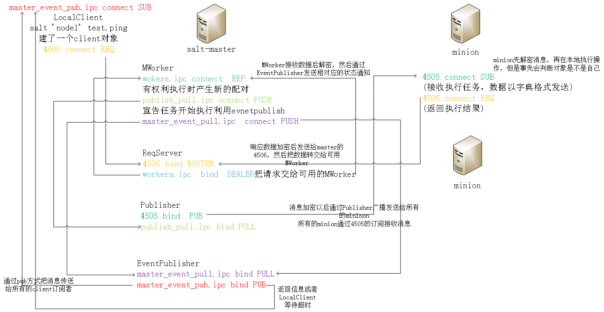

## status
```
$ID:               定义state的名称，通常采用与描述的对象保持一致的方法，如apache、nginx等
   $State:      须管理对象的类型，详见http://docs.saltstack.com/ref/states/all/index.html
      - $state: states      定制对象的状态

salt \* state.sls dhcp   使用
salt \* state.sls dhcp/aaa   使用dhcp目录下的aaa.sls
salt \* state.sls dhcp test=True   测试，不会修改minion
salt \* state.highstate

/usr/lib/python2.6/site-packages/salt/states        映射到modules
/usr/lib/python2.6/site-packages/salt/modules
如果使用states，需要在/srv/salt 下编写sls文件
state
确定你的文件路径
file_roots:
  base:
    - /srv/salt
保证你有入口文件
state文件包

vim /srv/salt/dhcp/init.sls
include:
  - dhcp.python_devel        包含dhcp目录下的python_devel.sls
cat /srv/salt/dhcp/python_devel.sls
dhcp:
  pkg.installed
salt \* state.sls dhcp


[root@node1 salt]# cat top.sls
base:
  '*':
    - test
找test.sls
test是一个sls文件的名字 或者是一个目录的名字（该目录下必须有init.sls这个文件）
[root@node1 salt]# cat test.sls
httpd: #id(默认这个位置对应的是name的值)
  pkg: #state
    - installed #state的函数

state目录
/usr/lib/python2.6/site-packages/salt/states
使用该state
salt 'node2' state.highstate

sls文件的中的任务执行顺序可以使用关键字控制（require）
httpd:        ID
  pkg:        states模块
    - installed        模块的函数
  service.running:
    - require:        需要，依赖
      - pkg: httpd
指定执行某一个sls文件（文件的扩展名.sls不需要写出来）
[root@node1 salt]# salt 'node2' state.sls test
针对配置文件设置监听，实现自动重启
###############################################
httpd:
  pkg:
    - installed
  service:
    - running
    - require:
      - pkg: httpd
    - watch:            观察，文件有变化就启动
      - file: /etc/httpd/conf/httpd.conf
/etc/httpd/conf/httpd.conf:
  file:
    - managed
    - source: salt://httpd.conf
    - require:
      - pkg: httpd
################################################
apache:
  pkg:
    - name: httpd
    - installed

  service.running:
    - name: httpd
    - require:
      - pkg: httpd
    - watch:
      - file: apache_config

apache_config:
  file.managed:
    - name: /etc/httpd/conf/httpd.conf
- source: salt://httpd.conf
- template: jinja    在apache_config控制的文件用jinja渲染
    - require:
      - pkg: httpd

httpd.conf


1、    安装软件包
2、    修改配置文件
3、    启动服务
https://docs.saltstack.com/en/latest/ref/states/all/index.html

vim user.sls
        渲染
{{user}}:                                    变量
user.present
                                结束（如果是if 为endif）

一次调用多个sls文件
vim /srv/salt/top.sls
base:
  ‘*’
-    user
-    apache_start
salt \* state.highstate


源码安装nginx
nginx_source:
 file.recurse:    # file.managed:用于单文件，file.recurse用于目录
  - name: /tmp/
  - source: salt://nginx/
extract_nginx:
cmd.run:
  - cwd: /tmp
  - names:                # 多命令用names，单命令用name
    - tar xf nginx-1.6.2.tar.gz
    - tar xf pcre-8.35.tar.gz
  - require:
    - file: nginx_source
nginx_compile:
cmd.run:
  - cwd: /tmp/nginx-1.6.2
  - names:
    - ./configure --prefix=/usr/local/nginx --with-pcre=/tmp/pcre-8.35 && make
    - make install
  - require:
    - cmd: extract_nginx

自定义
state就是用来控制sls文件与module的映射
state默认路径   /usr/lib/python2.6/site-packages/salt/states

mkdir -pv /srv/salt/_states
[root@node1 _states]# cat wjj.py
def bs(name, x):                                定义函数
    ret = {                                定义一个字典
            'name': name,           
            'changes': {},
            'result': False,
            'comment': 'test_state' 描述的字段
            }
    try:
        result = x*x                做一些事情
        ret['changes']['new'] = result
        ret['result'] = True
    except:                                出现异常怎么办
        ret['changes']['new'] = 'jisuan cuwu'
        return ret
注意你的函数的第一个参数应该永远是name
同步一下你的修改
salt '*' saltutil.sync_all

使用你自定义的state
定义sls文件
[root@node1 _states]# cat /srv/salt/jisuan.sls
test:
  wjj:
    -  bs
    -  x: 3
salt 'node2' state.sls jisuan

tips:在state里面引用salt命令
__salt__['模块.函数'](参数)

#encoding=utf-8
import logging
import os

log = logging.getLogger(__name__)

def touch(name, path, file):
    ret = {
            'name': name,
            'changes': {},
            'result': True,
            'comment': 'test_state'
            }
    #log.error(name)
    #log.error(path)
    try:
        with open(path+'/'+str(file), 'w') as f:
            f.write('my test!')
    except Exception, e:
        log.error(str(e))

    return ret

def delete(name, path, file):
    ret = {
            'name': name,
            'changes': {},
            'result': True,
            'comment': 'test_state'
            }
    cmd='rm -fr ' + path + '/' + file
    os.system(cmd)
    ret['result']=True
    return ret
```


## pillar
```
https://docs.saltstack.com/en/latest/topics/pillar/index.html

修改/etc/salt/master配置中的pillar_opts:Ture或False来定义是否开启或禁用这项功能
目录 /srv/pillar
vim /srv/pillar/top.sls
base:
  '*':
    - vimrc
    - data
    - pkg
 
vim /srv/pillar/data.sls
bind:
  port: 53
  listen-on: any
 
vim /srv/pillar/vimrc.sls
  id标识以server结尾的  类似的startswith
vimrc: salt://edit/vimrc1

vimrc: salt://edit/vimrc2

 
vim /srv/pillar/pkg.sls
    根据不同的操作系统，定义不同的包名
apache: httpd
git: git

apache: apache2
git: git-core

刷新生效 salt '*' saltutil.refresh_pillar
查看     salt \* pillar.items

使用pillar
可以在state、模板文件中引用，模板格式为“{{pillar变量}}”，例如：
{{ pillar['appname'] }}（一级字典）
{{ pillar['flow']['maxconn'] }}（二级字典）或 {{ salt['pillar.get']('flow: 'maxconn', {}) }}
Python API格式如下：pillar['flow']['maxconn']
                                     pillar.get(' flow:appname', {})

1、在state的sls文件
vim /srv/salt/down_vimrc.sls
/root/.vimrc:
  file.managed:
- source: {{ pillar['vimrc'] }}   调用之前定义的pillar
或者- source: {{ salt['pillar.get']('vimrc','salt://edit/vimrc2') }}
                          pillar的key，默认值
salt \* state.show_sls down_vimrc  查看详细的变量
2、salt -I "nginx:80" cmd.run "ls"   -I 指定pillar
3、pillar的临时定义
vim /srv/salt/pillar_temp.sls
        之前没有这个pillar
{{u}}:
  user.present
 
salt 'node2' state.sls pillar_temp pillar='{"u_name": "v1"}'    临时指定一个pillar
```


## job
```
[root@salt-master salt]# salt -I "nginx:80" cmd.run "sleep 100" -v
Executing job with jid 20151011154835704857
salt-run 管理job
salt-run -d |grep jobs
salt-run jobs.active   查看当前正在运行的jobs
salt-run jobs.list_job 20130916125524463507     指定jid查看jobs详细信息    
salt-run jobs.list_jobs      #查看所有jobs信息                
salt-run jobs.lookup_jid 20130916125524463507  #指定jid查询jobs结果
salt-run jobs.print_job   #指定jid查询jobs详细信息
-------------------------------------------------
通过saltutil模块管理job
salt \* sys.doc saltutil |grep job
salt '*' saltutil.find_cached_job <job id>  #查询job cache信息
salt 'node2' saltutil.find_job 20150810003021849521  通过jid查找
salt 'node2' saltutil.is_running cmd.run  通过函数名查找
salt 'node2' saltutil.kill_job 20150810003232388165  杀死一个job
saltutil.running #查看minion当前正在运⾏的jobs
saltutil.find_job<jid> #查看指定jid的job(minion正在运⾏的jobs)
saltutil.signal_job<jid> <single> #给指定的jid进程发送信号
saltutil.term_job <jid> #终⽌指定的jid进程(信号为15)
saltutil.kill_job <jid> #终⽌指定的jid进程(信号为9)
```


## return存储结果
    每台minion跟存储服务器连接后发送返回数据。在大规模的Minion环境下并不适合企业级应用。也有网友通过event事件实现Master端直接Return到存储服务器。参考地址为：http://pengyao.org/salt-stack_master_retuner_over_event_system.html

    使用redis 存储
    修改minion的/etc/salt/minion配置文件
    redis.db: '0'                    #redis数据库
    redis.host: 'vps.shencan.net'    #redis主机(ip地址和域名都行)
    redis.port: 6379                 #redis端口
    minion按照redis客户端  pip install redis
    python -c 'import redis; print redis.VERSION'
    salt 'Minion' cmd.run 'hostname' --return redis

    mysql存储
    /usr/lib/python2.6/site-packages/salt/returners/
    具体的配置   cat mysql.py
    vim /etc/salt/minion（冒号后有空格）
    mysql.host:  '10.255.254.221'
    mysql.user:  'salt'
    mysql.pass:  '123'
    mysql.db:  'salt'
    mysql.port:  3306

    在10.255.254.221这台mysql服务器上
    启动mysql服务
    设置mysql用户，salt，密码，123
    GRANT ALL PRIVILEGES ON *.* TO 'salt'@'%' IDENTIFIED BY ‘123’；

    把以下sql语句保存到/tmp/salt.sql文件中，执行mysql -u root < /tmp/salt.sql
    (创建一个salt库，然后在salt库里面创建两个表jids，salt_returns)
    GRANT ALL PRIVILEGES ON *.* TO 'salt'@'%' IDENTIFIED BY ‘123’；

    CREATE DATABASE  `salt`
          DEFAULT CHARACTER SET utf8
          DEFAULT COLLATE utf8_general_ci;

    USE `salt`;

    DROP TABLE IF EXISTS `jids`;
        CREATE TABLE `jids` (
          `jid` varchar(255) NOT NULL,
          `load` mediumtext NOT NULL,
          UNIQUE KEY `jid` (`jid`)
        ) ENGINE=InnoDB DEFAULT CHARSET=utf8;

    DROP TABLE IF EXISTS `salt_returns`;
        CREATE TABLE `salt_returns` (
          `fun` varchar(50) NOT NULL,
          `jid` varchar(255) NOT NULL,
          `return` mediumtext NOT NULL,
          `id` varchar(255) NOT NULL,
          `success` varchar(10) NOT NULL,
          `full_ret` mediumtext NOT NULL,
          `alter_time` TIMESTAMP DEFAULT CURRENT_TIMESTAMP,
          KEY `id` (`id`),
          KEY `jid` (`jid`),
          KEY `fun` (`fun`)
        ) ENGINE=InnoDB DEFAULT CHARSET=utf8;

    DROP TABLE IF EXISTS `salt_events`;
        CREATE TABLE `salt_events` (
        `id` BIGINT NOT NULL AUTO_INCREMENT,
        `tag` varchar(255) NOT NULL,
        `data` varchar(1024) NOT NULL,
        `alter_time` TIMESTAMP DEFAULT CURRENT_TIMESTAMP,
        `master_id` varchar(255) NOT NULL,
        PRIMARY KEY (`id`),
        KEY `tag` (`tag`)
        ) ENGINE=InnoDB DEFAULT CHARSET=utf8;

    保证你的python能够操作mysql数据库
    yum install MySQL-python -y

    使用mysql作为returner，将结果放入mysql
    [root@node1 ~]# salt 'node2' test.ping --return mysql
    node2:
        True
    ----------------------------------------------------------------
    可以通过salt的schedule去收集minion上的信息。
    schedule:
      uptime:
        function: status.uptime
        seconds: 60
        returner: mysql
      meminfo:
        function: status.meminfo
        minutes: 5
        returner: mysql


## api web
```
用户

# chmod 755 /etc/salt/master /var/run/salt  /var/cache/salt
修改master配置文件
external_auth:
  pam:
    a1:
      - '*':
        - test.*
        - cmd.*
http://docs.saltstack.com/en/latest/topics/eauth/index.html#acl-eauth
切换a1用户进行测试
salt -a pam * test.ping
salt -a pam * cmd.run 'whoami'

测试令牌
$ salt -T -a pam web\* test.ping
[a1@zabbix_server ~]$ salt -T -a pam * test.ping
username: a1
password:
zabbixnode1.example.com:
    True

API

yum install salt-api -y
cd  /etc/pki/tls/certs
# 生成自签名证书, 过程中需要输入key密码及RDNs
make testcert
cd /etc/pki/tls/private/
# 解密key文件，生成无密码的key文件, 过程中需要输入key密码，该密码为之前生成证书时设置的密码
openssl rsa -in localhost.key -out localhost_nopass.key
或者
yum install gcc make python-devel libffi-develpip-python install PyOpenSSL
salt-call tls.create_self_signed_cert  #生成证书，需要有salt-minion，salt-call在salt-minion包里
添加saltapi.conf 文件
vim /etc/salt/master.d/saltapi.conf
rest_cherrypy:
   port: 8000
   host: 127.0.0.1
   #disable_ssl: true 开关https
   ssl_crt: /etc/pki/tls/certs/localhost.crt #使用前面生成的证书
   ssl_key: /etc/pki/tls/certs/localhost.key
external_auth:
    pam:
       saltapi:
          - .*
          - '@runner'
          - '@wheel'    
#添加用户    useradd -M -s /sbin/nologin saltapi    echo "spassword" | passwd saltapi --stdin

重启master
启动salt-api 
----------------------------------------
import json
import urllib
import urllib2
class SaltAPI(object):
    __token_id = ''
    def __init__(self):
        self.__url = url
        self.__user = user
        self.__password = pass
        params = {'eauth': 'pam', 'username': self.__user, 'password': self.__password}
        content = self.postRequest(params, prefix='/login')
        print content['return'][0]['token']
        self.__token_id = content['return'][0]['token']
    def postRequest(self, obj, prefix='/'):
        url = self.__url + prefix
        headers = {'X-Auth-Token': self.__token_id}
        data = urllib.urlencode(obj)
        req = urllib2.Request(url, data, headers)
        opener = urllib2.urlopen(req)
        content = json.loads(opener.read())
        return content
    def postRequest1(self, obj, prefix='/'):
        url = self.__url + prefix
        headers = {'X-Auth-Token': self.__token_id}
        req = urllib2.Request(url, obj, headers)
        opener = urllib2.urlopen(req)
        content = opener.info()
        return content
    def list_all_key(self):
        params = {'client': 'wheel', 'fun': 'key.list_all'}
        content = self.postRequest(params)
        # minions = content['return'][0]['data']['return']['minions']
        # minions_pre = content['return'][0]['data']['return']['minions_pre']
        # return minions,minions_pre
        minions = content['return'][0]['data']['return']
        return minions
    def delete_key(self, node_name):
        params = {'client': 'wheel', 'fun': 'key.delete', 'match': node_name}
        content = self.postRequest(params)
        ret = content['return'][0]['data']['success']
        return ret
    def accept_key(self, node_name):
        params = {'client': 'wheel', 'fun': 'key.accept', 'match': node_name}
        content = self.postRequest(params)
        ret = content['return'][0]['data']['success']
        return ret
    def reject_key(self, node_name):
        params = {'client': 'wheel', 'fun': 'key.reject', 'match': node_name}
        content = self.postRequest(params)
        ret = content['return'][0]['data']['success']
        return ret
    def remote_noarg_execution(self, tgt, fun):
        ''' Execute commands without parameters '''
        params = {'client': 'local', 'tgt': tgt, 'fun': fun}
        content = self.postRequest(params)
        ret = content['return'][0][tgt]
        return ret
    def remote_execution(self, tgt, fun, arg):
        ''' Command execution with parameters '''
        params = {'client': 'local', 'tgt': tgt, 'fun': fun, 'arg': arg}
        content = self.postRequest(params)
        ret = content['return'][0][tgt]
        return ret
    def shell_remote_execution(self, tgt, arg):
        ''' Shell command execution with parameters '''
        params = {'client': 'local', 'tgt': tgt, 'fun': 'cmd.run', 'arg': arg, 'expr_form': 'list'}
        content = self.postRequest(params)
        ret = content['return'][0]
        return ret
    def grains(self, tgt, arg):
        ''' Grains.item '''
        params = {'client': 'local', 'tgt': tgt, 'fun': 'grains.item', 'arg': arg}
        content = self.postRequest(params)
        ret = content['return'][0]
        return ret
    def target_remote_execution(self, tgt, fun, arg):
        ''' Use targeting for remote execution '''
        params = {'client': 'local', 'tgt': tgt, 'fun': fun, 'arg': arg, 'expr_form': 'nodegroup'}
        content = self.postRequest(params)
        jid = content['return'][0]['jid']
        return jid
    def deploy(self, tgt, arg):
        ''' Module deployment '''
        params = {'client': 'local', 'tgt': tgt, 'fun': 'state.sls', 'arg': arg}
        content = self.postRequest(params)
        return content
    def async_deploy(self, tgt, arg):
        ''' Asynchronously send a command to connected minions '''
        params = {'client': 'local_async', 'tgt': tgt, 'fun': 'state.sls', 'arg': arg}
        content = self.postRequest(params)
        jid = content['return'][0]['jid']
        return jid
    def target_deploy(self, tgt, arg):
        ''' Based on the list forms deployment '''
        params = {'client': 'local_async', 'tgt': tgt, 'fun': 'state.sls', 'arg': arg, 'expr_form': 'list'}
        content = self.postRequest(params)
        jid = content['return'][0]['jid']
        return jid
    def jobs_list(self):
        ''' Get Cache Jobs Defaut 24h '''
        url = self.__url + '/jobs/'
        headers = {'X-Auth-Token': self.__token_id}
        req = urllib2.Request(url, headers=headers)
        opener = urllib2.urlopen(req)
        content = json.loads(opener.read())
        jid = content['return'][0]
        return jid
    def runner_status(self, arg):
        ''' Return minion status '''
        params = {'client': 'runner', 'fun': 'manage.' + arg}
        content = self.postRequest(params)
        jid = content['return'][0]
        return jid
    def runner(self, arg):
        ''' Return minion status '''
        params = {'client': 'runner', 'fun': arg}
        content = self.postRequest(params)
        jid = content['return'][0]
        return jid
cl = SaltAPI()
print cl.shell_remote_execution('aws-ms1','date')
print cl.grains('aws-ms1','ipv4')


WEB(halite)很不好用  

这个还行 https://github.com/yueyongyue/saltshaker/
yum install salt-api git
cd /var/www/
git clone https://github.com/saltstack/halite
cd halite/halite
./genindex.py -C
 
vim /etc/salt/master
rest_cherrypy:
host: 0.0.0.0
port: 8080
debug: true
disable_ssl: True
static: /var/www/halite/halite
app: /var/www/halite/halite/index.html
 
external_auth:
   pam:
     salt:
     - .*
     - '@runner'
     - '@wheel'
/etc/init.d/salt-master restart
useradd salt
echo salt | passwd –stdin salt
salt -a pam \*  test.ping 
输入用户和密码 如看到minion返回信息 则表示登陆验证成功
 
启动 salt-api
salt-api -d 或
cd /var/www/halite/halite
python server_bottle.py -d -C -l debug -s cherrypy
打开http://ip:8080/app
```


## beacons
```
https://docs.saltstack.com/en/latest/topics/beacons/index.html
https://docs.saltstack.com/en/latest/ref/beacons/all/index.html#all-salt-beacons
 
1 在minion上定义beacon
beacons:
  service:
    httpd:
      onchangeonly: True
      uncleanshutdown: /var/run/httpd/httpd.pid
只要httpd的状态放生改变就会给master发送事件
2 你要知道发送的event长什么样
salt/beacon/centos2/service/    {
    "_stamp": "2015-12-06T07:24:25.095014",
    "data": {
        "httpd": {
            "running": false,
            "shutdown": "clean"
        },
        "id": "centos2"
    },
    "tag": "salt/beacon/centos2/service/"
}
 
3 编写master配置文件，监听相对应的tag
vim /etc/salt/master
reactor:
  - 'salt/beacon/znode2/service/':
    - '/srv/reactor/backup.sls'
 
4 编写触发文件
vim /srv/reactor/backup.sls

backup file:
  local.cmd.run:
    - tgt: {{data['data']['id']}}
    - arg:
      - "/etc/init.d/httpd start"

 
#如果调用的是state.sls 还要编写相对应的sls文件
 
 
自定义beacon插件
1 mkdir -pv /srv/salt/_beacons
2 在这个目录下编写插件
3 同步
salt '*' saltutil.sync_all
 
4 vim t.py
#你在minion配置文件中的字典，会赋值给config
beacons:
  t:
    - rm: /tmp/kk
    - interval: 2
 
函数的返回值必须是[{'t1':1},{'t2':2}]
 
导入你需要的模块
import 模块名字
def beacon(config):
    ret = []
    r_dict = {}
    拆分config然后去做你想做的判断
    然后把返回值追加到ret
    return ret
 
做一个最简单的审计系统
# -*- coding: utf-8 -*-
 
import logging
import re
import pexpect
log = logging.getLogger(__name__)
 
__virtualname__ = 't'
 
"""
def __virtual__():
    if salt.utils.is_windows():
        return False
    else:
        return __virtualname__
"""
 
def beacon(config):
    '''
    code_block:: yaml
 
        beacons:
          t:
            - rm : /
            - interval: 100
    '''
    ret = []
    user = __salt__['cmd.run']('whoami')
    logging.debug(user)
    r_dict = {}
    for t in config:
        for k,v in t.items():
            cmd = "grep '^.*rm.* /tmp/kk[[:space:]]$' /tmp/.shellog"
            output, status = pexpect.run(cmd, withexitstatus=1)
            if status == 0 :
                logging.debug(output)
                r_dict = { user : output}
                logging.debug(r_dict)
                ret.append(r_dict)
 
    return ret
```


## 安装zabbix_agent
```
ls zabbix_linux_install/
agent_install.sls  init.sls  zabbix_agentd.conf  zabbix.repo

cat init.sls
include:
  - zabbix_linux_install.agent_install

cat zabbix.repo
[zabbix]
baseurl=http://mirrors.aliyun.com/zabbix/zabbix/2.4/rhel/6/x86_64/
gpgcheck=0

cat agent_install.sls
agent_install.sls
/etc/yum.repos.d/zabbix.repo:
  file.managed:
    - source: salt://zabbix_linux_install/zabbix.repo

zabbix-agent:
  cmd.run:
    - name: yum install zabbix-agent-2.4.5 -y
    - require:
      - file: /etc/yum.repos.d/zabbix.repo
  service.running:
    - require:
      - cmd: zabbix-agent
    - watch:
      - file: /etc/zabbix/zabbix_agentd.conf

/etc/zabbix/zabbix_agentd.conf:
  file.managed:
    - source: salt://zabbix_linux_install/zabbix_agentd.conf    ( 主要内容：Hostname={{ grains['ip_interfaces']
                                                                                       ['eth1'][0] }})
    - template: jinja
    - require:
      - cmd: zabbix-agent


老师的




# source pacekages
zabbix_source:
  file.managed:
    - name: /tmp/zabbix-2.4.1.tar.gz
    - unless: test -e /tmp/zabbix-2.4.1.tar.gz
    - source: salt://files/common/zabbix/zabbix-2.4.1.tar.gz

#trace zabbix
extract_zabbix:
  cmd.run:
    - cwd: /tmp
    - names:
      - tar -zxf zabbix-2.4.1.tar.gz >/dev/null 2>&1
    - unless: test -d /tmp/zabbix-2.4.1/
    - require:
      - file: zabbix_source


#Add user
zabbix_user:
  user.present:
    - name: zabbix
    - uid: 1000
    - createhome: False
    - gid_from_name: True
    - shell: /sbin/nologin
/var/log/zabbix:
  file.directory:
    - user: zabbix
    - group: zabbix
    - dir_mode: 755
    - file_mode: 655
    - recurse:
      - user
      - group
"init.sls" 87L, 2508C
agent_start_init:
  file.managed:
    - name: /etc/init.d/zabbix_agentd
    - user: root
    - mode: 0755
    - source: salt://files/common/zabbix/zabbix_agentd
    - source_hash: salt://files/common/zabbix_agent/zabbix_agentd
    - template: jinja
    - defaults:
      ZABBIX_BIN: {{ BINDIR }}
    - unless: if [[ ${cat /etc/init.d/zabbix_agentd  | grep "{{ BINDIR }}" | awk -F'=' 'NR==1{print $2}'} = 
                                                                                 '"{{ BINDIR }}"' ]];then exit 0;fi
  cmd.run:
    - names:
      - /sbin/chkconfig --add zabbix_agentd
      - /sbin/chkconfig zabbix_agentd on
    - unless: /sbin/chkconfig --list zabbix_agentd
  service.running:
    - name: zabbix_agentd
    - enable: True
    - restart: True
zabbix_config_set:
  file.managed:
    - name: /usr/local/zabbix/etc/zabbix_agentd.conf
    - user: root
    - mode: 744
    - source: salt://files/common/zabbix/zabbix_agentd.conf
    - template: jinja
    - defaults:
      ServerADD: {{ Serverip }}
      AgentNAME: {{ NODENAME }}
    - unless: if grep '{{ NODENAME }}' /usr/local/zabbix/etc/zabbix_agentd.conf >/dev/null 2>&1;then exit 0;fi
/usr/bin/zabbix_get:
  file.symlink:
    - target: /usr/local/zabbix/bin/zabbix_get
    - unless: test -L /usr/bin/zabbix_get
/usr/bin/zabbix_sender:
  file.symlink:
    - target: /usr/local/zabbix/bin/zabbix_sender
    - unless: test -L /usr/bin/zabbix_sender
```


## 显示salt进程具体名称
```
安装setproctitle(Master/Minion端均进行)

yum -y install python-setproctitle
重启salt

service salt-master restart
service salt-minion restart
查看Master端进程

ps ax |grep salt |grep -v salt
Master端显示如下(同时个人在行尾追加上进程的具体用途):

2943 ?        S      0:00 /usr/bin/python /usr/bin/salt-master -d ProcessManager       # 中心进程管理器
2944 ?        S      0:00 /usr/bin/python /usr/bin/salt-master -d _clear_old_jobs      # 清除旧的Jobs文件及更新fileserver
2945 ?        Sl     0:00 /usr/bin/python /usr/bin/salt-master -d Publisher            # 将任务PUB到Minion端
2946 ?        Sl     0:00 /usr/bin/python /usr/bin/salt-master -d EventPublisher       # Event Publisher进程
2951 ?        S      0:00 /usr/bin/python /usr/bin/salt-master -d ReqServer_ProcessManager    # ReqServer进程管理器
2952 ?        Sl     0:01 /usr/bin/python /usr/bin/salt-master -d MWorker              # 劳苦大众, 奋斗在一线的Worker进程
2953 ?        Sl     0:01 /usr/bin/python /usr/bin/salt-master -d MWorker              # 同楼上
2954 ?        Sl     0:01 /usr/bin/python /usr/bin/salt-master -d MWorker
2955 ?        Sl     0:01 /usr/bin/python /usr/bin/salt-master -d MWorker
2956 ?        Sl     0:01 /usr/bin/python /usr/bin/salt-master -d MWorker
2957 ?        Sl     0:00 /usr/bin/python /usr/bin/salt-master -d MWorkerQueue         
# 将Ret接口(ROUTER)数据转发到Worker(DEALER)
执行个任务, 看看Minion端怎么显示(同时个人在行尾追加上进程的具体用途):

2003 ?        Sl     0:01 /usr/bin/python /usr/bin/salt-minion -d        # Minion进程, 接收来自Master端的任务
2069 ?        S      0:00 /usr/bin/python /usr/bin/salt-minion -d 20150108034936245247   # 接收到任务后, 会启动名为
对应jid的进程进行任务处理及结果反馈
这样, 就可以非常清晰的知道Salt的每个进程是做什么用途的, 如果Master/Minion进程异常, 也可以迅速的定位
```


## salt安装
```
并发 == 效率
差异性

4505  4506 master        队列  zeromq，raet

salt-call --master=10.21.40.23 --id="host1" state.highstate

yum安装
https://repo.saltstack.com/#rhel  salt官方源，版本更新
http://repo.saltstack.com/yum/redhat
[saltstack-repo]
name=SaltStack repo for RHEL/CentOS $releasever
baseurl=http://repo.saltstack.com/yum/redhat/$releasever/$basearch/latest
enabled=1
gpgcheck=1
gpgkey=http://repo.saltstack.com/yum/redhat/$releasever/$basearch/latest/SALTSTACK-GPG-KEY.pub

yum install epel-release 
yum install salt-master
master端
salt-2014.1.10-4.el6.noarch
salt-master-2014.1.10-4.el6.noarch
salt-minion-2014.1.10-4.el6.noarch（optional）

minion端（客户端）
yum install salt-minion
salt-2014.1.10-4.el6.noarch
salt-minion-2014.1.10-4.el6.noarch

防火墙添加
iptables -I INPUT -m state --state new -m tcp -p tcp --dport 4505 -j ACCEPT
iptables -I INPUT -m state --state new -m tcp -p tcp --dport 4506 -j ACCEPT

python安装
yum install swig
yum install gcc gcc-c++
yum install openssl-devel
yum install libyaml-devel -y

pip install M2Crypto
pip install pyzmq
pip uninstall PyCrypto
pip uninstall salt Jinja2 msgpack-python PyYAML MarkupSafe
pip install PyCrypto
cd /usr/lib/python2.6/site-packages/
rm -fr salt salt-2014.1.4-py2.6.egg-info/
pip install salt

http://docs.saltstack.com/en/latest/


http://msgpack.org/
zeromq
使用了消息队列
信息使用msgpack进行封装

选择salt的理由

1 使用消息队列（异步） zeromq
2 消息封装的是2机制 msgpack封装
3 安全使用aes算法
4 服务器开两个端口4505 4506
5 理念是block（适合拼积木，实现业务流）

配置
在master上编辑vim /etc/hosts
master_ip  master_name
minion_ip  minion_name
然后把这份文件同步到所有的主机上


修改文件描述符
修改sk_buffer
echo 16777216 > /proc/sys/net/core/rmem_max
echo 16777216 > /proc/sys/net/core/wmem_max
echo "4096 87380 16777216" > /proc/sys/net/ipv4/tcp_rmem
echo "4096 87380 16777216" > /proc/sys/net/ipv4/tcp_wmem

 minion  vim /etc/salt/minion
 id: node2 (minion的名字)            冒号后有空格
master: 10.255.254.221（master的ip）
/etc/init.d/salt-minion start
/etc/init.d/salt-master start

查看你的minion是否发送了加入请求
[root@node1 salt]# salt-key -L
                salt-key –A  接受所有minion   -a minion名字   接受指定的minion
测试
salt '*' test.ping
   目标 模块.函数 函数的参数

如何定义目标
shell下的通配符
*
"*.example.com"
"web?.example.com"
"web[1-5].example.com"
regex  正则表达式
salt -E 'web1-(prod|devel).example.com'
list    列表的方式
salt -L 'web1,web2,web3'
grains(数据存放在minion上，默认就有)
[root@node1 salt]# salt 'node1' grains.ls
salt -G 'os:CentOS' test.ping
定义主机组
[root@node1 salt]# vim /etc/salt/master
salt -N 组名 test.ping
批次执行-b （依次执行）

salt '*' sys.doc
如何使用相对应的模块和函数
/usr/lib/python2.6/site-packages/salt/modules
test.ping (是在minion上执行)

http://docs.saltstack.com/en/latest/ref/modules/all/index.html
[root@node1 modules]# salt 'node3' cmd.run 'uptime'
salt中文件的根目录
file_roots:
  base:
    - /srv/salt
salt 'node2' cmd.script salt://test.sh
脚本缓存的路径
/var/cache/salt/minion/files/base
```

## 修改minion id
```
service salt-minion stop
rm -f /etc/salt/pki/minion/minion.pub
rm -f /etc/salt/pki/minion/minion.pem
echo $(hostname) > /etc/salt/minion_id
service salt-minion start

```

## event和反射
```
1、event实际就是一个字典
这个字典有两个固定的key
"tag" 可以用来区分哪一个mininon
"data" 包含更详细的数据，比如执行是否成功，执行的是哪一个函数，以及id是谁
2、把你的minion和master，以及其他的minion可以联动起来
 
master执行  salt-run state.event pretty=True   捕捉event
minion执行 salt-call event.send  'tag'  'data'  data可以没有,tag必须有
master再开一个终端执行salt 'zabbix_server' state.sls apache_install
捕捉到的event:
salt/job/20151018191951447100/ret/zabbix_server    {   tag和data ,字典为data
    "_stamp": "2015-10-18T11:20:19.543008",
    "cmd": "_return",
    "fun": "state.sls",
    "fun_args": [
        "apache_install"
    ],
    "id": "zabbix_server",
    "jid": "20151018191951447100",
    "out": "highstate",
    "retcode": 0,
    "return": {
        "pkg_|-httpd_|-httpd_|-installed": {
            "__run_num__": 0,
            "changes": {},
            "comment": "Package httpd is already installed.",
            "duration": 4001.181,
            "name": "httpd",
            "result": true,
            "start_time": "11:20:14.264181"
        }
    },
"success": true
}
}配置
修改master配置文件
reactor:
  - "salt/job/*":        捕捉到的tag，jid会变化用了*代替
    - /srv/reactor/my_custom_module.sls     捕捉到tag要做的事
mkdir -pv /srv/reactor/  &&  vim /srv/reactor/my_custom_module.sls
  进行一些具体的判断
touch_new_file:
  local.state.sls:   （老版本这里是cmd.state.sls）
    - tgt: 'zabbix_server'   执行的目标
    - arg:
      - newfile       执行/srv/salt/newfile.sls文件
    - kwarg:          临时定义pillar
        pillar:          注意这里是四个空格
          filename: {{ data["fun_args"][0] }}
 ##这个{{data是模板里面的变量}}
相当于 salt ' zabbix_server ' state.sls newfile pillar='{"filename": " apache_install "}'
 
cat /srv/salt/newfile.sls
/tmp/{{pillar['filename']}}:
  file.managed:
- source: salt://passwd
 
到此，执行salt 'zabbix_server' state.sls apache_install后(成功)，就会联动执行newfile.sls
```


## 帮助文档
```
包含所有模块，state等，记不起来可以在这找
salt 'centos2' sys.list_functions
salt 'centos2' sys.list_functions sys
    - sys.argspec
    - sys.doc          文档， salt '*' sys.doc cmd  为cmd的文档，其他类似
    - sys.list_functions   module的所有function的命令， salt  'Minion' sys.list_functions cmd
    - sys.list_modules   Minion支持的所有module列表，salt 'Minion' sys.list_modules
    - sys.list_renderers  查看所有Return列表
    - sys.list_returner_functions
    - sys.list_returners
    - sys.list_runner_functions
    - sys.list_runners
    - sys.list_state_functions  指定states的所有function，salt  'Minion' sys.list_state_functions file
    - sys.list_state_modules   Minion支持的所有states列表
    - sys.state_doc                 state的详细用法与例子
    - sys.reload_modules
    - sys.renderer_doc
    - sys.returner_argspec
    - sys.returner_doc
    - sys.runner_argspec
    - sys.runner_doc
    - sys.state_argspec
   

```


## grains
```
grains是master从minion上拿数据
salt '*' grains.ls
salt 'node1' grains.items
salt 'node1' grains.item os
salt -G 'os:CentOS' test.ping

1、用grains命令添加
salt 'Minion' grains.append  saltbook  'verycool' 
salt '*' grains.setval key "{'sub-key': 'val', 'sub-key2': 'val2'}"  设置多个
salt '*' grains.remove key val  删除

2、在minion端定义grains
vim /etc/salt/minion.d/hostinfo.conf       #自定义grains,相当于打上一个标签，在根据标签进行操作
grains:
  roles:
    - webserver
    - memcache
  deployment: datacenter4
  cabinet: 13
 重启minion   /etc/init.d/salt-minion restart

3、在master端自己编写grains，然后推送给minion
mkdir /srv/salt/_grains
vim /srv/salt/_grains/system.py
import platform
def get_system():
    grains = {}                 # 初始化一个grains字典
    grains['system'] = platform.platform()
    return grains              #返回结果

salt "zabbix_agent" saltutil.sync_grains        #推送给minion（被控端的/var/cache/salt/minion/extmods/grains/目录下）
salt "zabbix_agent" grains.item system        #查看这个grains

使用
grains是静态的
1、通过目标使用grains
salt -G 'os:CentOS' test.ping
2、通过top.sls来使用
vim top.sls
base:
'location:shanghai':
    - match: grain
    - webserver (具体的sls文件名)
salt '*' state.highstate来调用，只有location:shanghai的主机才执行user.sls
3、通过在定义的state，sls文件使用
    or  grains['os']

  'node_type:{{ the_node_type }}':
    - match: grain
    - {{ the_node_type }}

4、通过编写模块来调用grains，__grains__['key']
vim g1.py
def t1():
return __grains__['location']
salt '*' saltutil.sync_modules 推送
salt ‘*’ g1.t1    调用
```


## modules
```
常用模块  http://docs.saltstack.com/ref/modules/all/index.html#all-salt-modules

import salt.client
client = salt.client.LocalClient()
ret = client.cmd('*', 'test.ping')
print ret
Archive压缩包

salt 'centos1' archive.gunzip /tmp/sourcefile.txt.gz   #采用gzunzip解压/tmp/sourcefile.txt.gz包
salt 'centos1' archive.gzip /tmp/sourcefile.txt     #采用gzip压缩/tmp/sourcefile.txt文件
---   API调用：client.cmd('centos1', ' archive.gunzip' ， ['/tmp/sourcefile.txt.gz '])
cmd命令

salt 'centos1' cmd.run "free -m"   #获取所有被控主机的内存使用情况
salt 'centos1' cmd.script salt://script/test.sh   #在centos1主机运行test.sh脚本，其中script/test.sh存放在
file_roots指定的目录，首先同步test.sh到minion的cache目录（如同步到/var/cache/salt/minion/files/base/script/test.sh）；
其次运行该脚本
---  API调用：client.cmd('SN2013-08-021', 'cmd.run',['free -m'])
cp文件目录管理

salt 'centos1' cp.cache_local_file /etc/hosts  #将指定被控主机的/etc/hosts文件复制到被控主机本地的salt cache目录
（/var/cache/salt/minion/localfiles/）
salt 'centos1' cp.get_dir salt://path/to/dir/ /minion/dest   #将主服务器file_roots指定位置下的目录复制到被控主机
salt 'centos1' cp.get_file salt://path/to/file /minion/dest  #将主服务器file_roots指定位置下的文件复制到被控主机
salt 'centos1' cp.get_url http://www.slashdot.org /tmp/index.html  #下载URL内容到被控主机指定位置
-----  API调用：client.cmd('centos1', 'cp.get_file',[' salt://path/to/file ',' /minion/dest'])
crontab定时任务

salt 'centos1' cron.raw_cron root    or  salt 'centos1' cron.list_tab root  #查看指定被控主机、root用户的crontab清单
salt 'centos1' cron.set_job root '*' '*' '*' '*' 1 /usr/local/weekly   #为指定的被控主机、root用户添加/usr/local/weekly任务
salt 'centos1' cron.rm_job root /usr/local/weekly  #删除指定的被控主机、root用户crontab的/usr/local/weekly任务
-----  API调用：client.cmd('centos1', 'cron.set_job',['root','*','*','*','*','*','/usr/echo'])
dnsutil DNS相关

salt 'centos1' dnsutil.hosts_append /etc/hosts 192.168.8.12 salt-master #添加指定被控主机hosts的主机配置项
salt 'centos1' dnsutil.hosts_remove /etc/hosts salt-master  #删除指定被控主机hosts的主机配置项
-----  API调用：client.cmd('*', 'dnsutil.hosts_append',['/etc/hosts','127.0.0.1','ad1.yuk.co'])
file文件

salt 'centos2' file.check_hash /etc/fstab md5:e4b13a1b984950ade18cbc8bc33be658  #校验被控主机/etc/fstab文件的md5
一致则返回True
salt '*' file.get_sum /etc/passwd md5   #校验所有被控主机文件的加密信息、支持md5、sha1、sha224、sha256、sha384、sha512
加密算法
salt '*' file.chown /etc/passwd root root  #修改所有被控主机/etc/passwd文件的属组、用户权限，
等价于chown root:root /etc/passwd
salt '*' file.copy /path/to/src /path/to/dst   #复制所有被控主机本地/path/to/src文件到本地的/path/to/dst文件
salt '*' file.directory_exists /etc   #检查所有被控主机/etc目录是否存在，存在则返回True，检查文件是否存在使用
file.file_exists方法
salt '*' file.stats /etc/passwd    #获取所有被控主机/etc/passwd的stats信息
salt '*' file.get_mode /etc/passwd  #获取所有被控主机/etc/passwd的权限mode，如755、644
salt '*' file.set_mode /etc/passwd 0644   #修改所有被控主机/etc/passwd的权限mode为0644
salt '*' file.mkdir /opt/test   #在所有被控主机创建/opt/test目录
salt '*' file.sed /etc/httpd/httpd.conf 'LogLevel warn' 'LogLevel info'  #将所有被控主机/etc/httpd/httpd.conf
文件的LogLevel参数的warn值修改成info
salt '*' file.append  /tmp/test/test.conf "maxclient 100"  #给所有被控主机的/tmp/test/test.conf文件追加内容"maxclient 100"
salt '*' file.remove /tmp/foo3   #删除所有被控主机的/tmp/foo文件
------  API调用：client.cmd('*', ' file.remove ',['/tmp/foo'])
iptables防火墙

salt '*' iptables.append filter INPUT rule='-m state --state RELATED,ESTABLISHED -j ACCEPT'
salt '*' iptables.insert filter INPUT position=3 rule='-m state --state RELATED,ESTABLISHED -j ACCEPT'
#在所有被控端主机追加(append)、插入(insert)iptables规则,其中INPUT为输入链
salt '*' iptables.delete filter INPUT position=3
salt '*' iptables.delete filter INPUT rule='-m state --state RELATED,ESTABLISHED-j ACCEPT'
#在所有被控端主机删除指定链编号为3（position=3）或指定存在的规则
salt '*' iptables.save /etc/sysconfig/iptables   #保存所有被控端主机规则到本地硬盘(/etc/sysconfig/iptables)
----  API调用： client.cmd('SN2013-08-022', 'iptables.append',['filter','INPUT','rule=\'-p tcp --sport 80 -j ACCEPT\''])
netwrok网络信息

salt 'centos2' network.dig www.qq.com
salt 'centos2' network.ping www.qq.com
salt 'centos2' network.traceroute www.qq.com
#在指定被控主机'centos2'获取dig、ping、traceroute目录域名信息
salt 'centos2' network.hwaddr eth0  #获取指定被控主机的MAC地址
salt 'centos2' network.in_subnet 10.0.0.0/16 #检测指定被控主机是否属于10.0.0.0/16子网范围，属于则返回True
salt 'centos2' network.interfaces #获取指定被控主机的网卡配置信息
salt 'centos2' network.ip_addrs  #获取指定被控主机的IP地址配置信息
salt 'centos2' network.subnets  #获取指定被控主机的子网信息
----  API调用：client.cmd('SN2013-08-022', 'network.ip_addrs')
pkg包管理

salt '*' pkg.install php  #为所有被控主机安装PHP环境，根据不同系统发行版调用不同安装工具进行部署，如redhat平台的yum，
等价于yum -y install php
salt '*' pkg.remove php  #卸载所有被控主机的PHP环境
salt '*' pkg.upgrade   #升级所有被控主机的软件包
----   API调用：client.cmd('SN2013-08-022', 'pkg.remove',['php'])
Service服务

salt '*' service.enable nginx
salt '*' service.disable nginx 
#开启（enable）、禁用（disable）nginx开机自启动服务
salt '*' service.reload nginx
salt '*' service.restart nginx
salt '*' service.start nginx
salt '*' service.stop nginx
salt '*' service.status nginx
#针对nginx服务的reload、restart、start、stop、status操作
-----  API调用： client.cmd('SN2013-08-022', 'service.stop',['nginx'])
other

Saltstack还提供了user（系统用户模块）、group（系统组模块）、partition（系统分区模块）、puppet（puppet管理模块）、
system（系统重启、关机模块）、timezone（时区管理模块）、nginx（Nginx管理模块）、mount（文件系统挂载模块），等等

自定义模块

分发机制
/usr/lib/python2.6/site-packages/salt/modules
在minion执行，可以在master写分发到minion
根目录 fileroot:  /etc/salt/master
/srv/salt
1、    module是在minion执行
2、    master创建2次开发出来的modules,发布到所有的minion
3、mkdir –pv /srv/salt/_modules && cd /srv/salt/_modules
4、创建module文件并且定义函数
cat file.py             模块名File
def t1(num)            函数名
‘’‘salt \* file.t1 ’‘’     描述
return num*num    信息在函数的return里
5、推送给所有的minion  salt '*' saltutil.sync_modules
会推送给minion的路径： /var/cache/salt/minion/extmods/modules
推送所有 : salt '*' saltutil.sync_all  包括以下所有的
```


## zmq
```
saltstack
master 启动


REQSERVER
1 接收来自于client的请求，然后派发给空闲的Mworker
2 接收来自于minion的返回信息
4506 bind ROUTER
workers.ipc  bind  DEALER


Publisher
发布来自于client的请求给所有的minion
4505 bind  PUB
publish_pull.ipc bind PULL


EVENTPUBLISHER
主要是通知client，任务执行的状态，结果！
master_event_pull.ipc bind pull
master_event_pub.ipc bind PUB


MWORKER
多进程，实际处理工作
wokers.ipc connect  REP 


minion
4505 connect SUB (接收执行任务，数据以字典格式发送)
4605 connect REQ (返回执行结果)


执行具体任务的时候
job flow
1 salt '*' test.ping
创建了一个client对象
2 client 4506 REQ connect
发送执行项目
3 REQSERVER把请求交给可用的MWOKER，通过wokers.ipc

4 首先，确定你有权利这么做。然后通过publish 把client交予的命令发送给所有的minion。ClearFuncs.publish()
MWokers 产生新的配对
publish_pull.ipc connect PUSH

5 你的woker宣告任务开始执行利用evnetpublish
master_event_pull.ipc  connect push
然后eventpublish通过pub方式把消息传送给所有的client订阅者
（连接到master_event_pub.ipc）

6 消息加密以后通过Publisher发送给所有的mininon

7 所有的minion通过4505的订阅接收消息

8 minion先解密消息，再在本地执行操作，但是事先会判断对象是不是自己

9 minion把响应数据加密后发送给master的4506，master把数据交给可用Mwoker

10 Mwoker接收数据后解密，然后通过eventpublish 发送相对应的状态通知

11 此时你的LocalClient就接收到返回信息了。或者等待超时。
 
12 当所有的minion都返回了结果，或者超时，则此次任务结束。
salt-zmq.png
```



