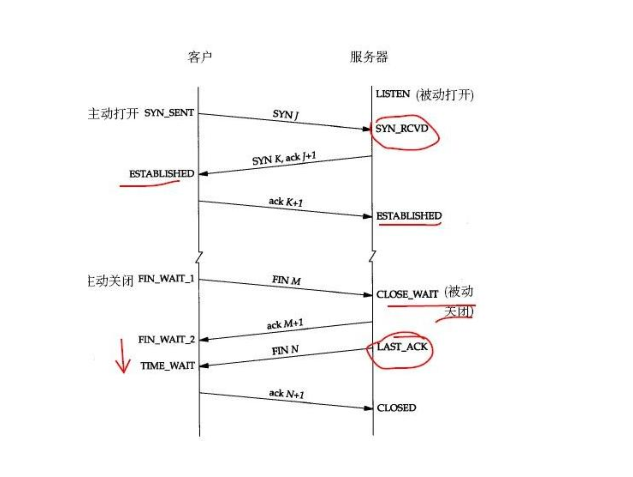
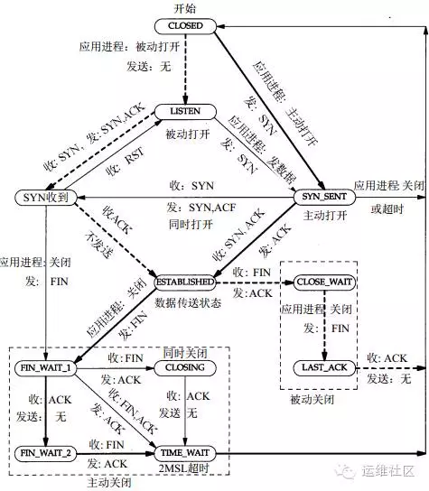
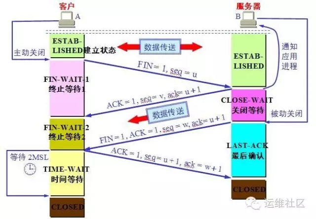
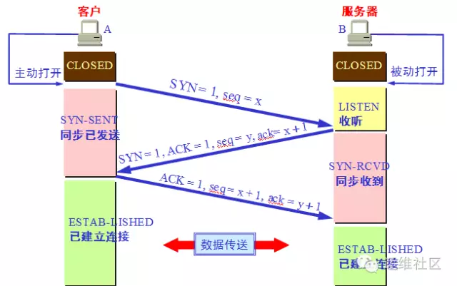

## TCP状态变迁
在Web性能优化中，我们经常会调整很多TCP相关的性能参数，那么今天我们深入理解一下TCP协议的
11种状态变迁。我相信大家已经对于TCP连接的三次握手和四次挥手，并不陌生。在这其中TCP定义了
11种状态，下面我们来看看TCP的状态转换。

TCP状态变迁图





首先，在开始理解这个TCP状态转换图之前，我们需要明确，在实际情况下我们的Web服务器，
会同时充当两种角色：

充当服务器端的角色：就是作为Web服务器，等待客户端来进行请求。

充当客户端的角色：Web服务器作为请求的客户端请求后端的Redis或者MySQL等，或者请求其它
互联网上的服务。如果是作为反向代理，那么会请求后端的其它Web服务器。

备注：客户端和服务器端都可以主动发起关闭。

三次握手的状态变迁

要搞明白一个HTTP请求的时候，在TCP层面的11种状态转换，那么就需要我们的思路在客户端和
服务器端两种角色之间不停的变换。

客户端：

我们先从实线开始看，实线是客户端的状态变迁、虚线是服务器端的状态变迁。所以先看图的右半侧。

CLOSED：作为起始状态。

SYN\_SENT：（CLOSED-&gt;SYN\_SENT）

当某个应用进程在CLOSED状态下执行主动打开时，那就开始了TCP的三次握手，TCP将发送一个SYN，
然后这个客户端的状态由CLOSE转换为SYN\_SENT状态。

注意，我们先不要考虑服务器端的状态，我们继续看客户端。

ESTABLISHED：（SYN\_SENT-&gt; ESTABLISHED）

那么这个时候根据TCP的三次握手，服务器端会发送一个带ACK的SYN给客户端，那么客户端收到后，
会发送一个ACK给服务器端，这个时候客户端的状态就会从SYN\_SENT转换为ESTABLISHED，那么
这个状态我们应该非常熟悉，因为这个是数据传送发生的一个状态，表示已经建立TCP连接，并且
可以进行数据传送。可以看到图中标注的是收：SYN，ACK 发：ACK。

服务器端：

请注意！先不要往看ESTABLISHED以下的状态转换，我们现在马上把视角转换到服务器端，看看
服务器端在刚才的过程中都经历了哪些状态，我们需要看图的左半侧。

LISTEN：

比如我们客户端请求的是一个Web服务器，例如是Nginx服务，它监听在80端口，那么此时的TCP
状态为LISTEN，注意服务器端的起始状态也是CLOSE。

SYN\_RCVD：\(LISTEN-&gt;SYN\_RCVD\)

好的，现在处于LISTEN状态的Nginx服务器收到了客户端发过来的SYN，然后自身状态从LISTEN转换为
SYN\_RCVD，我们想想此时客户端处于什么状态，与之相对应的SYN\_SENT。服务器端是收SYN，
发送SYN和ACK给客户端。

ESTABLISHED：（SYN\_RCVD&gt; ESTABLISHED）

服务器端发送完毕SYN和ACK后，客户端会返回一个ACK，那么当服务器端接收到这个ACK后，
状态从SYN\_RCVD转换到了ESTABLISHED。

好的，我们刚才已经详细说明了，在TCP建立连接过程中，客户端和服务器端的状态转换，
先不要继续往下看这个大图，我们在通过下面的小图按照TCP三次握手的方式，再次来梳理一下流程。



客户端执行主动打开，发送seq=x。SYN标志位置为1。状态从CLOSED到SYN\_SENT。

服务器端被动打开，从CLOSED到LISTEND，收到客户端的SYN后，TCP标志位SYN、AC都置为1，
然后回复确认号ack=x+1，同时也发送一个序列号seq=y。状态从LISTEN转换为SYN\_RCVD。

客户端收到服务器端的确认后，将TCP标志位ACK置为1，确认号是ack=y+1，发送序号seq=x+1，
此时进入ESTABLISHEN状态

服务器收到客户端发的信息后，也进入EXTABLISHED状态。

TCP四次挥手的连接状态：

```
 我们需要继续看这个状态转换的大图，这次我们要从ESTABLISHED开始往下看。这次我们还是
 从客户端开始看。
```

客户端FIN\_WAIT\_1:（ESTABLISHED-&gt;FIN\_WAIT\_1）：客户端在ESTABLISHED的状态下，
发送FIN给服务器端要求关闭连接，这个时候，客户端的状态从ESTABLISHED转换为FIN\_WAIT\_1。

服务器端CLOSE\_WAIT：\(ESTABLISHED-&gt;CLOSE\_WAIT\)好的，我们先将客户端的状态暂停下，
回过来头来看服务器端，那么服务器端收到客户端发过来的FIN后，立即发送一个ACK确认，然后状态从ESTABLISHED转换到了CLOSE\_WAIT。

客户端FIN\_WAIT\_2：\(FIN\_WAIT\_1-&gt;FIN\_WAIT\_2\)好的，我们再回来到客户端，
刚才服务器端给他发了一个ACK，也就是它收到了客户端的FIN的报文，这个时候，客户端马上从
FIN\_WAIT\_1转换到FIN\_WAIT\_2。

服务端LAST\_ACK:\(CLOSE\_WAIT-&gt;LAST\_ACK\)

好的注意此时客户端不能再给服务端发送任何的数据了，但是服务端能给客户端发。此时就是我们
说的“半关闭”状态。那么此时服务端在干啥呢，他通知上层应用，比如HTTP，关闭连接，当上层
的数据发送完毕后，通知TCP说可以释放连接了，此时服务端给客户端发送一个FIN。然后自己从
CLOSE\_WAIT状态转换为了LAST\_ACK状态。那么如果上层应用吃吃不关闭呢？大家考虑下回发生什么。

客户端TIME\_WAIT：（FIN\_WAIT\_2-&gt;TIME\_WAIT）刚才服务器端给客户端发送了一个
FIN后进入到了LAST\_ACK的状态，那么客户端收到这个FIN后，从FIN\_WAIT\_2转换为TIME\_WAIT。
注意同时客户端会发回一个ACK给服务器端。

服务器端CLOSED：\(LAST\_ACK-&gt;CLOSED\)我们先不管客户端，现在服务器端收到刚才客户端
发送的ACK后，状态从LAST\_ACK转换为了CLOSED状态。好的，服务端这边完事了。

客户端：客户端还在TIME\_WAIT呢。我们去看看它。

TIME\_WAIT状态有两个存在的理由：

可靠地实现TCP全双工连接的终止；

允许老的重复分节在网络中消逝。

那么在Linux下，这个状态要持续60秒，然后客户端的状态变换为CLOSED。



注意：还有同时打开和同时关闭等特殊情况这里没有列举。你现在可以对着小图，在脑海里在
梳理一遍四次挥手的时候客户端和服务器端的状态变换。今天的分享先到这里，后面我们有
文章，重点分析TIME\_WAIT状态和调优。

## Too many open files
```
java.net.SocketException: Too many open files
 at java.net.Socket.createImpl(Socket.java:388)
 at java.net.Socket.connect(Socket.java:517)
 at java.net.Socket.connect(Socket.java:469)
 at sun.net.NetworkClient.doConnect(NetworkClient.java:163)
 at sun.net.www.http.HttpClient.openServer(HttpClient.java:394)
 at sun.net.www.http.HttpClient.openServer(HttpClient.java:529)
 at sun.net.www.http.HttpClient.<init>(HttpClient.java:233)
 at sun.net.www.http.HttpClient.New(HttpClient.java:306)
 at sun.net.www.http.HttpClient.New(HttpClient.java:323)
 at sun.net.www.protocol.http.HttpURLConnection.getNewHttpClient(HttpURLConnection.java:852)
 at sun.net.www.protocol.http.HttpURLConnection.plainConnect(HttpURLConnection.java:793)
 at sun.net.www.protocol.http.HttpURLConnection.connect(HttpURLConnection.java:718)
 at sun.net.www.protocol.http.HttpURLConnection.getOutputStream(HttpURLConnection.java:896)
 at a8.mms.util.Tools.postObject(Tools.java:301) 情景描述：系统产生大量“Too many open files” 
原因分析：在服务器与客户端通信过程中，因服务器发生了socket未关导致的closed_wait发生，致使监听port打开的句柄数到了1024个，
且均处于close_wait的状态，最终造成配置的port被占满出现“Too many open files”，无法再进行通信。 
close_wait状态出现的原因是被动关闭方未关闭socket造成，如附件图所示： 

解决办法：有两种措施可行 
一、解决： 
原因是因为调用ServerSocket类的accept()方法和Socket输入流的read()方法时会引起线程阻塞，所以应该用setSoTimeout()方法设置
超时（缺省的设置是0，即超时永远不会发生）；超时的判断是累计式的，一次设置后，每次调用引起的阻塞时间都从该值中扣除，直至另一次
超时设置或有超时异常抛出。 
比如，某种服务需要三次调用read()，超时设置为1分钟，那么如果某次服务三次read()调用的总时间超过1分钟就会有异常抛出，如果要在同
一个Socket上反复进行这种服务，就要在每次服务之前设置一次超时。 
二、规避： 
调整系统参数，包括句柄相关参数和TCP/IP的参数； 

注意： 
/proc/sys/fs/file-max 是整个系统可以打开的文件数的限制，由sysctl.conf控制； 
ulimit修改的是当前shell和它的子进程可以打开的文件数的限制，由limits.conf控制； 
lsof是列出系统所占用的资源,但是这些资源不一定会占用打开文件号的；比如：共享内存,信号量,消息队列,内存映射等,虽然占用了这些资源,
但不占用打开文件号； 
因此，需要调整的是当前用户的子进程打开的文件数的限制，即limits.conf文件的配置； 
如果cat /proc/sys/fs/file-max值为65536或甚至更大，不需要修改该值； 
若ulimit -a ；其open files参数的值小于4096（默认是1024), 则采用如下方法修改open files参数值为8192；方法如下： 
1.使用root登陆，修改文件/etc/security/limits.conf 
vi /etc/security/limits.conf 添加 
xxx - nofile 8192 
xxx 是一个用户，如果是想所有用户生效的话换成 * ，设置的数值与硬件配置有关，别设置太大了。 
#<domain>      <type>     <item>         <value> 

*         soft    nofile    8192 
*         hard    nofile    8192 

#所有的用户每个进程可以使用8192个文件描述符。 
2.使这些限制生效 
确定文件/etc/pam.d/login 和/etc/pam.d/sshd包含如下行： 
session required pam_limits.so 
然后用户重新登陆一下即可生效。 
3. 在bash下可以使用ulimit -a 参看是否已经修改： 

一、 修改方法：（暂时生效,重新启动服务器后,会还原成默认值） 
sysctl -w net.ipv4.tcp_keepalive_time=600   
sysctl -w net.ipv4.tcp_keepalive_probes=2 
sysctl -w net.ipv4.tcp_keepalive_intvl=2 

注意：Linux的内核参数调整的是否合理要注意观察，看业务高峰时候效果如何。 

二、 若做如上修改后，可起作用；则做如下修改以便永久生效。 
vi /etc/sysctl.conf 

若配置文件中不存在如下信息，则添加： 
net.ipv4.tcp_keepalive_time = 1800 
net.ipv4.tcp_keepalive_probes = 3 
net.ipv4.tcp_keepalive_intvl = 15 

编辑完 /etc/sysctl.conf,要重启network 才会生效 
/etc/rc.d/init.d/network restart 
然后，执行sysctl命令使修改生效，基本上就算完成了。 

------------------------------------------------------------ 
修改原因： 

当客户端因为某种原因先于服务端发出了FIN信号，就会导致服务端被动关闭，若服务端不主动关闭socket发FIN给Client，此时服务端Socket
会处于CLOSE_WAIT状态（而不是LAST_ACK状态）。通常来说，一个CLOSE_WAIT会维持至少2个小时的时间（系统默认超时时间的是7200秒，
也就是2小时）。如果服务端程序因某个原因导致系统造成一堆CLOSE_WAIT消耗资源，那么通常是等不到释放那一刻，系统就已崩溃。因此，
解决这个问题的方法还可以通过修改TCP/IP的参数来缩短这个时间，于是修改tcp_keepalive_*系列参数： 
tcp_keepalive_time： 
/proc/sys/net/ipv4/tcp_keepalive_time 
INTEGER，默认值是7200(2小时) 
当keepalive打开的情况下，TCP发送keepalive消息的频率。建议修改值为1800秒。 

tcp_keepalive_probes：INTEGER 
/proc/sys/net/ipv4/tcp_keepalive_probes 
INTEGER，默认值是9 
TCP发送keepalive探测以确定该连接已经断开的次数。(注意:保持连接仅在SO_KEEPALIVE套接字选项被打开是才发送.次数默认不需要修改,
当然根据情形也可以适当地缩短此值.设置为5比较合适) 

tcp_keepalive_intvl：INTEGER 
/proc/sys/net/ipv4/tcp_keepalive_intvl 
INTEGER，默认值为75 
当探测没有确认时，重新发送探测的频度。探测消息发送的频率（在认定连接失效之前，发送多少个TCP的keepalive探测包）。
乘以tcp_keepalive_probes就得到对于从开始探测以来没有响应的连接杀除的时间。默认值为75秒，也就是没有活动的连接将在
大约11分钟以后将被丢弃。(对于普通应用来说,这个值有一些偏大,可以根据需要改小.特别是web类服务器需要改小该值,15是个比较合适的值) 

【检测办法】 
1. 系统不再出现“Too many open files”报错现象。 

2. 处于TIME_WAIT状态的sockets不会激长。 

在 Linux 上可用以下语句看了一下服务器的TCP状态(连接状态数量统计)： 

netstat -n | awk '/^tcp/ {++S[$NF]} END {for(a in S) print a, S[a]}' 

返回结果范例如下： 

ESTABLISHED 1423 
FIN_WAIT1 1 
FIN_WAIT2 262 
SYN_SENT 1 
TIME_WAIT 962 ulimit -a  指令可查询系统的文件等限制设置数值
```


## time_wait过多
```
vi /etc/sysctl.conf
编辑/etc/sysctl.conf文件，增加三行：
引用
net.ipv4.tcp_syncookies = 1
net.ipv4.tcp_tw_reuse = 1
net.ipv4.tcp_tw_recycle = 1
说明：
net.ipv4.tcp_syncookies = 1 表示开启SYN Cookies。当出现SYN等待队列溢出时，启用cookies来处理，可防范少量SYN攻击，
默认为0，表示关闭；
net.ipv4.tcp_tw_reuse = 1 表示开启重用。允许将TIME-WAIT sockets重新用于新的TCP连接，默认为0，表示关闭；
net.ipv4.tcp_tw_recycle = 1 表示开启TCP连接中TIME-WAIT sockets的快速回收，默认为0，表示关闭。
再执行以下命令，让修改结果立即生效：
/sbin/sysctl -p
```


## last_ack过多
```
netstat -ant|fgrep ":"|cut -b 77-90|sort |uniq -c

  6 CLOSE\_WAIT 

  7 CLOSING     
6838 ESTABLISHED

1037 FIN_WAIT1

357 FIN\_WAIT2   
5830 LAST_ACK

  2 LISTEN      

276 SYN\_RECV    

 71 TIME\_WAIT   
[root@ccsafe ~]#

看看系统状态，性能都花在系统中断和上下文切换

[root@ccsafe ~]# vmstat 2

procs -----------memory---------- ---swap-- -----io---- --system-- -----cpu------

r b swpd free buff cache si so bi bo in cs us sy id wa st

1 0 0 3091812 363032 284132 0 0 0 0 1 1 0 0 100 0 0

0 0 0 3091812 363032 284132 0 0 0 0 13750 3174 0 5 94 0 0

0 0 0 3091936 363032 284132 0 0 0 0 13666 3057 1 5 94 0 0

0 0 0 3092060 363032 284132 0 0 0 16 13749 3030 0 5 95 0 0

0 0 0 3092060 363032 284132 0 0 0 0 13822 3144 0 5 95 0 0

0 0 0 3092060 363032 284132 0 0 0 0 13390 2961 0 5 95 0 0

0 0 0 3092060 363032 284132 0 0 0 0 13541 3182 0 6 94 0 0

查看socket队列信息

[root@ccsafe ~]# sar -n SOCK 5

Linux 2.6.18-53.1.13.el5PAE (ccsafe) 10/21/2008

06:31:43 PM totsck tcpsck udpsck rawsck ip-frag tcp-tw

06:31:48 PM 6951 13868 1 0 0 430

Average: 6951 13868 1 0 0 430

根据TCP状态的变化过程来分析，LAST_ACK属于被动关闭连接过程中的状态

ESTABLISHED->CLOSE_WAIT->（发送ACK）->LAST_ACK->(发送FIN+接收ACK)->CLOSED

现在状态都堆积到LAST_ACK，初步判断问题从上下两个状态着手

调节一下LAST_ACK时间...

[root@ccsafe ~]# sysctl -a |grep last_ack

net.ipv4.netfilter.ip_conntrack_tcp_timeout_last_ack = 30

[root@ccsafe ~]# sysctl -w net.ipv4.netfilter.ip_conntrack_tcp_timeout_last_ack=10

net.ipv4.netfilter.ip_conntrack_tcp_timeout_last_ack = 10

[root@ccsafe ~]# sysctl -p

[root@ccsafe ~]# watch -n 10 "netstat -ant|fgrep ":"|cut -b 77-90|sort |uniq -c"

Every 5.0s: netstat -ant|fgrep :|cut -b 77-90|sort |uniq -c

  6 CLOSE\_WAIT

  9 CLOSING
6420 ESTABLISHED

693 FIN\_WAIT1

391 FIN\_WAIT2
5081 LAST_ACK

  2 LISTEN

203 SYN\_RECV

 66 TIME\_WAIT
检查一下LAST_ACK所对应的应用

[root@ccsafe ~]# netstat -ant|fgrep "LAST_ACK"|cut -b 49-75|cut -d ":" -f1|sort |uniq -c|sort -nr --key=1,7|head -5

101 220.160.210.6

 46 222.75.65.69

 31 221.0.91.118

 24 222.210.8.160

 22 60.161.81.28
[root@ccsafe ~]#

[root@ccsafe ~]# netstat -an|grep "220.160.210.6"

tcp 0 17280 10.1.1.145:80 220.160.210.6:52787 ESTABLISHED

tcp 1 14401 10.1.1.145:80 220.160.210.6:52513 LAST_ACK

tcp 1 14401 10.1.1.145:80 220.160.210.6:52769 LAST_ACK

tcp 1 14401 10.1.1.145:80 220.160.210.6:52768 LAST_ACK

tcp 0 8184 10.1.1.145:80 220.160.210.6:52515 LAST_ACK

tcp 1 14401 10.1.1.145:80 220.160.210.6:52514 LAST_ACK

tcp 0 8184 10.1.1.145:80 220.160.210.6:52781 LAST_ACK

是TCP80端口的应用，调节一下nginx的keepalive时间...

[root@ccsafe ~]# /usr/local/nginx/sbin/nginx -t -c /usr/local/nginx/conf/nginx.conf

2008/10/21 19:15:31 [info] 21352#0: the configuration file /usr/local/nginx/conf/nginx.conf syntax is ok

2008/10/21 19:15:31 [info] 21352#0: the configuration file /usr/local/nginx/conf/nginx.conf was tested successfully

[root@ccsafe ~]# ps aux|egrep '(PID|nginx)'

USER PID %CPU %MEM VSZ RSS TTY STAT START TIME COMMAND

root 8290 0.0 0.0 7572 1124 ? Ss Oct04 0:00 nginx: master process /usr/local/nginx/sbin/nginx

nobody 8291 0.2 0.3 19704 13776 ? S Oct04 71:35 nginx: worker process

nobody 8292 0.3 0.2 17604 11680 ? S Oct04 77:26 nginx: worker process

nobody 8293 0.2 0.4 22528 16636 ? S Oct04 58:13 nginx: worker process

nobody 8294 0.3 0.4 24944 19020 ? S Oct04 94:07 nginx: worker process

nobody 8295 0.3 0.5 27496 21508 ? S Oct04 84:41 nginx: worker process

nobody 8296 0.3 0.1 13388 7496 ? S Oct04 84:14 nginx: worker process

nobody 8297 0.2 0.0 9196 3268 ? S Oct04 58:21 nginx: worker process

nobody 8298 0.3 0.2 15392 9504 ? S Oct04 75:16 nginx: worker process

root 21354 0.0 0.0 3896 720 pts/0 S+ 19:15 0:00 egrep (PID|nginx)

（动态加载新配置）

[root@ccsafe ~]# kill -HUP 8290

[root@ccsafe ~]#

Every 10.0s: netstat -ant|fgrep :|cut -b 77-90 |sort |uniq -c

  1 CLOSE\_WAIT
1138 CLOSING

7161 ESTABLISHED

1427 FIN_WAIT1

396 FIN\_WAIT2
5740 LAST_ACK

  2 LISTEN

350 SYN\_RECV

148 TIME\_WAIT
...

[root@ccsafe ~]# netstat -ant|fgrep ":"|cut -b 77-90 |sort |uniq -c

1151 CLOSING

8506 ESTABLISHED

1452 FIN_WAIT1

666 FIN\_WAIT2   
6568 LAST_ACK

  2 LISTEN      

429 SYN\_RECV    

 92 TIME\_WAIT   
...

LAST_ACK不下，而且CLOSING 和FIN_WAIT突增

着重看看可影响主动断开TCP连接时几个参数

tcp_keepalive_intvl:探测消息发送的频率

tcp_keepalive_probes:TCP发送keepalive探测以确定该连接已经断开的次数

tcp_keepalive_time:当keepalive打开的情况下，TCP发送keepalive消息的频率

[root@ccsafe ~]# sysctl -a|grep tcp_keepalive

net.ipv4.tcp_keepalive_intvl = 30

net.ipv4.tcp_keepalive_probes = 2

net.ipv4.tcp_keepalive_time = 160

tcp_retries2:在丢弃激活(已建立通讯状况)的TCP连接之前﹐需要进行多少次重试

[root@ccsafe ~]# sysctl -a |grep tcp_retries

net.ipv4.tcp_retries2 = 15

net.ipv4.tcp_retries1 = 3

加速处理那些等待ACK的LAST_ACK，减少等待ACK的LAST_ACK的重试次数

[root@ccsafe ~]# sysctl -w net.ipv4.tcp_retries2=5

net.ipv4.tcp_retries2 = 5

减少keepalive发送的频率

[root@ccsafe ~]# sysctl -w net.ipv4.tcp_keepalive_intvl=15

net.ipv4.tcp_keepalive_intvl = 15

[root@ccsafe ~]# sysctl -p

排除syncookies的影响

[root@ccsafe ~]# !ec

echo "0" >/proc/sys/net/ipv4/tcp_syncookies

[root@ccsafe ~]# echo "1" >/proc/sys/net/ipv4/tcp_syncookies

[root@ccsafe ~]# sysctl -a|grep tcp_keepalive

net.ipv4.tcp_keepalive_intvl = 30

net.ipv4.tcp_keepalive_probes = 2

net.ipv4.tcp_keepalive_time = 160

[root@ccsafe ~]# sysctl -a|grep syncookies

net.ipv4.tcp_syncookies = 1

延长keepalive检测周期，保留ESTABLISHED数量

[root@ccsafe ~]# echo "1800" >/proc/sys/net/ipv4/tcp_keepalive_time

[root@ccsafe ~]# echo "5" >/proc/sys/net/ipv4/tcp_keepalive_probes

[root@ccsafe ~]# echo "15" >/proc/sys/net/ipv4/tcp_keepalive_intvl

[root@ccsafe ~]# sysctl -a|grep tcp_keepalive

net.ipv4.tcp_keepalive_intvl = 15

net.ipv4.tcp_keepalive_probes = 5

net.ipv4.tcp_keepalive_time = 1800

[root@ccsafe ~]# !wat

watch -n 10 "netstat -ant|fgrep ":"|cut -b 77-90|sort |uniq -c"

Every 10.0s: netstat -ant|fgrep :|cut -b 77-90|sort |uniq -c

  1 CLOSE\_WAIT

363 CLOSING
5145 ESTABLISHED

1073 FIN_WAIT1

174 FIN\_WAIT2
6042 LAST_ACK

  2 LISTEN

301 SYN\_RECV

 85 TIME\_WAIT
LAST_ACK不下，但是CLOSING有所回落

tcp_orphan_retries:在近端丢弃TCP连接之前﹐要进行多少次重试。

[root@ccsafe ~]# sysctl -a|grep tcp_orphan

net.ipv4.tcp_orphan_retries = 0

关键，丢TCP太频繁了，以至于后勤都跟不上。设置丢弃之前的重试次数

[root@ccsafe ~]# echo "3" >/proc/sys/net/ipv4/tcp_orphan_retries

[root@ccsafe ~]# !wat

watch -n 10 "netstat -ant|fgrep ":"|cut -b 77-90|sort |uniq -c"

Every 10.0s: netstat -ant|fgrep :|cut -b 77-90|sort |uniq -c

  1 CLOSE\_WAIT

 24 CLOSING
5422 ESTABLISHED

279 FIN\_WAIT1

214 FIN\_WAIT2
1966 LAST_ACK

  2 LISTEN

269 SYN\_RECV

 74 TIME\_WAIT
上下调节该值，找个合适的临界点

[root@ccsafe ~]# echo "7" >/proc/sys/net/ipv4/tcp_orphan_retries

[root@ccsafe ~]# !wat

watch -n 10 "netstat -ant|fgrep ":"|cut -b 77-90|sort |uniq -c"

Every 10.0s: netstat -ant|fgrep :|cut -b 77-90|sort |uniq -c

  1 CLOSE\_WAIT

175 CLOSING
5373 ESTABLISHED

436 FIN\_WAIT1

209 FIN\_WAIT2
3184 LAST_ACK

  2 LISTEN

283 SYN\_RECV

110 TIME\_WAIT
恢复，同时FIN_WAIT1的值过高。考虑减少tcp_fin_timeout时间

[root@ccsafe ~]# echo "2" >/proc/sys/net/ipv4/tcp_orphan_retries

[root@ccsafe ~]# sysctl -a|grep tcp_fin

net.ipv4.tcp_fin_timeout = 10

[root@ccsafe ~]# echo "5" >/proc/sys/net/ipv4/tcp_fin_timeout

[root@ccsafe ~]# !wat

watch -n 10 "netstat -ant|fgrep ":"|cut -b 77-90|sort |uniq -c"

Every 10.0s: netstat -ant|fgrep :|cut -b 77-90|sort |uniq -c

  2 CLOSE\_WAIT

 17 CLOSING
5665 ESTABLISHED

145 FIN\_WAIT1

141 FIN\_WAIT2
1068 LAST_ACK

  2 LISTEN

287 SYN\_RECV

 68 TIME\_WAIT
相比FIN_WAIT，SYN_RECV的值偏高。加大发送synack的质量

[root@ccsafe ~]# sysctl -a|grep synack

net.ipv4.tcp_synack_retries = 1

[root@ccsafe ~]# echo "2" >/proc/sys/net/ipv4/tcp_synack_retries

[root@ccsafe ~]# !wat

watch -n 10 "netstat -ant|fgrep ":"|cut -b 77-90|sort |uniq -c"

Every 10.0s: netstat -ant|fgrep :|cut -b 77-90|sort |uniq -c

  3 CLOSE\_WAIT

 16 CLOSING
5317 ESTABLISHED

200 FIN\_WAIT1

158 FIN\_WAIT2
1001 LAST_ACK

  2 LISTEN

303 SYN\_RECV

 78 TIME\_WAIT
[root@ccsafe ~]# sysctl -a|grep keepalive

net.ipv4.tcp_keepalive_intvl = 15

net.ipv4.tcp_keepalive_probes = 5

net.ipv4.tcp_keepalive_time = 1800

[root@ccsafe ~]# watch -n 10 "netstat -ant|fgrep ":"|cut -b 77-90|sort |uniq -c"

Every 10.0s: netstat -ant|fgrep :|cut -b 77-90|sort |uniq -c

  1 CLOSE\_WAIT

  7 CLOSING
5356 ESTABLISHED

175 FIN\_WAIT1

136 FIN\_WAIT2
1045 LAST_ACK

  2 LISTEN

345 SYN\_RECV

 64 TIME\_WAIT
减少keepalive的检测周期，LAST_ACK上升

[root@ccsafe ~]# echo "10" >/proc/sys/net/ipv4/tcp_keepalive_intvl

[root@ccsafe ~]# echo "1" >/proc/sys/net/ipv4/tcp_synack_retries

[root@ccsafe ~]# !wat

watch -n 10 "netstat -ant|fgrep ":"|cut -b 77-90|sort |uniq -c"

Every 10.0s: netstat -ant|fgrep :|cut -b 77-90|sort |uniq -c

  1 CLOSE\_WAIT

 13 CLOSING
5605 ESTABLISHED

212 FIN\_WAIT1

131 FIN\_WAIT2
1143 LAST_ACK

  2 LISTEN

252 SYN\_RECV

 79 TIME\_WAIT
恢复

[root@ccsafe ~]# echo "15" >/proc/sys/net/ipv4/tcp_keepalive_intvl

[root@ccsafe ~]# watch -n 10 "netstat -ant|fgrep ":"|cut -b 77-90|sort |uniq -c"

Every 10.0s: netstat -ant|fgrep :|cut -b 77-90|sort |uniq -c

  3 CLOSE\_WAIT

 14 CLOSING
5862 ESTABLISHED

230 FIN\_WAIT1

205 FIN\_WAIT2
1064 LAST_ACK

  2 LISTEN

244 SYN\_RECV

 59 TIME\_WAIT
[root@ccsafe ~]# watch -n 10 "netstat -ant|fgrep ":"|cut -b 77-90|sort |uniq -c"

Every 10.0s: netstat -ant|fgrep :|cut -b 77-90|sort |uniq -c

  3 CLOSE\_WAIT

 26 CLOSING
6712 ESTABLISHED

270 FIN\_WAIT1

230 FIN\_WAIT2

994 LAST\_ACK

  2 LISTEN

254 SYN\_RECV

 73 TIME\_WAIT
[root@ccsafe ~]#

目前LAST_ACK占ESTABLISHED的量在15%左右
```


## close_wait过多
```
netstat -n | awk '/^tcp/ {++S[$NF]} END {for(a in S) print a, S[a]}'
LAST_ACK 1
SYN_RECV 15
CLOSE_WAIT 7729
ESTABLISHED 471
FIN_WAIT1 3
FIN_WAIT2 52
SYN_SENT 1
TIME_WAIT 725
要解决这个问题的可以修改系统的参数，系统默认超时时间的是7200秒，也就是2小时。
默认如下：
tcp_keepalive_time = 7200 seconds (2 hours)
tcp_keepalive_probes = 9
tcp_keepalive_intvl = 75 seconds
意思是如果某个TCP连接在idle 2个小时后,内核才发起probe.如果probe 9次(每次75秒)不成功,内核才彻底放弃,认为该连接已失效
修改后
sysctl -w net.ipv4.tcp_keepalive_time=30
sysctl -w net.ipv4.tcp_keepalive_probes=2
sysctl -w net.ipv4.tcp_keepalive_intvl=2
经过这个修改后，服务器会在短时间里回收没有关闭的tcp连接
```


## find_wait1过多
```
fin_wait1过多
net.ipv4.tcp_orphan_retries = 0
默认值是7，在近端丢弃TCP链接前，要进行多少次重试，默认值为7个，相当于50秒-16分钟，视RTO而定。
如果系统是负载很大的web服务器，那么也许需要降低该值，这类sockets可能会耗费大量的资源。
```


