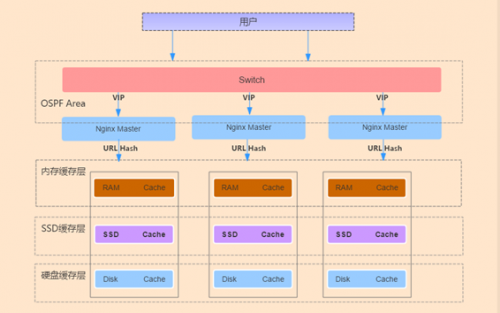

## 裸盘配置
```
裸盘配置 我知道的有2种 下面分别讲下

第一种(性能我没测试过)

1.先创建裸盘设备 （不要对盘进行分区跟格式化）

[root@CMN-NC-X-X ~]# fdisk -l /dev/sdb

Disk /dev/sdb: 146.0 GB, 145999527936 bytes
255 heads, 63 sectors/track, 17750 cylinders
Units = cylinders of 16065 * 512 = 8225280 bytes
Sector size (logical/physical): 512 bytes / 512 bytes
I/O size (minimum/optimal): 512 bytes / 512 bytes
Disk identifier: 0x0001610e

Device Boot Start End Blocks Id System

 

2.修改配置

cat /etc/udev/rules.d/60-raw.rules  ###一块盘 加2行 注意raw1  多快盘 依次是 raw2 raw3 …..

ACTION==”add”, KERNEL==”sdb”, RUN+=”/bin/raw /dev/raw/raw1 %N”
KERNEL==”raw1″, OWNER=”ats”, GROUP=”ats”, MODE=”640″

#添加一个裸设备  是sdb盘  成功后会映射到 /dev/raw/raw1   其他的都是一些权限信息

 

3.启动裸设备

start_udev

也可以这样查看   ll /dev/raw/raw1

4.配置traffic server  storage.config配置

添加 一行

/dev/raw/raw1

5.重启服务

traffic_line -x

6.查看状态

echo “show:cache-stats”|traffic_shell

看到如下信息 说明已经配置成功
Bytes Used — 0 GB
Cache Size — 135 GB

 

第二种 (ATS 开发人员 FAQ 里面采用的方法  我们线上也是这种方法)

先来个 删分区的脚本吧(如果是新盘 那这个过程不用了)  我们自己用的

for i in {d..l};
do
fdisk /dev/sd$i  <<EOF
d
w
EOF
done

先看看裸设备的权限(因为我ATS 是用ats用户跑的)

权限不对 加一个就行  for i in {c..l};do  chmod a+rw /dev/sd$i;done


然后新建一个这样的文件 内容如下


然后   在storage.config 文件内 添加 裸盘


然后重启 ATS

确认是否生效


 

2种方法都说明了  有时间 测试对比一下性能 不知道有没有区别
```


## 远程日志
```
做CDN的 一直担心 跟 纠结 网民访问日志的 收集(因为很多数据的展示都是需求这些日志来分析的)  咱们线上的所有的访问日志传送 
分析  都是基于公司开发的(传送的核心还是FTP)

下面讲下ATS的日志传送(自带的)

日志接受端     配置一下(默认监听8085端口)


traffic_line -x 后确定下


传送端 配置下

编辑 logs_xml.config  文件

附上我们线上的一个日志项目格式吧  (没截全)


添加一段

<LogObject>
<Format = “access”/>   #需要传送的日志 格式(一般是 上面定义的)
<Filename = “shencan”/> #接受段显示的文件名(shencan.log)   默认在ATS 的日志目录下
<CollationHosts = “X.X.X.X:8085″/>  #接受端IP地址

<Filters = “IMG”/>  #还可以定义指定 Filters 的日志(可以不定义  IMG是一个自定义的Filters名称)
</LogObject>

完成

然后去 接受端查看下


总结下吧  这种传送日志 方式 确实很好  就是不知道   性能如何(好几十台同时传送)  有时间 测试下吧   先写这么多吧

附上官网一个自定义 Filters的4种过滤方式


也附上一个例子吧      psct 大家应该都知道 是啥吧
```


## clusters
```
ats这个东西好久没写博客了 现在离我认识ats已经有1年的时间了但是到目前为止 也没关注多少了  在上家公司 因为cache需求
比较简单所以ats上得比较快   本来一直想在我们公司推ats的  一开始由于3.2.4版本对206 range请求有问题 所以一直没上多少台
（其实上的就是 简单的一些web页面） 最近上了几台3.3.4的开发版本 简单测试了一下  range 206请求的问题好像修复了 
目前已经在线上 跑了1周多了 。

因为我们公司的squid进行过2次开发 支持多进程（进程数 完全可以自定义） 我稍微测试过一些性能 不比ats差多少  
而且我们公司的squid 功能模块有好几百个  功能比ats强大很多  这也是我推ats的 一大难处  大家都知道 ats 性能比较牛掰  
 今天没事测试了一些 ats的集群功能 这也是ats的一大特色功能    如果这个功能没问题 可以完全代理 我们线上的 前端haproxy
 （主要用他做一致性hash 功能  可以防止后端cache 重复存储）

下面开始简单 测试吧  （因为ats 集群功能设置很简单 下面主要是多讲讲概念性的东西 ）

http://trafficserver.apache.org/docs/trunk/admin/cluster-howto/index.en.html

这个是官方文档的 一个说明  不是很多  英文好的 15分钟就搞定了

下面简单介绍下集群模式吧

ats的集群模式 就是如果你后端有多台ats cache设备 如果前端没haproxy 做hash的话  dns直接轮询解析过来 会出现多台
ats cache存储一样的文件 这样既影响网民访问 又影响后端cache 磁盘利用率  如果开启了ats集群功能   就相当于你多台
ats cache设备 可以共享自己的cache 存储   （ats 有进程一直在集群中进行通信 与更新 object资源）

下面举例子把  （假设有 3台ats 分别为 A  B C 3台设备）

如果一个object请求发送到A 设备上后   A设备会先看集群中（A B C）设备上有这个object没 如果没那就A直接去源站去抓取 
 然后自己存储  最后会把这个cache object存储 广播到其他集群节点去

当下次请求同一个object 访问到B 设备是（A B C都有可能） 这个时候 B 设备会去A设备上抓取这个内容（因为刚才 A设备存储了
这个object）  然后返回网民 （因为 A B C都在一个集群环境下  速度会很快）


这就是一个简单的集群例子  不知道 大家搞懂没

下面介绍下 ats集群模式的 2个模式吧

1. Management-Only Clustering

2.Full Clustering

大家看单词都能看懂    因为我们的cache 设备都是同级别的 所以我们一般采用第二种模块  有时间把第一种模式也测试下吧 
（配置其实很简单）

下面开始演示吧  （我是用的2台设备演示的 ）


2台设备开启集群之前 这个集群节点都是1 （就是自己本身）

下面分别在2台设备上 进行下面的设置

traffic_line -s proxy.config.proxy_name -v CPIS-OPT  （定义一个名字 集群节点名字得一样）

traffic_line -s proxy.local.cluster.type -v 1（集群模式 1是full cluersing 模式 2.是management-only 模式 
3.是不加入集群 默认就是这个）

traffic_line -s proxy.config.cluster.ethernet_interface -v bond0 设备集群内部通讯网卡

traffic_line -x  reload配置

/etc/init.d/trafficserver restart 重启下服务

OK 2台设备 都设置完成后   过10s 在看看

traffic_line  -r proxy.process.cluster.nodes    取得集群节点数量


OK 都识别出来了

下面是ats 官方的一些性能优化配置 大家可以根据实际情况设置下

##性能优化
$traffic_line -s proxy.config.cluster.threads -v 10
$traffic_line -s proxy.config.cluster.num_of_cluster_connections -v 10  #我的3.3.4-dev版本有问题
下面测试下吧
我在其他一天上绑定自己抓下qq
第一次  MISS了

第二次 HIT了

OK 相当于预存储了下
我去其他一台设备也是抓取qq 你会看到 直接HIT 并且还是HIT CPIS-OPT
下面就不截图了
下面再看下 怎么把一个节点从集群中T掉（如果设备再集群自己down了  大家不用担心 ats其他集群节点会自动把他T掉的）
traffic_line -s proxy.local.cluster.type -v 3    把类型设置为3 就把是退出集群模式
```


## 安装
    来源 灿哥的Blog

    1.安装（软件去官网下载就行）
    先安装一下依赖包
    http://mirrors.aliyun.com/apache/trafficserver/

    yum install gcc gcc-devel gcc-c++ openssl openssl-devel tcl  tcl-devel  libxml2 libxml2-devel pcre pcre-devel

    tar -jxf trafficserver-6.1.1.tar.bz2 
    cd trafficserver-6.1.1（安装包里面有http_load  jtest等压力测试工具，还有一个push.pl的脚本）

    新建用户
    useradd -s /sbin/nologin trafficserver
    ./configure –prefix=/usr/local/trafficserver  –with-user=trafficeserver –with-group=trafficeserver
    make -j 8
    make -j 8 install
    添加一下环境变量 echo “export PATH=$PATH:/usr/local/trafficserver/bin” >>/etc/profile

    2.配置records.config(主配置文件)
    配置参数较多，不能一一解释 下面介绍几个常用的（而且配置参数易懂 ）
    CONFIG proxy.config.cache.ram_cache.size INT 26843545600   （配置内存大小）
    CONFIG proxy.config.http.server_port INT 80       （监听端口 默认是8080）
    CONFIG proxy.config.http.insert_request_via_str INT 1 （开启请求via）
    CONFIG proxy.config.http.insert_response_via_str INT 1（开启响应via 在集群中容易排查）
    CONFIG proxy.config.log.custom_logs_enabled INT 1 （开启自定义日志 默认日志格式不好进行分析）
    CONFIG proxy.config.dns.resolv_conf STRING /etc/resolv.conf （回源dns）
    CONFIG proxy.config.http.cache.when_to_revalidate INT 0 （相当于squid mod_offline ）

    3.配置remap.config （回源配置文件）
    添加一行
    regex_map http://(.*) http://$1

    4.配置日志格式 logs_xml.config
    下面贴一个我们线上用的日志格式 （默认在安装路径 var/log/trafficserver/下）
    <LogFormat>
    <Name = “access”/>
    <Format = “%<cqtq> %<ttms> %<{X-Forwarded-For}cqh> %<crc>/%<pssc> %<pscl> %<cqhm> %<cquuc> %<cqhv> %<phr>/%<pqsi> %<psc
    t> \”%<{Referer}cqh>\” \”%<{User-Agent}cqh>\” %<shn> %<sscl>”/>
    </LogFormat>
    5.配置storage.config 文件（cache目录定义文件）
    淘宝最新出的一个版本有一个专门的stotage_ssd.config配置文件针对ssd盘的
    格式为目录 大小
    /export/data 100GB
    /dev/raw/raw1 #这个是我们直接把cache目录指定到裸盘上面，关于裸盘的使用，后面博客会记录
    上面5个过程配置完成后，trafficserver基本可以服务了，可能每个人有些特殊的要求，可以到官网文档上去找，

    网上的一些解析
    CONFIG proxy.config.exec_thread.autoconfig INT 1
    CONFIG proxy.config.exec_thread.autoconfig.scale FLOAT 2.0
    CONFIG proxy.config.exec_thread.limit INT 2   # 每个核创建的线程数
    CONFIG proxy.config.cluster.ethernet_interface STRING eth0 # 设置以太网接口
    CONFIG proxy.config.http.server_port INT 8080  # 监听端口，反向代理通常为80
    LOCAL proxy.local.incoming_ip_to_bind STRING 0.0.0.0 # 绑定的 IP，可省略，默认即为 0.0.0.0
    CONFIG proxy.config.http.cache.http INT 1 # 打开缓存功能
    CONFIG proxy.config.cache.ram_cache.size INT 512M  # RAM 缓存大小
    CONFIG proxy.config.reverse_proxy.enabled INT 1   # 打开
    CONFIG proxy.config.url_remap.remap_required INT 1 # 1为只反向代理，0为正向+反向代理
    CONFIG proxy.config.url_remap.pristine_host_hdr INT 0
    CONFIG proxy.config.ssl.enabled INT 0 # 关闭SSL
    CONFIG proxy.config.ssl.server.cert.filename STRING server.pem
    CONFIG proxy.config.http.server_max_connections INT 2000  # 同源服务器的最大连接数
    CONFIG proxy.config.http.keep_alive_no_activity_timeout_out INT 60 # 当一个事务结束后同原服务器保持连接的时间

    6.启动trafficserver

    trafficserver start (前面已经弄了环境变量)

    7.一些查看trafficserver服务信息的命令

    traffic_shell 是一个命令集

    traffic_line 可以直接改配置文件

    例如查看流量 cache率 qps     echo “show:proxy-stats”|traffic_shell

    命令很多 不能一一解释了 可以traffic_shell 然后show一下 很多东东

    重读配置 traffic_line -x

    附上一个清cache的小脚本

    [root@XMEN-CT-CDN-55 ~]# cat purg.sh
    #!/bin/bash
    URL=$1
    host=`echo $URL|awk -F”/” ‘{print$3}’`
    url=`echo $URL|cut -d”/” -f4-`
    curl -X PURGE -I -H Host:$host http://127.0.0.1/$url

    清除全部cache

    先关闭服务
    traffic_server -Cclear 就行
    更新一个ATS的PUSH方法(就是讲一个内容打进cache内)

    如何启用PUSH方法：
    PUSH方法是一种直接往TS中注入内容的方法，其为标准的HTTP协议。TS支持PUSH， 但是出于安全等的考虑，默认关闭了PUSH方法，
    下面是如何启用并测试的步骤。请 注意，如不严格限制对PUSH方法的使用，将会产生严重的安全隐患，请务必在acl 层面进行对PUSH发起端的控制。

    启用PUSH方法：
    traffic_line -s proxy.config.http.push_method_enabled -v 1
    修改默认的quick_filter，允许PUSH协议。
    traffic_line -s proxy.config.http.quick_filter.mask -v 130
    让配置生效：
    traffic_line -x
    测试，测试之前，应该配置好代理的map等其他功能，确保正确的访问没有问题，然后再测 试PUSH功能，以利于分析问题。TS
    代码中的tools目录下，有个push.pl可以用来 向TS 服务器push文件，也可以使用类似如下telnet方法测试：
    zym6400 trafficserver # telnet localhost 80 Trying 127.0.0.1... Connected to localhost.localdomain.
     Escape character is '^]'.


    PUSH http://cdn.zymlinux.net/trafficserver/2 HTTP/1.0


    出现200 ok就行
    然后再测试一下
    zym6400 trafficserver # telnet localhost 80 Trying 127.0.0.1... Connected to localhost.localdomain.
     Escape character is '^]'.


    GET http://cdn.zymlinux.net/trafficserver/2 HTTP/1.0


    出现200 ok就行 并且看一下响应头 会出现H字段


## 40GB-cdn
一、架构介绍 

---

集群部署方式实现的主要思想：Nginx 和上联交换机间运行 OSPF 协议，上联交换机通过ECMP 等价路由，将数据流分发给 Nginx 集群，Nginx 集群再转发给缓存服务器。Nginx 和交换机间运行 OSPF 心跳，1 个 vip 配置在集群的所有 Nginx 上，当一台 Nginx 宕机，交换机会自动发现并将其从 ECMP 等价路由中剔除。Nginx 服务器通过 Url 一致性哈希的算法分配给指定 Cache服务器，避免多份缓存。基于七层的健康检查，加入和剔除后端不会影响其它服务器。Cache 服务器接收 Nginx 的请求，每台 Cache 服务器都有内存、SSD、普通硬盘缓存。

**架构图**：



**整个架构被分为三层：**

**1.**`网络设备层`：三层交换机或其它网络设备，运行 OSPF 协议，宣告与其直连负载均衡设备的网段，提供多条到 VIP 等价路径的设备，主动发现路径，主动更新路由信息表，可支持大流量，必须为万兆网络设备。

**2.**`代理转发层`：用 Nginx 七层代理替换了传统的四层代理，支持 Http 协议的转发，支持灵活的 ACL，网速限速，对访问 Url 进行一致性哈希，软件配置方便。与网络设备之间运行 OSPF 心跳来维护关系，多台服务器同时工作。

**3.**`缓存层`：通过不同的介质临时或永久保存用户访问的内容，按对象访问热点进行数据迁移： 最热的放进 RAM，中等热度的放 SSD，轻热度的存普通 Disk。用户点播过程中，频繁被访问的视频会从硬盘缓存到内存，同时访问次数超过指定次数，内容再次从普通机械硬盘缓存到 SSD 中，这样就实现了冷热门内容的分层缓存。

```
 1) 内存缓存层：快速的读写速率，适合存取频繁访问的数据。 
 2) SSD 缓存层：做为机械硬盘和内存之间的缓冲，保存次热门的数据，更好的衔接了内存与普通硬盘的读写速度。 
 3) 机械硬盘缓存层：读写速度最慢，可永久性保存冷门数据。
```

二、安装部署 

---

1. 准备工作

在所有服务器上配置:

1\) 关闭`irqbalance`,`iptables`,`selinux`

2\) 更改内核参数，在`/etc/sysctl.conf`添加

```
fs.nr_open = 2097152
fs.file-max = 2097152
net.ipv4.tcp_mem = 3097431 4129911 6194862
net.ipv4.tcp_rmem = 4096 87380 6291456
net.ipv4.tcp_wmem = 4096 65536 4194304
net.ipv4.tcp_max_tw_buckets = 26214400
net.ipv4.tcp_timestamps = 0
net.ipv4.tcp_tw_recycle = 0
net.ipv4.tcp_tw_reuse  = 0
net.ipv4.tcp_syncookies  = 0
net.ipv4.tcp_fin_timeout = 15
net.ipv4.ip_local_port_range = 1024 65535
net.ipv4.tcp_max_syn_backlog = 65535
net.core.somaxconn  = 65535
net.core.netdev_max_backlog  = 200000
vm.swappiness = 0
kernel.panic = 30
```

```
cat /etc/security/limits.conf 
*    soft    nofile  2097152
*    hard    nofile  2097152
*    soft    nproc   65535
*    hard    nproc   65535
*    soft    memlock 1048576
*    soft    memlock 1048576
```

3\) 网卡中断绑定,上传[irq](http://wiki.ops.itv.cn/lib/exe/fetch.php/wiki:irq)至`/etc/init.d/`

```
chmod +x /etc/init.d/irq
chkconfig irq on
service irq start
```

2. 安装ATS {#安装ats}

在所有Cache Server上部署ATS

（1） 编译安装 {#编译安装}

```
yum install
 pkgconfig libtool 
gcc
 gcc-c++ 
make
 openssl-devel tcl-devel expat-devel pcre-devel libcap-devel flex-devel hwloc-devel lua-devel ncurses-devel 
 curl-devel boost-devel
```

```
tar xf trafficserver-4.2.3.tar.bz2 
cd trafficserver-4.2.3
sed -i  's/ApacheTrafficServer/iTS/g' mgmt/RecordsConfig.cc

./configure --prefix=/usr/local/trafficserver \
--with-user=nobody \
--with-group=nobody \
--with-ncurses \
--enable-debug \
--enable-test-tools \
--enable-interim-cache \
--enable-experimental-plugins \
--enable-example-plugins \
--enable-hwloc


make && make install 

ln -s /usr/local/trafficserver/bin/* /usr/local/bin/
mkdir /data/logs -p ; chown nobody:nobody /data/logs -R

chown nobody /usr/local/trafficserver/ -R
```

（2） 挂载裸设备 {#挂载裸设备}

挂载除系统盘外，所用到的所有裸盘

```
cat /etc/udev/rules.d/51-cache-disk.rules 
SUBSYSTEM=="block", KERNEL=="sd[a-q]", MODE=="660" OWNER:="nobody" GROUP:="nobody"
执行 udevadm trigger --subsystem-match=block 生效
查看ll /dev/sd*
```

 （3） 健康检查 {#健康检查}

配置前端负载均衡器到ATS 7层健康检查，方便平滑踢出负载  
在`plugin.config`中添加

```
# healthchecks Plugin
/usr/local/trafficserver/libexec/trafficserver/healthchecks.so etc/trafficserver/healthchecks.config
```

在`etc/trafficserver`下新建`healthchecks.config`,添加以下内容\(说明查看plugins/experimental/healthchecks/README\)

```
/__hc  /usr/local/trafficserver/hc/ping.html  text/plain 200  404
```

新建`ping.html`

```
mkdir /usr/local/trafficserver/hc; echo OK 
>
 /usr/local/trafficserver/hc/ping.html
```

（4） tsar安装 {#tsar安装}

tar 地址：[https://github.com/alibaba/tsar](https://github.com/alibaba/tsar)

```
cd tsar
cd modules/
 sed -i 's/mgmtapisocket/mgmtapi.socket/g' *.c
sed -i 's/eventapisocket/eventapi.socket/g' *.c
cd ..
make 
make install

ln -s /usr/local/trafficserver/var/trafficserver/mgmtapi.sock /var/run/trafficserver/
ln -s /usr/local/trafficserver/var/trafficserver/eventapi.sock /var/run/trafficserver/

```

3. 配置代理 {#配置代理}

在所有前端代理上配置：

（1） 安装quagga {#安装quagga}

```
yum install
 quagga
```

```
cat /etc/quagga/zebra.conf
hostname cnbzgpngx22cdnp01
password 123456.itv
enable password 123456.itv
```

```
cat /etc/quagga/ospfd.conf
! -*- ospf -*-

hostname cnbzgpngx22cdnp01
password 123456.itv

log stdout
interface bond0
  ip ospf network broadcast
  ip ospf hello-interval 1 # hello包时间
  ip ospf dead-interval 4  # 死亡时间
  ip ospf priority 0  # 优先级为0 DRother

interface bond00

interface lo

router ospf
  ospf router-id 10.191.172.131
  log-adjacency-changes
  auto-cost reference-bandwidth 1000     #设置路径花费，每台相同
  network 10.191.172.128/27 area 0.0.0.0  # 宣告nginx外网段和VIP 
  network 10.191.172.130/32 area 0.0.0.0

line vty
```

启动服务

```
/etc/init.d/zebra start ; /etc/init.d/ospfd start
```

在每台上绑定VIP

```
cat /etc/sysconfig/network-scripts/ifcfg-lo:0
DEVICE=lo:0
IPADDR=10.191.172.130
NETMASK=255.255.255.255
```

```
ifup
 lo:
0
```

（2） 交换机配置OSPF {#交换机配置ospf}

```
router id 1.1.1.1
#
ospf 1
 maximum load-balancing 6
 area 0.0.0.0
  network 1.1.1.1 0.0.0.0
  network 10.191.172.128 0.0.0.31


nterface Vlan-interface22
 ip address 10.191.172.129 255.255.255.224
 ospf timer hello 1  # hello包时间要一致
 ospf timer dead 4   # 死亡时间要一致
 ospf network-type broadcast
 ospf dr-priority 100
```

配置完交换机后可以看到到VIP 有多条等价的路径

```
[CnXXXCdnHHXXXSw01]display ospf routing

     OSPF Process 1 with Router ID 1.1.1.1
          Routing Table

 Routing for network
 Destination        Cost     Type    NextHop         AdvRouter       Area
 10.191.172.128/27  1        Transit 0.0.0.0         1.1.1.1         0.0.0.0
 10.191.172.130/32  101      Stub    10.191.172.131  10.191.172.131  0.0.0.0
 10.191.172.130/32  101      Stub    10.191.172.132  10.191.172.132  0.0.0.0
 10.191.172.130/32  101      Stub    10.191.172.133  10.191.172.133  0.0.0.0
 1.1.1.1/32         0        Stub    0.0.0.0         1.1.1.1         0.0.0.0

 Total nets: 5  
 Intra area: 5  Inter area: 0  ASE: 0  NSSA: 0 
[CnXXXCdnHHXXXSw01]
```

 （3） 安装tengine {#安装tengine}

```
yum install
 tengine
```