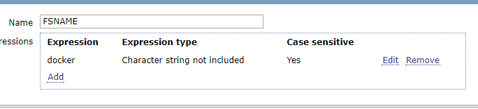
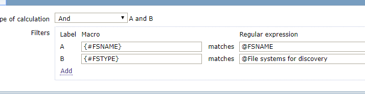
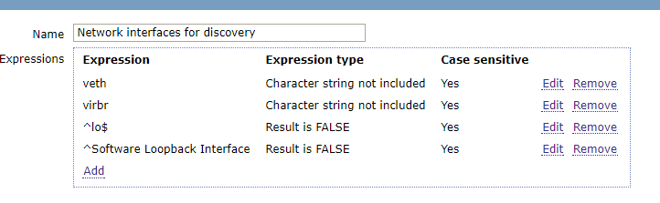
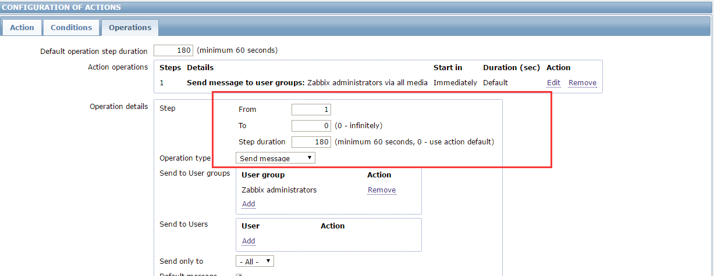

## 过滤docker无用分区
zabbix自带的自动发现文件系统的LLD能够发现系统内所有的分区，但是有些机器上跑的docker分区也同时被监控到了。然而监控到docker这些分区全是not supported的，网卡类似

设置zabbix的正则  Administration --&gt;  General  右上角选择 Regular expressions 添加




修改linux  Discovery list 模板





网卡的可以直接修改Network interfaces for discovery




这个正则的意思是过滤字符串不包含/var/lib/docker/devicemapper/mnt/，且区分大小。

这里需要说一下表达式5种类型：

Character string  included        \#模糊匹配字符串

Any character string included    \#模糊匹配多个字符串，可以用逗号（，）,点（.）,斜杠（/）作分隔符

Character string not included    \#模糊不匹配字符串

Result is TRUE        \#精确匹配，为真

Result is FALSE        \#精确匹配，为假设置zabbix的正则  Administration --&gt;  General  右上角选择 Regular expressions 添加


## 监控mysql
```
使用自带的模板
在zabbix agent操作
vim /etc/zabbix/.my.cnf
[mysql]
host     = localhost
user     = root
password = xxx
port = 3326
socket = /var/lib/mysql/mysql3326.sock
[mysqladmin]
host     = localhost
user     = root
password = xxxx
port = 3326
socket = /var/lib/mysql/mysql3326.sock

sed -i 's@/var/lib/zabbix@/etc/zabbix@g' /etc/zabbix/zabbix_agentd.d/userparameter_mysql.conf
/etc/init.d/zabbix-agent restart

之后在web界面添加mysql模板

mysql主从监控
vim /etc/zabbix/zabbix_agentd.d/userparameter_mysql.conf
UserParameter=mysql.replication,echo "show slave status\G;" | HOME=/etc/zabbix mysql | grep -E 
 "Slave_IO_Running|Slave_SQL_Running" | awk '{print $$2}'| grep -c Yes

zabbix_get -s 192.168.100.223 -k "mysql.replication"
如果上面返回的是2，那么是正常,代表Slave_IO_Running和Slave_SQL_Running两个状态都是Yes 其他值均不正常。


----------------------------------------------------------

MySQL的监控有很多种方案，如果你已经使用了Zabbix作为监控系统，那么集成进来就非常合适。而且使用Zabbix监控MySQL是
比较容易的，Zabbix官方也自带了MySQL监控模板，但是生产环境推荐使用percona的监控插件。
https://www.percona.com/doc/percona-monitoring-plugins/1.1/zabbix/index.html

下面让我们动手来完成添加一台MySQL数据库的监控工作。

1.安装percona仓库
# rpm -ivh http://www.percona.com/downloads/percona-release/redhat/0.1-3/percona-release-0.1-3.noarch.rpm

2.部署监控环境
percona的监控插件是php编写的。通过php连接mysql来获取相关的数据，所以需要你在本地安装zabbix agent的同时，部署php和php-mysql。
[root@linux-node1 ~]# yum install zabbix22-agentphp php-mysql

3.安装percona的zabbix模版
[root@linux-node1 ~]# yum install -ypercona-zabbix-templates
[root@linux-node1 ~]# rpm -qlpercona-zabbix-templates  
/var/lib/zabbix/percona
/var/lib/zabbix/percona/scripts
/var/lib/zabbix/percona/scripts/get_mysql_stats_wrapper.sh
/var/lib/zabbix/percona/scripts/ss_get_mysql_stats.php
/var/lib/zabbix/percona/templates
/var/lib/zabbix/percona/templates/userparameter_percona_mysql.conf
/var/lib/zabbix/percona/templates/zabbix_agent_template_percona_mysql_server_ht_2.0.9-sver1.1.6.xml
    可以看到他的组成部分有一个shell脚本，一个php脚本，一个zabbix的配置文件，和一个Zabbix 模版的xml。下面我们需要引用
    配置文件，并在Zabbix上来导入该模版。
# vim /etc/zabbix_agentd.conf
Include=/etc/zabbix_agentd.conf.d/
# mkdir/etc/zabbix_agentd.conf.d/

4.复制用户自定义配置项到Zabbix配置目录
# cp /var/lib/zabbix/percona/templates/userparameter_percona_mysql.conf /etc/zabbix_agentd.conf.d/

5.让PHP可以连接到MySQL上
# vim /var/lib/zabbix/percona/scripts/ss_get_mysql_stats.php.cnf

<?php
$mysql_user = 'root';
$mysql_pass = 's3cret';   //设置为你mysql的相关用户名和密码。

6.测试监控脚本
# /var/lib/zabbix/percona/scripts/get_mysql_stats_wrapper.sh gg

7.修改监控脚本
默认情况下，监控MySQL主从的，直接是硬编码在get_mysql_stats_wrapper.sh中。如果你的mysql安装路径或者socket不同，需
要手动修改下才可以使用。如果是从库，测试，返回1，证明该脚本正常。
# /var/lib/zabbix/percona/scripts/get_mysql_stats_wrapper.sh running-slave
1

8.导入zabbix模版
将/var/lib/zabbix/percona/templates/zabbix_agent_template_percona_mysql_server_ht_2.0.9-sver1.1.6.xml下载到本
地，然后在zabbix上导入
Configuration -> Templates -> Import


下面你就可以给你的MySQL数据库指定监控模板了，由于篇幅原因就不在截图，相信这难不倒你！

生产环境的注意事项


MySQL监控用户授权
在我们监控MySQL的时候，需要连接到MySQL数据库，但是在进行用户授权的时候，要遵循权限最小化的原则，分配最简单够用的权限即
可，下面是我给生产MySQL的监控用户授权。
mysql> grant select,process,replicationclient on *.* to monitor@'192.168.1.11' identified by 'monitor@xx';
mysql> flush privileges;

process通过这个权限，用户可以执行SHOWPROCESSLIST和KILL命令。默认情况下，每个用户都可以执行SHOW PROCESSLIST命令，但
是只能查询本用户的进程。
replication client拥有此权限可以查询master server、slave server状态。

彻底清除MySQL Slave信息
在生产环境，MySQL Master和Slave进行主从切换的时候，Slave成功升级为主库，那么这个时候就需要彻底清理从库的信息，不然监
控系统会认为这台服务器是Slave，而且会报主从同步失败。
    其实非常的简单，只需要以下两步：
stop slave;
reset slave all;
   RESET SLAVE ALL是清除从库的同步复制信息、包括连接信息和二进制文件名、位置。
   从库上执行这个命令后，使用show slave status将不会有输出。
```


## 监控mongo
```
1、配置zabbix自定义用户key
vim /usr/local/zabbix/etc/zabbix_agentd.conf
UserParameter=MongoDB.Status[*],/bin/echo "db.serverStatus().$1" | /usr/local/mongodb/bin/mongo admin | 
grep "\<$2\>"| awk -F : '{print $$2}'|awk -F , '{print $$1}'
db.serverStatus().$1的结果为1行时（兼容上面的）
MongoDB.Status[*],/bin/echo "db.serverStatus().$1" | /usr/local/mongodb/bin/mongo admin --port 10040 -u
 admin -p 'f8hIXm3g?' | grep "\<$2\>" | sed 's/,/\n/g' |grep "\<$2\>"| awk -F : '{print $$2}'|awk -F , '{print $$1}'

上面是通过db.serverStatus()来获取服务器状态
其中$1表示第一个参数
grep $2的时候要加上锚地符 "\<" 和 "\>"，因为有的对象名可能部分相同
echo "db.serverStatus()" |/usr/local/mongodb/bin/mongo --port 10040 --quiet
{
    "host" : "TENCENT64.site", --server的hostname
    "version" : "2.0.5", --mongo版本
    "process" : "mongod", --进程名
    "uptime" : 1238418, --启动时间（单位：S）
    "uptimeEstimate" : 1230730, --基于MongoDB内部粗粒度定时器的运行时间
    "localTime" : ISODate("2012-09-14T09:09:52.657Z"), --server的本地时间
    "globalLock" : {
        "totalTime" : 1238418105923, --全局锁创建的时间（单位：ms 微秒）
        "lockTime" : 75055831911, --全局锁保持的时间（单位：ms 微秒）
        "ratio" : 0.06060621332329477, --lockTime和totalTime的比
        "currentQueue" : {
            "total" : 0, --等待全局锁的队列中操作数目
            "readers" : 0, --等待读锁的队列中操作数目
            "writers" : 0 --等待写锁的队列中操作数目
        },
        "activeClients" : {
            "total" : 1, --连接到server的当前活动client数目
            "readers" : 1, --执行读操作的当前活动client数目
            "writers" : 0 --执行写操作的当前活动client数目
        }
    },
    "mem" : {
        "bits" : 64, --64位机器
        "resident" : 18363, --占用物理内存量。
        "virtual" : 478810, --占用的虚拟内存量
        "supported" : true, --是否支持扩展内存
        "mapped" : 233311, --映射到内存的数据文件大小，很接近于你的所有数据库大小。
        "mappedWithJournal" : 466622,
        "note" : "virtual minus mapped is large. could indicate a memory leak"
    },
    "connections" : {
        "current" : 737, --当前活动连接量。连接到server的当前活跃连接数目
        "available" : 82 --剩余空闲连接量。剩余的可用连接数目
    },
    "extra_info" : {
        "note" : "fields vary by platform",
        "heap_usage_bytes" : 3838448, --此过程中所有的堆字节数目。仅适用于Linux
        "page_faults" : 31058356 --此过程中访问内存中页面失败的总次数。仅适用于Linux
    },
    "indexCounters" : {
        "btree" : {
            "accesses" : 68229146, --Btree索引的访问次数（索引被访问量）
            "hits" : 68229146, --内存中的Btree页的数目。（索引命中量）
            "misses" : 0, --内存中不存在的Btree也数目。（索引偏差量）（索引内存访问失败次数）
            "resets" : 0, --索引计数器被重置为0的次数
            "missRatio" : 0 --索引偏差率（未命中率）
        }
    },
    "backgroundFlushing" : {
        "flushes" : 20640, --数据库刷新写到磁盘的次数
        "total_ms" : 2453287, --数据库刷新数据到磁盘花费的微秒数
        "average_ms" : 118.8608042635659, --执行单次刷新花费的平均微秒数
        "last_ms" : 1, --最后一次执行完成刷新数据到磁盘花费的微秒数
        "last_finished" : ISODate("2012-09-14T09:09:35.656Z") --当最后一次刷新数据完成时的时间戳
    },
    "cursors" : {
        "totalOpen" : 0, --server为client保持的游标（cursor）总数
        "clientCursors_size" : 0, --
        "timedOut" : 24 --server启动以来游标（cursor）超时的总数
    },
    "network" : {
        "bytesIn" : NumberLong("1929833164782"), --发送到数据库的数据总量（bytes）
        "bytesOut" : 553137147925, --数据库发出的数据总量（bytes）
        "numRequests" : 2475184328 --发送到数据库的请求量
    },
    "opcounters" : {
        "insert" : 687531883, --server启动以来总的insert数据量
        "query" : 711010343, --server启动以来总的query数据量
        "update" : 0, --server启动以来总的update数据量
        "delete" : 0, --server启动以来总的delete数据量
        "getmore" : 6484, --server启动以来调用任何游标的getMore总次数
        "command" : 1287537 --server启动以来执行其他命令的总次数
    },
    "asserts" : {
        "regular" : 0, --server启动以来抛出正规断言（assert 类似于异常处理的形式）总数目
        "warning" : 1, --server启动以来抛出的告警总数目
        "msg" : 0, --消息断言数目。服务器内部定义的良好字符串错误
        "user" : 4, --用户断言数目。用户产生的错误，譬如：磁盘空间满；重复键。
        "rollovers" : 0 --server启动以来，assert counters have rolled over的次数
    },
    "writeBacksQueued" : false, --是否有从mongos执行的retry操作
    "dur" : {
        "commits" : 30, --上一间隔journal日志发生commit的次数
        "journaledMB" : 0, --上一间隔写到journal日志的数据量（单位：MB）
        "writeToDataFilesMB" : 0, --上一间隔journal日志写到数据文件的数据量（单位：MB）
        "compression" : 0, --
        "commitsInWriteLock" : 0, --写锁期间发生commits的次数
        "earlyCommits" : 0, --schedule时间前请求commit的次数
        "timeMs" : {
            "dt" : 3064,
            "prepLogBuffer" : 0, --准备写journal日志花费的时间
            "writeToJournal" : 0, --写journal日志花费的实际时间
            "writeToDataFiles" : 0, --journal日志后写数据文件花费的时间
            "remapPrivateView" : 0 --The amount of time spent remapping copy-on-write memory mapped views
        }
    },
    "ok" : 1 --serverStatus是否返回正确
}


./zabbix_get -s 127.0.0.1 -k MongoDB.Status[opcounters,query]

添加监控项
监控command，收集所有的命令数，包括插入，删除，查询，更新等所有命令，这里每过10秒取一次值
insert、query、update、delete、getmore、command等都用相同的设置

监控内存，virtual是虚拟内存，resident是无论内存

监控网络，bytesIN是进流量，bytesOut是出流量，numRequests是请求数

监控连接数，available是可用连接数、current是当前连接数

监控刷写数据到硬盘的次数

定义mapped的项目，单位是MB


5、监控locks项目，由于部分项目是多维数组，不能使用之前自定义的用户key获取，需要额外创建专门的key

[root@mongodb bin]#  echo "db.serverStatus().locks" | mongo admin
MongoDB shell version: 2.6.3
connecting to: admin
{
       "." : {
               "timeLockedMicros" : {
                       "R" : NumberLong(572504),
                       "W" : NumberLong(480751)
               },
               "timeAcquiringMicros" : {
                       "R" : NumberLong(480946),
                       "W" : NumberLong(70198)
               }
       },
       "admin" : {
               "timeLockedMicros" : {
                       "r" : NumberLong(142364),
                       "w" : NumberLong(0)
               },
               "timeAcquiringMicros" : {
                       "r" : NumberLong(15018),
                       "w" : NumberLong(0)
               }
       },
       "local" : {
               "timeLockedMicros" : {
                       "r" : NumberLong(271651),
                       "w" : NumberLong(271)
               },
               "timeAcquiringMicros" : {
                       "r" : NumberLong(120699),
                       "w" : NumberLong(5)
               }
       },
       "test" : {
               "timeLockedMicros" : {
                       "r" : NumberLong(93725),
                       "w" : NumberLong(114935)
               },
               "timeAcquiringMicros" : {
                       "r" : NumberLong(67411),
                       "w" : NumberLong(41)
               }
       }
}
bye
创建自定义key

UserParameter=MongoDB.Status.locks[*],/bin/echo "db.serverStatus().locks.$1.$2.$3" | 
/usr/local/mongodb/bin/mongo admin |/usr/bin/tail -n 2 | /usr/bin/head -n 1 | awk -F 
'(' '{print $$2}'|awk -F ')' '{print $$1}'


来源： http://www.zhengdazhi.com/archives/662
```


## fping key
```
fping 192.168.1.20 2> /dev/null | grep -c alive
```


## 连续报警
默认的步骤是1-1,也即是从1开始到1结束。一旦故障发生，就是执行发邮件脚本

假如故障持续了1个小时，它也只发送一次。如果改成1-0，0是表示不限制.无限发送

间隔就是默认持续时间60秒。那么一个小时，就会发送60封邮件。



## 区分域名统计nginx
```
# 不同域名的日志文件区分开来
#!/usr/bin/env bash
case $2 in
    "net")
     count=$(sudo grep $(date "+%Y:%H:%M") /var/log/nginx/access_$1.log | wc -l)
     if [ $count -eq 0  ];then
          echo 0
     else
     sudo grep $(date "+%Y:%H:%M") /var/log/nginx/access_$1.log | awk '{sum +=$10}END{print sum}'
     fi
     ;;
    "connect")
     sudo grep $(date "+%Y:%H:%M") /var/log/nginx/access_$1.log | wc -l
     ;;
esac
key：
    UserParameter=domain_stats[*],/etc/zabbix/domain_stats.sh $1 $2

测试
zabbix_get -s 192.168.1.5 -k domain_stats[data,net]
1172557
zabbix_get -s 192.168.1.5 -k domain_stats[data,connect]
0
```


## 监控redis
    UserParameter=Redis.Info[*],/etc/zabbix/redisinfo.sh $1 $2
    #! /bin/bash
    REDISCLI="/usr/local/src/redis-cli"
    HOST="116.213.204.14"
    PORT=6379
    if [[ $# == 1 ]];then
        case $1 in
            version)
                result=`$REDISCLI -h $HOST -p $PORT info | grep -w "redis_version" | awk -F':' '{print $2}'`
                echo $result
            ;;
            uptime)
                result=`$REDISCLI -h $HOST -p $PORT info | grep -w "uptime_in_seconds" | awk -F':' '{print $2}'`
                echo $result
            ;;
            connected_clients)
                result=`$REDISCLI -h $HOST -p $PORT info | grep -w "connected_clients" | awk -F':' '{print $2}'`
                echo $result
            ;;
            blocked_clients)
                result=`$REDISCLI -h $HOST -p $PORT info | grep -w "blocked_clients" | awk -F':' '{print $2}'`
                echo $result
            ;;
            used_memory)
                result=`$REDISCLI -h $HOST -p $PORT info | grep -w "used_memory" | awk -F':' '{print $2}'`
                echo $result
            ;;
            used_memory_rss)
                result=`$REDISCLI -h $HOST -p $PORT info | grep -w "used_memory_rss" | awk -F':' '{print $2}'`
                echo $result
            ;;
            used_memory_peak)
                result=`$REDISCLI -h $HOST -p $PORT info | grep -w "used_memory_peak" | awk -F':' '{print $2}'`
                echo $result
            ;;
            used_memory_lua)
                result=`$REDISCLI -h $HOST -p $PORT info | grep -w "used_memory_lua" | awk -F':' '{print $2}'`
                echo $result
            ;;
            used_cpu_sys)
                result=`$REDISCLI -h $HOST -p $PORT info | grep -w "used_cpu_sys" | awk -F':' '{print $2}'`
                echo $result
            ;;
            used_cpu_user)
                result=`$REDISCLI -h $HOST -p $PORT info | grep -w "used_cpu_user" | awk -F':' '{print $2}'`
                echo $result
            ;;
            used_cpu_sys_children)
                result=`$REDISCLI -h $HOST -p $PORT info | grep -w "used_cpu_sys_children" | awk -F':' '{print $2}'`
                echo $result
            ;;
            used_cpu_user_children)
                result=`$REDISCLI -h $HOST -p $PORT info | grep -w "used_cpu_user_children" | awk -F':' '{print $2}'`
                echo $result
            ;;
            rdb_last_bgsave_status)
     result=`$REDISCLI -h $HOST -p $PORT info  | grep -w "rdb_last_bgsave_status" | awk -F':' '{print $2}' | grep -c ok`
                echo $result
            ;;
            aof_last_bgrewrite_status)
     result=`$REDISCLI -h $HOST -p $PORT info  | grep -w "aof_last_bgrewrite_status" | awk -F':' '{print $2}' | grep -c ok`
                echo $result
            ;;
            aof_last_write_status)
     result=`$REDISCLI -h $HOST -p $PORT info  | grep -w "aof_last_write_status" | awk -F':' '{print $2}' | grep -c ok`
                echo $result
            ;;
            *)
                echo -e "\033[33mUsage: $0 {connected_clients|blocked_clients|used_memory|used_memory_rss|
                used_memory_peak|used_memory_lua|used_cpu_sys|used_cpu_user|used_cpu_sys_children|used_cpu_user_children
                |rdb_last_bgsave_status|aof_last_bgrewrite_status|aof_last_write_status}\033[0m" 
            ;;
        esac
    elif [[ $# == 2 ]];then
        case $2 in
            keys)
                result=`$REDISCLI -h $HOST -p $PORT info | grep -w "$1" | grep -w "keys" | awk -F'=|,' '{print $2}'`
                echo $result
            ;;
            expires)
                result=`$REDISCLI -h $HOST -p $PORT info | grep -w "$1" | grep -w "keys" | awk -F'=|,' '{print $4}'`
                echo $result
            ;;
            avg_ttl)
                result=`$REDISCLI -h $HOST -p $PORT info | grep -w "$1" | grep -w "avg_ttl" | awk -F'=|,' '{print $6}'`
                echo $result
            ;;
            *)
                echo -e "\033[33mUsage: $0 {db0 keys|db0 expires|db0 avg_ttl}\033[0m" 
            ;;
        esac
    fi


## zabbix日报
```
#!/usr/bin/env python
# coding=utf-8
import json
import urllib
import urllib2
from datetime import datetime
import cookielib
import smtplib
from email.mime.multipart import MIMEMultipart
from email.mime.text import MIMEText
from email.mime.image import MIMEImage
def zab_api(data):
    url = 'http://116.213.207.5:15080/zabbix/api_jsonrpc.php'
    header = {"Content-Type": "application/json"}
    request = urllib2.Request(url, data, header)
    result = urllib2.urlopen(request)
    response = json.loads(result.read())
    result.close()
    return response
auth_data = json.dumps({
    "jsonrpc": "2.0",
    "method": "user.login",
    "params": {
        "user": "admin",
        "password": "dachui$5zabbix"
    }, "id": 2
})
auth = zab_api(auth_data)["result"]
hostget = json.dumps({
    "jsonrpc": "2.0",
    "method": "host.get",
    "params": {
        "output": ["hostid", "host"],
        "selectInterfaces": ["interfaceid", "ip"]
    }, "id": 2, "auth": auth
})
def getgraphid(hostid):
    graph1 = json.dumps({
        "jsonrpc": "2.0",
        "method": "graph.get",
        "params": {
            "output": "extend",
            "hostids": hostid,
            "sortfield": "name"
        },
        "auth": auth,
        "id": 1
    })
    for graph in zab_api(graph1)['result']:
        print graph['name'], " : ", graph['graphid']
def getcookie():
    cookiejar = cookielib.CookieJar()
    urlOpener = urllib2.build_opener(urllib2.HTTPCookieProcessor(cookiejar))
    values = {"name": "admin", "password": "dachui$5zabbix", 'autologin': 1, "enter": 'Sign in'}
    data = urllib.urlencode(values)
    request = urllib2.Request('http://116.213.207.5:15080/zabbix/index.php', data)
    try:
        urlOpener.open(request, timeout=10)
        return urlOpener
    except urllib2.HTTPError, e:
        print e
def getgraph(graid):
    gr_url = "http://116.213.207.5:15080/zabbix/chart2.php"
    # http://116.213.207.5:15080/zabbix/chart6.php  饼图
    stime = datetime.now().strftime('%Y%m%d%H%M%S')
    values = {"graphid": graid, "period": 86400, "stime": stime, "width": 800, "height": 200}
    data = urllib.urlencode(values)
    request = urllib2.Request(gr_url, data)
    url = getcookie().open(request)
    image = url.read()
    imagename = "img/%s.png" % graid
    f = open(imagename, 'wb')
    f.write(image)
def SendMail(imglist):
    msgRoot = MIMEMultipart('related')
    msgRoot['Subject'] = 'zabbix report'
    msgRoot['From'] = "liangguangyu@dachuizichan.com"
    to_list = ["liangguangyu@dachuizichan.com", "2219722370@qq.com"]
    msgRoot['To'] = ",".join(to_list)
    for img in imglist:
        imagename = "img/%s.png" % img
        msgImage = MIMEImage(open(imagename, 'rb').read())
        msgImage.add_header('Content-ID', str(img))
        msgRoot.attach(msgImage)
    sendText = '<html><body><p>web服务器 cpu使用：</p>' + \
        '<p></p>' + \
        '<p></p>' + \
        '<p>web服务器 内存剩余：</p>' + \
        '<p></p>' + \
        '<p></p>' + \
        '<p>web服务器 网络使用：</p>' + \
        '<p></p>' + \
        '<p></p>' + \
        '<p>web服务器 连接数：</p>' + \
        '<p></p>' + \
        '<p></p>' + \
        '<p>mysql服务器 cpu使用：</p>' + \
        '<p></p>' + \
        '<p></p>' + \
        '<p>mysql服务器 内存剩余：</p>' + \
        '<p></p>' + \
        '<p></p>' + \
        '<p>mysql服务器 网络使用：</p>' + \
        '<p></p>' + \
        '<p></p>' + \
        '<p>mysql服务器 查询情况：</p>' + \
        '<p></p>' + \
        '<p></p>' + \
    '</body></html>'
    msgText = MIMEText(sendText, 'html', 'utf-8')
    msgRoot.attach(msgText)
    smtp = smtplib.SMTP_SSL()
    smtp.connect('smtp.exmail.qq.com', "465")
    smtp.login("liangguangyu@dachuizichan.com", "lianggyA01")
    smtp.sendmail(msgRoot['From'], to_list, msgRoot.as_string())
    smtp.quit()
# for hostmsg in zab_api(hostget)['result']:
#     print hostmsg['host'], ' : ', hostmsg['hostid']
# Zabbix server  :  10084
# 192.168.1.6  :  10105
# 192.168.1.7  :  10106
# 192.168.1.2  :  10107
# 192.168.1.3  :  10108
# web cpu:525 mem:534  net:568 connect:626
# slave   cpu:550  mem:553 net:575  connect:628
#mysql  cpu:557   mem:560  net:583  qps: 614
# mysql-slae cpu:564 mem:567  net:590 qps:631
#getgraphid("10084")
imglist = [525,534,568,626,550,553,575,628,557,560,583,614,564,567,590,631]
for graphid in imglist:
    getgraph(graphid)
SendMail(imglist)

```


## 微信告警
```
http://www.cnyunwei.com/thread-29593-1-1.html

申请微信企业号https://qy.weixin.qq.com/


微信python脚本
#!/usr/bin/python
# coding: utf-8
import urllib2
import json
import sys
reload(sys)
sys.setdefaultencoding('utf-8')
def gettoken(corpid, corpsecret):
    gettoken_url = 'https://qyapi.weixin.qq.com/cgi-bin/gettoken?corpid='+ corpid + '&corpsecret=' + corpsecret
    try:
        token_file = urllib2.urlopen(gettoken_url)
    except urllib2.HTTPError as e:
        print e.code
        print e.read().decode("utf8")
        sys.exit()
    token_data = token_file.read().decode('utf-8')
    token_json = json.loads(token_data)
    token_json.keys()
    token = token_json['access_token']
    return token
def senddata(access_token, content):
    send_url = 'https://qyapi.weixin.qq.com/cgi-bin/message/send?access_token=' + access_token
    send_values = {
        "touser": "@all",    #@all为所有人
        "msgtype": "text",
        "agentid": "1",   #企业号中的应用id，消息类型
        "text": {
            "content": content
        },
        "safe": "0"
    }
    send_data = json.dumps(send_values, ensure_ascii=False)
    send_request = urllib2.Request(send_url, send_data)
    response = json.loads(urllib2.urlopen(send_request).read())
    print str(response)
if __name__ == '__main__':
    content = str(sys.argv[3])
    corpid = 'wxc8b10c89ac3d8f9b'  #CorpID是企业号的标识
    corpsecret = 'Y9dS4chGDIpFmqDP_tT_FQlDHWMuFcjM_RzTnakwf7rnmhNE8mveeQuD44qTEp4x'  #corpsecretSecret是管理组凭证密钥
    accesstoken = gettoken(corpid, corpsecret)
    senddata(accesstoken, content)

mv weixin.sh /usr/local/zabbix/share/zabbix/alertscripts
chown zabbix.zabbix /usr/local/zabbix/share/zabbix/alertscripts/weixin.sh
chmod +x /usr/local/zabbix/share/zabbix/alertscripts/weixin.sh
配置zabbix

3.1、添加报警媒介

4.png

3.2、用户添加报警媒介，这里使用默认的administrator用户

5.png

3.3、添加报警动作

6.png

信息如下，使用默认的信息也可以


修改操作条件，使用默认的也是可以的
```


## 监控nginx
```
/etc/nginx/conf.d/default.conf 
添加
location /ngx_status {
        stub_status on;
        access_log off;
        allow 127.0.0.1;
        deny all;
    }

curl http://127.0.0.1/ngx_status
Active connections: 362
server accepts handled requests
6823 6823 6821
Reading: 0 Writing: 362 Waiting: 0

第1列：
当前与http建立的连接数，包括等待的客户端连接：2
 
第2列：
接受的客户端连接总数目：20
处理的客户端连接总数目：20
客户端总的请求数目：50
 
第3列：
当前，nginx读请求连接
当前，nginx写响应返回给客户端
目前有多少空闲客户端请求连接

ngx_status.sh：
#!/bin/bash
# DateTime: 2015-10-25
# AUTHOR：凉白开
# WEBSITE: http://www.ttlsa.com
# Description：zabbix监控nginx性能以及进程状态
# Note：此脚本需要配置在被监控端，否则ping检测将会得到不符合预期的结果
 ‎
 
HOST="127.0.0.1"
PORT="80"
 
# 检测nginx进程是否存在
function ping {
    /sbin/pidof nginx | wc -l 
}
# 检测nginx性能
function active {
    /usr/bin/curl -s "http://$HOST:$PORT/ngx_status/" | grep 'Active' | awk '{print $NF}'
}
function reading {
    /usr/bin/curl -s "http://$HOST:$PORT/ngx_status/" | grep 'Reading' | awk '{print $2}'
}
function writing {
    /usr/bin/curl -s "http://$HOST:$PORT/ngx_status/" | grep 'Writing' | awk '{print $4}'
}
function waiting {
    /usr/bin/curl -s "http://$HOST:$PORT/ngx_status/" | grep 'Waiting' | awk '{print $6}'
}
function accepts {
    /usr/bin/curl -s "http://$HOST:$PORT/ngx_status/" | awk NR==3 | awk '{print $1}'
}
function handled {
    /usr/bin/curl -s "http://$HOST:$PORT/ngx_status/" | awk NR==3 | awk '{print $2}'
}
function requests {
    /usr/bin/curl -s "http://$HOST:$PORT/ngx_status/" | awk NR==3 | awk '{print $3}'
}
# 执行function
$1

#cat /usr/local/zabbix-3.0.0/etc/zabbix_agentd.conf | grep nginx
UserParameter=nginx.status[*],/usr/local/zabbix-3.0.0/scripts/ngx-status.sh $1

测试
# zabbix_get -s 10.10.1.121 -k 'nginx.status[accepts]'
9570756
#zabbix_get -s 10.10.1.121 -k 'nginx.status[ping]'
1
```


## zabbix安装
```
mysql优化三板斧       
http://www.woqutech.com/?p=1200
zabbix的数据存到mysql中，后期会有IO瓶颈，提前做好规划。

zabbix官网
http://www.zabbix.com/

https://github.com/leonanu/moss/
（lamp等环境自动部署）

安装依赖（配置好网络yum源）
yum -y install gcc gcc-c++ autoconf httpd php mysql mysql-server php-mysql httpd-manual mod_ssl 
mod_perl mod_auth_mysql php-gd php-xml php-mbstring php-ldap php-pear php-xmlrpc php-bcmath 
mysql-connector-odbc mysql-devel libdbi-dbd-mysql net-snmp-devel curl-devel unixODBC-devel 
OpenIPMI-devel java-devel libssh2-devel openldap
修改php
sed -i "s/;date.timezone =/date.timezone = Asia\/Shanghai/g" /etc/php.ini
sed -i "s#max_execution_time = 30#max_execution_time = 300#g" /etc/php.ini
sed -i "s#post_max_size = 8M#post_max_size = 32M#g" /etc/php.ini
sed -i "s#max_input_time = 60#max_input_time = 300#g" /etc/php.ini
sed -i "s#memory_limit = 128M#memory_limit = 128M#g" /etc/php.ini
#sed -i "/;mbstring.func_overload = 0/ambstring.func_overload = 2\n" /etc/php.ini
开启mysql，apache
chkconfig mysqld on
chkconfig httpd on
service mysqld start
service httpd start
安装（也可以直接yum安装）
groupadd zabbix -g 201
useradd -g zabbix -u 201 -m zabbix
cd /usr/local/src/zabbix-2.4.6
./configure --prefix=/usr/local/zabbix --sysconfdir=/etc/zabbix --enable-server --enable-proxy 
--enable-agent --enable-ipv6 --with-mysql=/usr/bin/mysql_config --with-net-snmp --with-libcurl 
--with-openipmi --with-unixodbc --with-ldap --with-ssh2 --enable-java（某些功能不需要可以不写）
make && make install


创建mysql库导入数据
mysql -uroot -e "create database zabbix character set utf8;"
mysql -uroot -e "grant all privileges on zabbix.* to zabbix@localhost identified by 'zabbix';"
mysql -uroot -e "flush privileges;"
mysql -uzabbix -pzabbix zabbix < ./database/mysql/schema.sql
mysql -uzabbix -pzabbix zabbix < ./database/mysql/images.sql
mysql -uzabbix -pzabbix zabbix < ./database/mysql/data.sql

zabbix的web界面和log目录
cp -r ./frontends/php/ /var/www/html/zabbix
chown -R apache.apache /var/www/html/zabbix
mkdir /var/log/zabbix
chown zabbix.zabbix /var/log/zabbix
启动脚本
cp misc/init.d/fedora/core/zabbix_* /etc/init.d/
chmod 755 /etc/init.d/zabbix_*
配置
sed -i "s#BASEDIR=/usr/local#BASEDIR=/usr/local/zabbix#g" /etc/init.d/zabbix_server
sed -i "s#BASEDIR=/usr/local#BASEDIR=/usr/local/zabbix#g" /etc/init.d/zabbix_agentd
sed -i "s#tmp/zabbix_server.log#var/log/zabbix/zabbix_server.log#g" /etc/zabbix/zabbix_server.conf
sed -i "s/ServerActive\=127.0.0.1/ServerActive\=127.0.0.1:10051/g" /etc/zabbix/zabbix_agentd.conf
sed -i "s#tmp/zabbix_agentd.log#var/log/zabbix/zabbix_agentd.log#g" /etc/zabbix/zabbix_agentd.conf
sed -i "#UnsafeUserParameters=0#aUnsafeUserParameters=1\n" /etc/zabbix/zabbix_agentd.conf
chkconfig zabbix_server on
chkconfig zabbix_agentd on
service zabbix_server start
service zabbix_agentd start
----------------------------------------------------------------------------
yum安装
rpm -ivh http://repo.zabbix.com/zabbix/2.4/rhel/6/x86_64/zabbix-release-2.4-1.el6.noarch.rpm
yum install zabbix-server-mysql zabbix-web-mysql  zabbix-server

# cd /usr/share/doc/zabbix-server-mysql-2.4.0/create
# mysql -uroot zabbix < schema.sql
# mysql -uroot zabbix < images.sql
# mysql -uroot zabbix < data.sql

# vi /etc/zabbix/zabbix_server.conf
DBHost=localhost
DBName=zabbix
DBUser=zabbix
DBPassword=zabbix
StartPollers=10
StartPollersUnreachable=80
StartTrappers=15
StartPingers=4
StartDiscoverers=0
HousekeepingFrequency=1
CacheSize=384M
CacheUpdateFrequency=300
StartDBSyncers=8
HistoryCacheSize=512M
TrendCacheSize=384M
HistoryTextCacheSize=512M
Timeout=30
LogSlowQueries=1000
Include=/usr/local/zabbix/etc/zabbix_server.conf.d/
#AlertScriptsPath=/usr/local/zabbix/alertscripts
#ExternalScripts=/usr/local/zabbix/externalscripts
#FpingLocation=/usr/local/sbin/fping

# service zabbix-server start
```


## http不同时间监控
```
zabbix 的 discovery功能
监控dns，连接，传输，总共等不同时间段

cat /etc/zabbix/zabbix_agentd.d/http_time.conf 
UserParameter=HttpUrl,/usr/bin/python /etc/zabbix/httpurl.py
UserParameter=http_dns[*],curl -o /dev/null -s -w %{time_namelookup} $1
UserParameter=http_connect[*],curl -o /dev/null -s -w %{time_connect} $1
UserParameter=http_transfer[*],curl -o /dev/null -s -w %{time_starttransfer} $1
UserParameter=http_total[*],curl -o /dev/null -s -w %{time_total} $1


cat /etc/zabbix/httpurl.py    不要放到/etc/zabbix/zabbix_agentd.d/下面
#!/usr/bin/env python
from json import dumps
url_list=[
"http://60.205.128.141/3m/17zuoye/1106/live/config/Server.json",
"http://doc5.3mang.com"
]
data = {}
list2 = []
for url in url_list:
    Url = {}
    Url['{#HTTP_URL}'] = url
    list2.append(Url)

data['data'] = list2
jsonStr = dumps(data, sort_keys=True, indent=4)
print jsonStr


curl的部分时间等变量注释：

url_effective The URL that was fetched last. This is most meaningful if you've told curl to follow location: headers.

filename_effective The ultimate filename that curl writes out to. This is only meaningful if curl is told 
to write to a file with the --remote-name or --output option. It's most useful in combination with the 
--remote-header-name option. (Added in 7.25.1)

http_code http状态码，如200成功,301转向,404未找到,500服务器错误等。(The numerical response code that was found
 in the last retrieved HTTP(S) or FTP(s) transfer. In 7.18.2 the alias response_code was added to show the same info.)

http_connect The numerical code that was found in the last response (from a proxy) to a curl CONNECT request
. (Added in 7.12.4)

time_total 总时间，按秒计。精确到小数点后三位。 （The total time, in seconds, that the full operation lasted. 

The time will be displayed with millisecond resolution.）

time_namelookup DNS解析时间,从请求开始到DNS解析完毕所用时间。(The time, in seconds, it took from the start until
 the name resolving was completed.)

time_connect 连接时间,从开始到建立TCP连接完成所用时间,包括前边DNS解析时间，如果需要单纯的得到连接时间，用这个
time_connect时间减去前边time_namelookup时间。以下同理，不再赘述。(The time, in seconds, it took from the
 start until the TCP connect to the remote host (or proxy) was completed.)

time_appconnect 连接建立完成时间，如SSL/SSH等建立连接或者完成三次握手时间。(The time, in seconds, it took 
from the start until the SSL/SSH/etc connect/handshake to the remote host was completed. (Added in 7.19.0))

time_pretransfer 从开始到准备传输的时间。(The time, in seconds, it took from the start until the file 
transfer was just about to begin. This includes all pre-transfer commands and negotiations that are 
specific to the particular protocol(s) involved.)

time_redirect 重定向时间，包括到最后一次传输前的几次重定向的DNS解析，连接，预传输，传输时间。(The time, in 
seconds, it took for all redirection steps include name lookup, connect, pretransfer and transfer
 before the final transaction was started. time_redirect shows the complete execution time for 
 multiple redirections. (Added in 7.12.3))

time_starttransfer 开始传输时间。在client发出请求之后，Web 服务器返回数据的第一个字节所用的时间(The time, 
in seconds, it took from the start until the first byte was just about to be transferred. This 
includes time_pretransfer and also the time the server needed to calculate the result.)

size_download 下载大小。(The total amount of bytes that were downloaded.)

size_upload 上传大小。(The total amount of bytes that were uploaded.)

size_header  下载的header的大小(The total amount of bytes of the downloaded headers.)

size_request 请求的大小。(The total amount of bytes that were sent in the HTTP request.)

speed_download 下载速度，单位-字节每秒。(The average download speed that curl measured for the 
complete download. Bytes per second.)

speed_upload 上传速度,单位-字节每秒。(The average upload speed that curl measured for the complete
 upload. Bytes per second.)

content_type 就是content-Type，不用多说了，这是一个访问我博客首页返回的结果示例(text/html; charset=UTF-8)；
(The Content-Type of the requested document, if there was any.)

num_connects Number of new connects made in the recent transfer. (Added in 7.12.3)

num_redirects Number of redirects that were followed in the request. (Added in 7.12.3)

redirect_url When a HTTP request was made without -L to follow redirects, this variable will show the
 actual URL a redirect would take you to. (Added in 7.18.2)

ftp_entry_path The initial path libcurl ended up in when logging on to the remote FTP server. (Added in 7.15.4)

ssl_verify_result ssl认证结果，返回0表示认证成功。( The result of the SSL peer certificate verification 
that was requested. 0 means the verification was successful. (Added in 7.19.0))
```


## agent安装
```
      rpm -ivh http://repo.zabbix.com/zabbix/2.4/rhel/6/x86_64/zabbix-release-2.4-1.el6.noarch.rpm
      官方源，可能比较慢
      
      #!/bin/bash
SERVERIP=1.1.1.1
localip=$(ifconfig eth0 | grep "inet addr" | awk '{print $2}' | awk -F":" '{print $2}')
[ $UID -ne 0 ] && exit;echo "You not is root!!!"
iptables -F && /etc/init.d/iptables stop && chkconfig iptables off
sed -i.bak 's/SELINUX=enforcing/SELINUX=disabled/g' /etc/selinux/config

cat > /etc/yum.repos.d/zabbix.repo << EOF
[zabbix]
baseurl=http://mirrors.aliyun.com/zabbix/zabbix/2.4/rhel/6/\$basearch
gpgcheck=0
EOF
yum install zabbix-agent -y
sed -i.bak "s/Hostname=Zabbix server/Hostname=$localip/g" /etc/zabbix/zabbix_agentd.conf
sed -i "s/Server=127.0.0.1/Server=$SERVERIP/g" /etc/zabbix/zabbix_agentd.conf
sed -i "s/ServerActive=127.0.0.1/ServerActive=$SERVERIP:10051/g" /etc/zabbix/zabbix_agentd.conf
sed -i "261a\UnsafeUserParameters=1" /etc/zabbix/zabbix_agentd.conf
sed -i "168a\HostMetadataItem=system.uname" /etc/zabbix/zabbix_agentd.conf
chkconfig zabbix-agent on
service zabbix-agent start


windows
zabbix_agentd.exe –c c:\zabbix\zabbix_agentd.conf -i
zabbix_agentd.exe –c c:\zabbix\zabbix_agentd.conf –s
```


## 清理历史数据
    清理events表
    #!/bin/bash
    #this script name is delete_events.sh
    host="localhost"
    socket="/data/perconadata5.6/mysql.sock"
    user="zabbix"
    pass="zabbix"
    port="3306"
    time=`date -d "last-month" +%Y-%m-01`
    mysql -u $user -p$pass -h$host  -S $socket -P $port <<EOF
    use zabbix;
    delete  from  events where  clock <= UNIX_TIMESTAMP('${time}') limit 40000;
    EOF


    ------------------------------------------------------------------------------

    先暂停zabbix.当然是service zabbix_server stop

    然后最好也把http停掉 service httpd stop

    连上数据库:

    mysql -u root(zabbix) -p
    use zabbix

    核心语句:    排序表的大小
    SELECT table_name AS "Tables",
    round(((data_length + index_length) / 1024 / 1024), 2) "Size in MB"
    FROM information_schema.TABLES
    WHERE table_schema = 'zabbix'
    ORDER BY (data_length + index_length) DESC;
    truncate table history;
    truncate table history_uint;
    truncate table alerts;
    truncate table trends_uint;
    truncate table trends;
    truncate table history_text;
    truncate table events;

    使用delete的话,也会清空数据,但是不会更改表中的记录ID.


